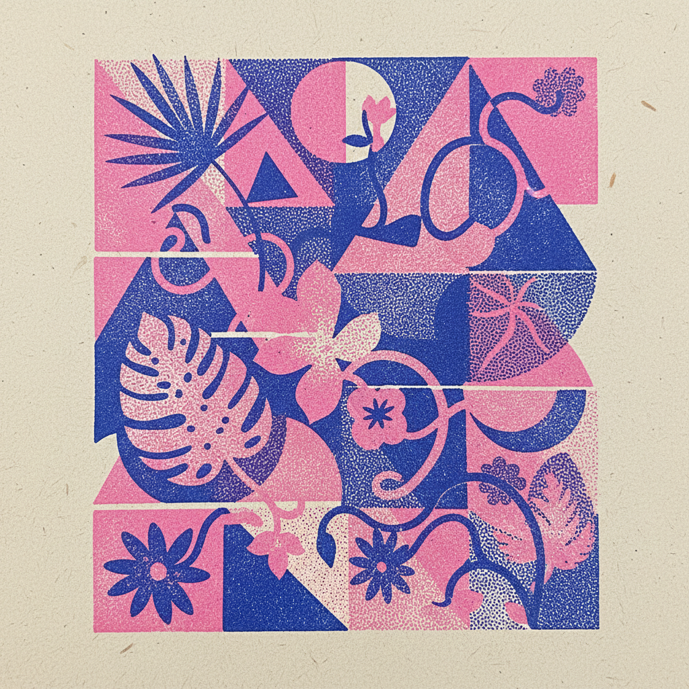

# Risograph 孔版印刷美学



> **"荧光油墨、套色偏移、颗粒质感——最'不完美'的印刷术成了最酷的设计风格。"**

## 概述

| 维度 | 描述 |
|------|------|
| 时期 | 1986（机器发明）/2010s（美学复兴）–至今 |
| 别名 | Risograph, Riso Print, 孔版印刷 |
| 核心色彩 | 荧光粉、荧光橙、蓝色、黄色（Riso专用油墨色） |
| 关键元素 | 限定色板、套色偏移、颗粒质感、半调网点 |
| 代表人物 | 独立出版社群、Zine文化、独立插画师 |
| 关联风格 | Zine Culture, Mid-Century Illustration, Naive Art, Indie Design |

---

## 历史脉络

| 年份 | 事件 |
|------|------|
| 1986 | 日本理想科学工业发明 Risograph 印刷机 |
| 1990s | 主要用于学校/教会的廉价印刷 |
| 2010 | 独立出版社开始用 Riso 做艺术印刷 |
| 2015 | Riso 美学在设计社区爆发 |
| 2018 | "Riso风格"成为数字设计趋势 |
| 2020s | Riso 美学融入主流品牌设计 |

### 核心哲学

Risograph 美学的精神是**"限制就是创造力——两种颜色比CMYK更有表现力"**：
- 限制 = 创意（"只有2-3种颜色——逼你思考"）
- 不完美 = 魅力（"套色偏移不是错误——是特色"）
- DIY = 独立（"一台Riso机器 = 一个出版社"）
- 物理 = 真实（"每一张都略有不同——因为是真正的印刷"）
- "Riso 是数字时代最有'物理感'的印刷方式"

---

## 视觉语法

### 色彩系统

```
Riso 专用油墨色（部分）：
  荧光粉 (#FF48B0) — 最标志性
  荧光橙 (#FF6C2F) — 温暖、活力
  蓝色 (#0078BF) — 经典
  黄色 (#FFE800) — 明亮
  绿色 (#00A95C) — 自然
  紫色 (#765BA7) — 神秘

规则：
  - 限定2-3色叠印
  - 叠色产生新色（蓝+黄=绿）
  - 套色可能偏移
  - 颗粒/半调网点可见

质感：
  颗粒 — 油墨分布不均
  半调 — 网点可见
  偏移 — 套色不准
  纸张 — 吸墨、纹理
```

### 标志性元素

| 类别 | 元素 |
|------|------|
| 色彩 | 荧光色、限定色板、叠印混色 |
| 纹理 | 颗粒、半调网点、套色偏移 |
| 载体 | Zine、海报、明信片、独立出版物 |
| 社区 | 独立出版社、艺术家工作室、Zine Fair |
| 工具 | Risograph印刷机（MZ/SF/SE系列） |
| 态度 | DIY、独立、限制中的创意、物理感 |

---

## 与千禧怀旧的关系

### 数字时代的"物理反叛"
- Riso = 对数字完美的物理回应
- "在Photoshop能做任何事的时代——选择只用2种颜色"
- 独立出版/Zine文化的复兴载体
- "Riso 让年轻设计师重新爱上了'印刷'"

### 从工具到美学
- 2010s: Riso 从印刷工具变成设计风格
- 数字模拟 Riso 效果的插件/滤镜
- "Riso风格"可以完全在数字环境中实现
- "真正的Riso" vs "数字Riso" 的争论

---

## 中国语境

- 中国独立出版/Zine社区的Riso使用
- 上海、北京的Riso工作室
- 中国设计师对Riso美学的采用
- 与中国"独立设计"运动的交叉

---

## 设计应用

| 场景 | 应用方式 |
|------|----------|
| 出版 | Zine+海报+明信片+独立出版 |
| 品牌 | 独立+手工+限定+荧光+年轻 |
| 数字 | Riso滤镜+限定色+颗粒+半调 |
| 活动 | 展览+市集+工作坊+独立文化 |

---

## 相关风格

← [Mid-Century Illustration 世纪中叶插画](mid-century-illustration.md) | [Zine Culture 独立出版](zine-culture.md) →

↑ [返回千禧怀旧目录](README.md) | [返回总目录](../README.md)
