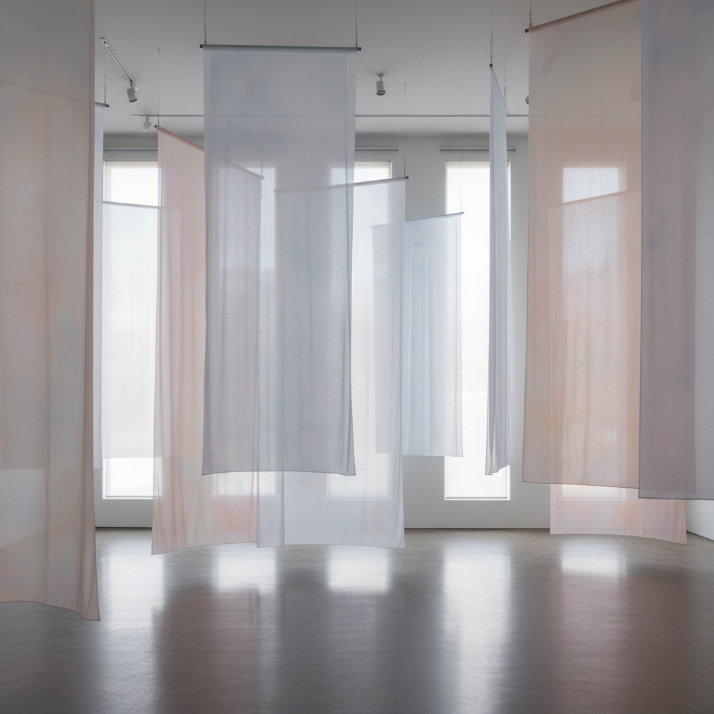

# Robert Irwin 罗伯特·欧文

> **时期：** 1928–2023  
> **关键词：** 光与感知、加州光与空间运动、场域条件、消失的艺术

## 概述

Robert Irwin 是美国艺术家，"光与空间"（Light and Space）运动的核心人物。他的职业生涯是一个不断减少的过程——从抽象绘画到圆盘雕塑到纱幕装置，最终到纯粹的光线和建筑干预，追求让艺术品"消失"而只留下纯粹的感知体验。他的终极目标是让观者意识到自己正在感知这一行为本身。

## 风格特征

- **感知为媒介**：作品的真正材料不是物质，而是观者的感知过程
- **光的操控**：自然光和人工光被精确控制以创造感知体验
- **逐渐消失**：从有形物体到几乎不可见的干预
- **场域条件**：每件作品都是对特定空间的独特回应
- **纱幕与薄膜**：半透明材料模糊空间边界，创造感知的不确定性

## 代表作品

- *Untitled*（圆盘系列，1966–1969）
- *Scrim Veil—Black Rectangle—Natural Light*（1977）
- *Central Garden, Getty Center*（1997）
- *Untitled (dawn to dusk)*（2016，Chinati Foundation）

## 历史意义

Irwin 是20世纪最激进的感知艺术家之一，他将艺术从物体解放为纯粹的体验。他的"场域条件"理论影响了后来的建筑、景观设计和沉浸式艺术，他的Getty中心花园是艺术与自然融合的典范。

## 概念图

