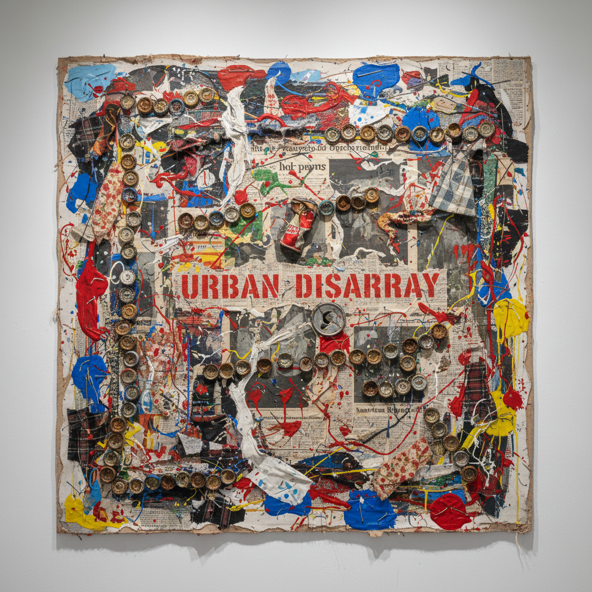

# Robert Rauschenberg 罗伯特·劳森伯格

> **流派**: 新达达 · 混合绘画 · 波普艺术先驱  
> **时期**: 1925–2008 美国  
> **关键词**: 混合绘画、丝网转印、现成品拼贴、跨界合作

## 概述

罗伯特·劳森伯格是连接抽象表现主义与波普艺术的关键人物。他发明了"混合绘画"(Combine)——将绘画与现成物品（轮胎、山羊标本、床铺）结合为一体，打破了绘画与雕塑的界限。他还率先将丝网印刷技术引入绘画，将新闻照片、广告和艺术史图像混合在同一画面上。

## 视觉特征

- **混合绘画**: 画布上附着真实物品（轮胎、瓶盖、布料）
- **丝网转印**: 将照片图像转印到画布上并覆以颜料
- **信息过载**: 大量图像和物品密集堆叠
- **城市碎片**: 纸板箱、报纸、街头废弃物入画
- **即兴拼贴**: 看似随意实则精心的构图平衡

## 代表作品

- 《床》(Bed, 1955) — 真实床铺涂满颜料
- 《独石》(Monogram, 1955–59) — 山羊标本穿过轮胎
- 《追溯I》(Retroactive I, 1964) — 肯尼迪丝网画
- 《擦除的德库宁画》(Erased de Kooning Drawing, 1953)

## 历史影响

劳森伯格证明了艺术可以包含一切——任何材料、任何图像、任何技术都可以进入画面。他为波普艺术、装置艺术和后现代主义铺平了道路，也是最早进行跨学科合作（与舞蹈家、音乐家、工程师）的视觉艺术家之一。

## 相关风格

- [Jasper Johns 贾斯珀·约翰斯](jasper-johns.md)
- [Pop Art 波普艺术](pop-art.md)
- [Neo-Dada 新达达](neo-dada.md)
