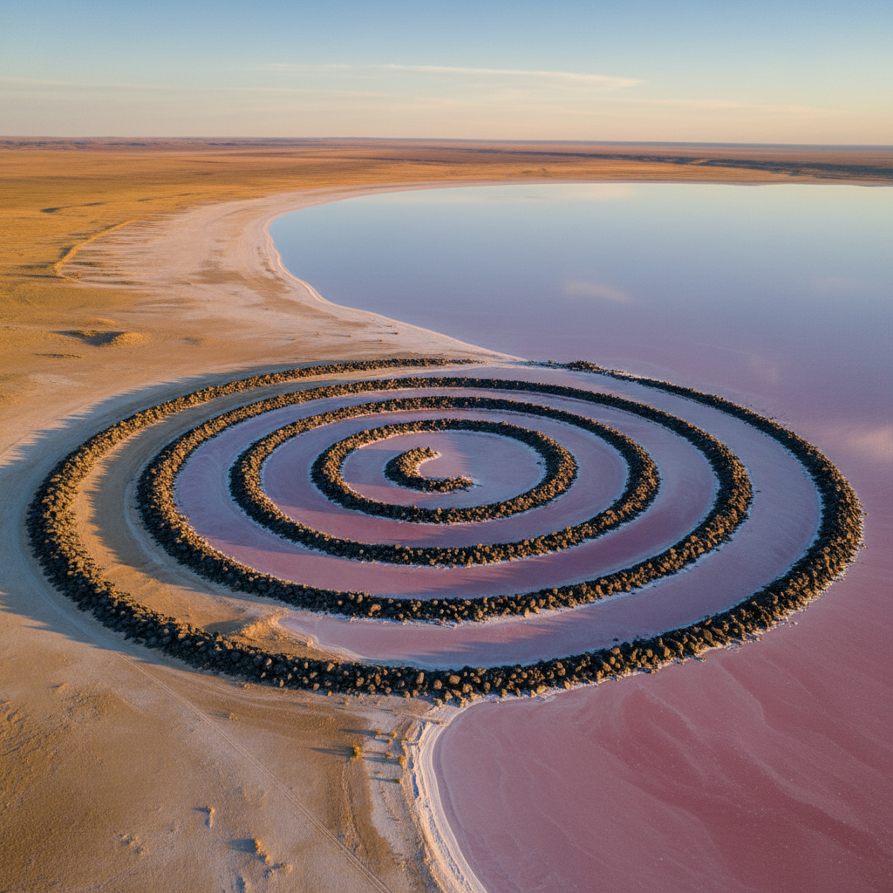

# Robert Smithson 罗伯特·史密森

> **时期：** 1938–1973  
> **关键词：** 大地艺术、螺旋防波堤、熵与废墟、场所/非场所

## 概述

Robert Smithson 是美国艺术家，大地艺术（Land Art）运动的核心人物，以犹他州大盐湖中的《螺旋防波堤》闻名。他的理论和实践探索了熵（entropy）——万物走向无序和衰败的趋势，将废弃的工业景观、采石场和盐湖转化为艺术的场域。他于35岁因飞机失事去世。

## 风格特征

- **大地尺度**：作品直接在自然景观中以推土机和卡车建造
- **熵的美学**：拥抱衰败、结晶、沉积等自然过程作为创作力量
- **场所/非场所辩证**：室外的大地作品与室内的岩石/镜子装置形成对话
- **螺旋与结晶**：偏好螺旋、层叠和结晶等自然生长/衰败的形态
- **时间的物质化**：作品随时间变化（被水淹没、被盐结晶覆盖）

## 代表作品

- *Spiral Jetty*（1970）
- *Partially Buried Woodshed*（1970）
- *Mirror Displacements*系列（1969）
- *Nonsites*系列（1968–1969）

## 历史意义

Smithson 将艺术从画廊解放到地球表面，他的"场所/非场所"理论和对熵的哲学思考影响了此后数十年的环境艺术、场域特定艺术和生态艺术。《螺旋防波堤》是20世纪最具标志性的艺术作品之一。

## 概念图

