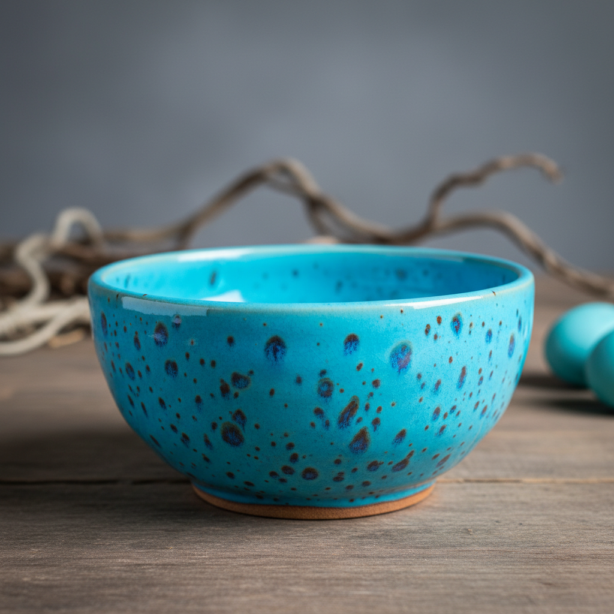

# Robin Egg Glaze Art 蛋壳青釉艺术

> "Robin's egg glaze is spring captured in ceramic — a bright turquoise blue speckled with darker spots like the shell of a robin's egg, achieved through a combination of copper and iron in a low-fire alkaline glaze, cheerful and vivid where celadon is serene, a color that brings the optimism of a bird's nest in May to the surface of fired clay." — Unknown

## 概述

蛋壳青釉艺术（Robin Egg Glaze Art）是一种以明亮的绿松石蓝色调中散布深色斑点为特征的陶瓷釉色艺术。蛋壳青釉因其色泽如同知更鸟蛋壳的蓝绿色而得名——釉面呈现明亮的天蓝到绿松石色，其中散布着深色的小斑点，如同鸟蛋壳上的自然斑纹。这种釉色在中国传统中被称为"炉钧釉"或"孔雀蓝"的变体，是一种低温铜釉的表现形式。

蛋壳青釉艺术的核心要素包括：1）绿松石蓝——明亮的蓝绿色调；2）斑点纹理——深色斑点的自然分布；3）铜呈色——铜在碱性釉中的呈色；4）低温烧成——相对较低的烧成温度；5）活泼明快——明快活泼的色彩感；6）自然模仿——模仿自然界的色彩；7）装饰性强——强烈的装饰效果。

## 核心特征

| 特征 | 描述 |
|------|------|
| 绿松石蓝 | 明亮的蓝绿色调 |
| 斑点纹理 | 深色斑点分布 |
| 铜呈色 | 铜在碱性釉中呈色 |
| 低温烧成 | 较低烧成温度 |
| 活泼明快 | 明快的色彩感 |
| 装饰性强 | 强烈装饰效果 |

## 视觉特征

- **天蓝色**：明亮的天蓝到绿松石色
- **深色斑点**：散布的深色小斑点
- **如鸟蛋**：如知更鸟蛋壳的色泽
- **明快感**：明快活泼的视觉感受
- **不均匀**：色彩的自然不均匀
- **装饰感**：强烈的装饰美感

## 代表作品

| 作品 | 艺术家/文化 | 年代 | 意义 |
|------|-------------|------|------|
| *清代炉钧釉* | 中国清代 | 雍正乾隆 | 蛋壳青的中国传统 |
| *孔雀蓝釉* | 中国 | 各时期 | 相关的蓝绿釉传统 |
| *土耳其蓝釉* | 中东 | 各时期 | 中东的蓝绿釉传统 |
| *Victorian Robin Egg* | 英国 | 19世纪 | 维多利亚时代的应用 |
| *当代蛋壳青* | 各地陶艺家 | 当代 | 当代的诠释 |

## 历史时间线

| 时期 | 事件 |
|------|------|
| 古代 | 埃及和中东的早期蓝绿釉 |
| 唐代 | 中国三彩中的蓝绿釉 |
| 清代 | 炉钧釉和蛋壳青的精致化 |
| 19世纪 | 欧洲的蛋壳青釉流行 |
| 当代 | 蛋壳青釉在当代的应用 |

## 中国语境

蛋壳青釉在中国有丰富的传统——虽然中国传统上不使用"知更鸟蛋"这个比喻，但类似的蓝绿色釉在中国陶瓷中有悠久的历史。中国的炉钧釉是最接近蛋壳青的传统釉色——其蓝绿色调中带有流动的深色纹理。中国唐三彩中的蓝色釉也是铜在碱性釉中呈色的早期实践。清代雍正、乾隆时期的炉钧釉将这种蓝绿色釉发展到了极致——色彩丰富变化，如同孔雀羽毛般绚丽。中国的孔雀蓝釉（法华彩）也是相关的传统——明代的法华器以其鲜艳的孔雀蓝著称。蛋壳青釉证明了蓝绿色在东西方陶瓷中都有重要的地位——它代表了天空、海洋和生命的色彩。

## AI生成概念图

## 与其他风格的关系

- **Turquoise Glaze** → 绿松石釉
- **Copper Glaze** → 铜釉
- **Lu Jun Glaze** → 炉钧釉
- **Tang Sancai** → 唐三彩
- **Alkaline Glaze** → 碱性釉
- **Decorative Ceramics** → 装饰陶瓷

---

*浮光艺志 | Chronicle of Artistry*
