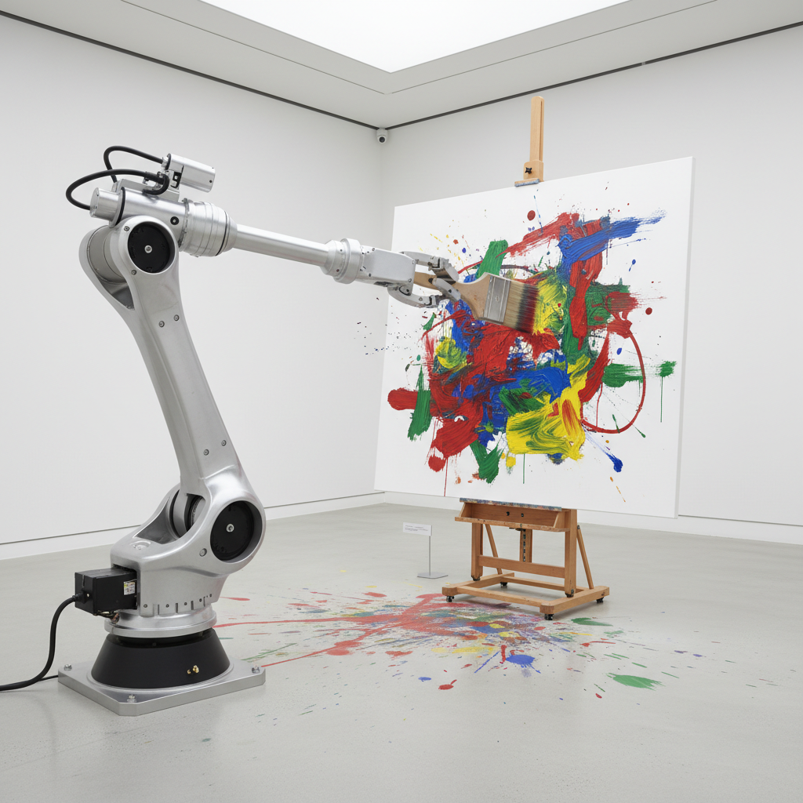

# Robotic Art 机器人艺术

> "The robot is not a tool. It is a collaborator." — Leonel Moura

## 概述

机器人艺术（Robotic Art / Robot Art）是以机器人——自主或半自主的机械系统——作为创作工具、合作者或主题的艺术形式。从1960年代的早期控制论雕塑到当代的AI绘画机器人，机器人艺术探索了人与机器的关系、创造力的本质、以及自主性的边界。

机器人艺术的核心问题是：机器能创造艺术吗？如果一个机器人画出了美丽的画，谁是艺术家——程序员、机器人、还是观众？

## 核心特征

| 特征 | 描述 |
|------|------|
| 机械自主 | 机器人具有某种程度的自主行为 |
| 人机关系 | 探索人与机器的合作和冲突 |
| 创造力问题 | 质疑创造力是否是人类独有的 |
| 技术美学 | 机械运动本身的美学价值 |
| 互动性 | 机器人与环境和观众的互动 |
| 进化性 | 机器学习使机器人可以"进化" |

## 视觉特征

- **机械**：齿轮、马达、传感器、机械臂
- **运动**：精确的或随机的机械运动
- **痕迹**：机器人留下的绘画、雕刻痕迹
- **互动**：对观众和环境的感应和反应
- **工业**：金属、电线、电路板的工业美学
- **拟人**：有时模仿人类形态和动作

## 代表作品

| 作品 | 艺术家 | 年代 | 意义 |
|------|--------|------|------|
| *SENSTER* | Edward Ihnatowicz | 1970 | 最早的互动机器人雕塑之一 |
| *Painting Machines* | Leonel Moura | 2003+ | 自主绘画的机器人群 |
| *Drawing Operations* | Sougwen Chung | 2015+ | 人与机器人的协作绘画 |
| *Can't Help Myself* | Sun Yuan & Peng Yu | 2016 | 不断清扫液体的机械臂——西西弗斯 |
| *Trampled by Oxen* | Jordan Wolfson | 2017 | 令人不安的拟人机器人 |
| *AARON* | Harold Cohen | 1973-2016 | 最早的AI绘画程序之一 |

## 历史时间线

| 时期 | 事件 |
|------|------|
| 1950s | 控制论雕塑的早期实验 |
| 1960s | Tinguely的自毁机器 |
| 1970 | Ihnatowicz的*SENSTER*——互动机器人 |
| 1973 | Cohen开始开发AARON——AI绘画 |
| 1990s | 机器人艺术的制度化 |
| 2000s | Moura——自主绘画机器人 |
| 2010s | 深度学习——AI创作能力爆发 |
| 2016 | *Can't Help Myself*——机器人的存在主义 |
| 2020s | AI生成艺术——机器人艺术的新阶段 |

## 子类型

| 子类型 | 特征 |
|--------|------|
| 绘画机器人 | Moura、Cohen——机器人作为画家 |
| 互动机器人 | Ihnatowicz——感应和回应观众 |
| 行为机器人 | Sun Yuan——机器人的"行为艺术" |
| 协作机器人 | Chung——人机协作创作 |
| 拟人机器人 | Wolfson——模仿人类的机器人 |
| 群体机器人 | 多个机器人的集体行为 |

## 中国语境

机器人艺术在中国近年快速发展。孙原和彭禹的*Can't Help Myself*在威尼斯双年展上引起全球关注。中国的科技实力为机器人艺术提供了硬件基础。中国美术学院等设立了科技艺术方向。中国的AI绘画和机器人书法实验也在探索传统艺术与新技术的结合。中国制造业的机器人化为艺术家提供了丰富的工业机器人资源。

## AI生成概念图

## 与其他风格的关系

- **Kinetic Art** → 动态艺术是机器人艺术的直接先驱
- **Systems Art** → 系统艺术的控制论基础与机器人相通
- **Data Art** → AI机器人使用数据作为创作素材
- **Performance Art** → 机器人的"行为"是行为艺术的延伸
- **New Media Art** → 新媒体艺术的技术实验包含机器人
- **Generative Art** → 生成艺术的算法逻辑驱动机器人创作

---

*浮光艺志 | Chronicle of Artistry*
