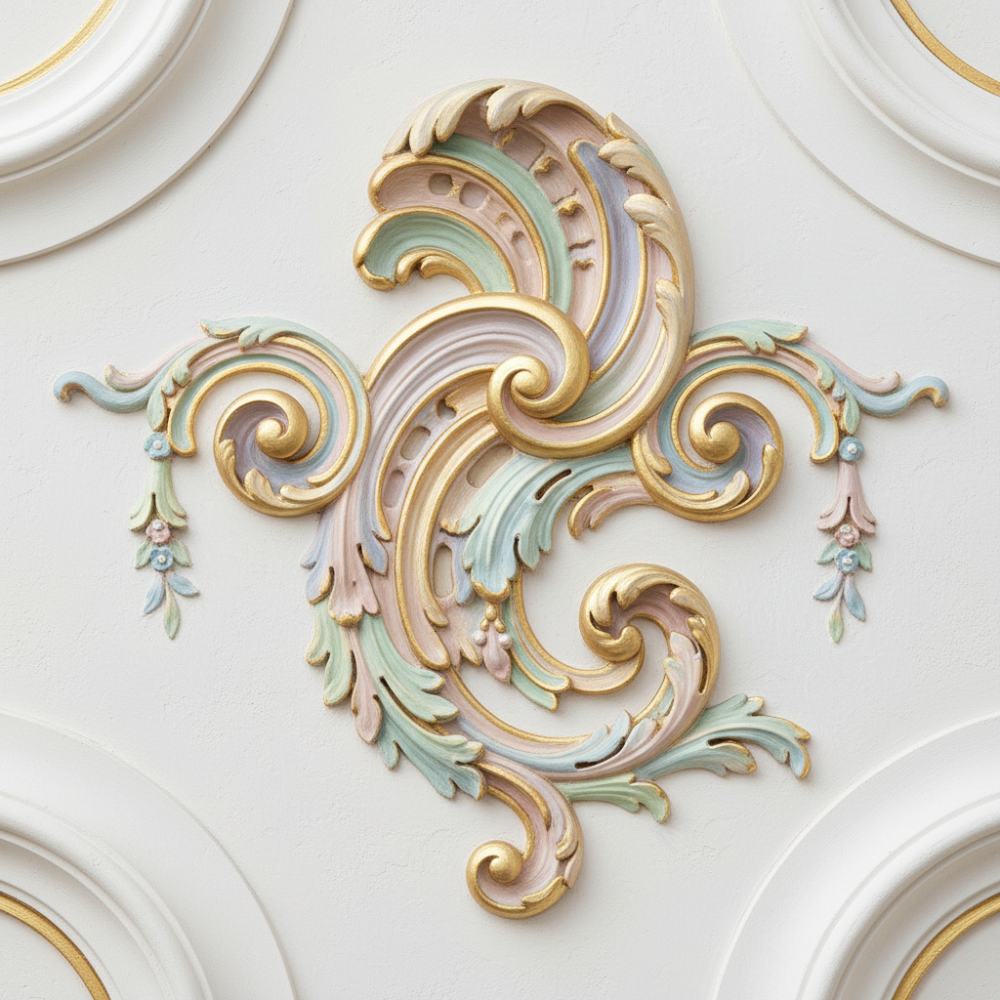

# Rocaille 洛可可装饰

> **时期：** 1730年代–1770年代  
> **关键词：** 贝壳曲线、不对称、轻盈优雅、室内装饰、路易十五

## 概述

Rocaille（洛可可装饰）是洛可可风格的核心装饰语汇——以贝壳（rocaille）的不规则曲线为基本母题，发展出一套轻盈、不对称、充满动感的装饰体系。它拒绝巴洛克的沉重对称，追求自然的有机形态：卷曲的贝壳、流动的水草、缠绕的藤蔓，在镀金和粉彩中创造出一个精致的梦幻世界。

## 风格特征

- **贝壳母题**：C形和S形的不规则曲线
- **不对称**：打破古典的镜像对称
- **轻盈感**：纤细线条和浅淡色彩
- **有机形态**：模仿自然界的生长曲线
- **镀金粉彩**：金色与粉色、蓝色的搭配

## 代表人物与作品

- 朱斯特-奥雷勒·梅索尼耶 洛可可装饰设计
- 弗朗索瓦·布歇 洛可可绘画
- 日耳曼·博弗朗 苏比兹府邸
- 巴伐利亚维斯教堂 洛可可内饰

## 概念图

