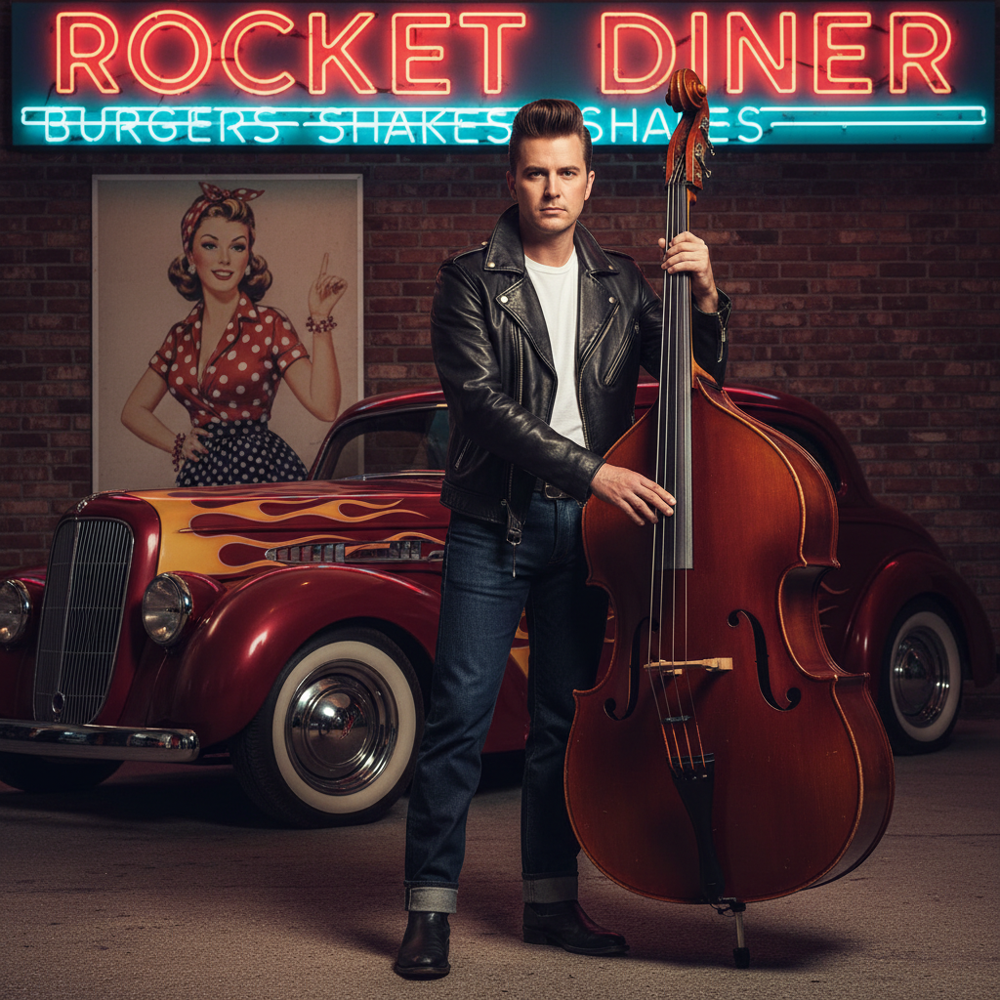

# Rockabilly 摇滚比利



> **"飞机头、复古纹身、站立贝斯——50年代的叛逆从未过时。"**

## 概述

| 维度 | 描述 |
|------|------|
| 时期 | 1950s/1980s复兴/至今 |
| 别名 | Rockabilly, Rock-a-Billy, Psychobilly (极端分支) |
| 核心色彩 | 黑色、红色、白色、蓝色牛仔 |
| 关键元素 | 飞机头/Pin-up卷发、复古纹身、站立贝斯、老爷车 |
| 代表人物 | Elvis Presley (早期), Eddie Cochran, Stray Cats |
| 关联风格 | Greaser, Pin-up, Teddy Boy, Psychobilly, Mod |

---

## 历史脉络

| 年份 | 事件 |
|------|------|
| 1954 | Elvis "That's All Right"——Rockabilly 诞生 |
| 1955 | Sun Records 黄金时代——Carl Perkins, Jerry Lee Lewis |
| 1958 | 原始 Rockabilly 衰落——摇滚进化 |
| 1980 | Stray Cats——Rockabilly Revival |
| 1983 | Psychobilly 兴起——The Meteors |
| 2000s | 全球 Rockabilly 社区持续活跃 |

### 核心哲学

Rockabilly 的精神是**"50年代的叛逆精神——永远年轻、永远酷"**：
- 复古 = 态度（不是怀旧）
- 速度 = 生活（"快车、快歌、快节奏"）
- 手工 = 真实（"机器做不出灵魂"）
- 忠诚 = 文化（"一旦 Rockabilly，永远 Rockabilly"）
- "我们不是在模仿50年代——我们是在延续它"

---

## 视觉语法

### 色彩系统

```
主色：
  黑色 (#000000) — 皮夹克、发油
  红色 (#FF0000) — 经典搭配
  白色 (#FFFFFF) — T恤、衬衫
  牛仔蓝 (#4169E1) — 牛仔裤

辅色：
  粉色 (#FF69B4) — Pin-up 元素
  绿色 (#006400) — 军事元素
  金色 (#DAA520) — 配饰

质感：
  皮革 — 夹克、靴子
  牛仔 — 裤子、裙子
  棉 — T恤、衬衫
  铬 — 老爷车、配饰
  墨水 — 纹身
```

### 标志性元素

| 类别 | 元素 |
|------|------|
| 男性 | 飞机头/Pompadour、皮夹克、白T恤、牛仔裤 |
| 女性 | Pin-up卷发、波点裙、猫眼墨镜、红唇 |
| 音乐 | 站立贝斯、Gretsch吉他、回声效果 |
| 交通 | 50s 老爷车、Hot Rod、摩托车 |
| 纹身 | 传统美式纹身（燕子、锚、心） |
| 态度 | 酷、忠诚、复古、手工、速度 |

---

## 与千禧怀旧的关系

### 永恒的亚文化
- Rockabilly = 最"长寿"的亚文化之一（70年+）
- 每一代都有自己的 Rockabilly 复兴
- 与 Vintage/Retro 文化的天然交叉
- "Rockabilly 不是怀旧——它是一种活着的文化"

### 对现代时尚的影响
- Pompadour 发型 → 现代男士理发
- Pin-up 美学 → Dita Von Teese → 主流时尚
- 传统纹身 → 现代纹身文化的基础
- "50s 的酷从未过时"

---

## 中国语境

- Rockabilly 在中国的小众但忠实社区
- 中国复古车文化的兴起
- 传统美式纹身在中国的流行
- 与中国"复古"/"美式复古"的关系

---

## 设计应用

| 场景 | 应用方式 |
|------|----------|
| 时尚 | 皮夹克+牛仔+Pin-up+复古+纹身 |
| 品牌 | 复古+手工+真实+美式+经典 |
| 空间 | 50s 餐厅+铬+红色+黑白格 |
| 音乐 | 站立贝斯+复古海报+Sun Records风 |

---

## 相关风格

← [Punk 朋克美学](punk.md) | [Mod 摩德文化](mod.md) →

↑ [返回千禧怀旧目录](README.md) | [返回总目录](../README.md)
