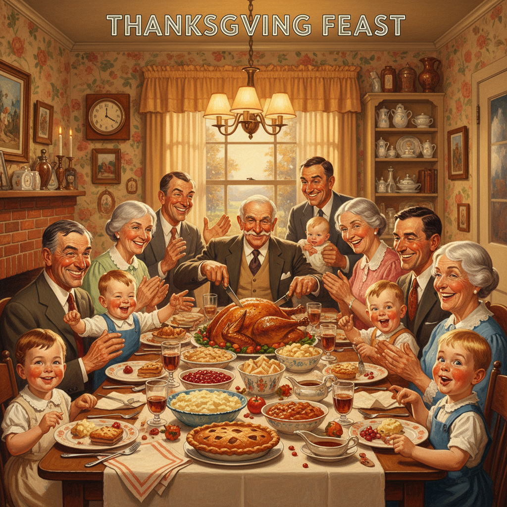

# Norman Rockwell 诺曼·洛克威尔

> "I paint life as I would like it to be." — Norman Rockwell

## 概述

诺曼·洛克威尔（Norman Rockwell，1894–1978）是美国最受大众喜爱的插画家和画家，为《星期六晚邮报》创作了321幅封面。他以精确的写实技巧和温暖的幽默感描绘美国小镇生活的理想化场景，成为美国文化认同的视觉代言人。

## 核心特征

| 特征 | 描述 |
|------|------|
| 叙事性 | 每幅画都讲述一个完整故事 |
| 精确写实 | 照片级的细节描绘 |
| 幽默温暖 | 善意的、令人微笑的日常场景 |
| 美国小镇 | 理想化的中产阶级生活 |
| 人物表情 | 极其生动的面部表达 |
| 社会评论 | 晚期作品涉及民权等严肃议题 |

## 代表作品

| 作品 | 年代 | 意义 |
|------|------|------|
| *Freedom from Want* | 1943 | 四大自由系列——感恩节餐桌 |
| *Triple Self-Portrait* | 1960 | 画家画自己画自己 |
| *The Problem We All Live With* | 1964 | 民权运动的有力声明 |
| *Girl at Mirror* | 1954 | 少女的成长焦虑 |

## AI生成概念图

## 与其他风格的关系

- **American Illustration** → 美国插画黄金时代的巅峰
- **Realism** → 精确写实的传统
- **Wyeth** → 同代美国写实画家，但风格迥异
- **Pop Art** → 沃霍尔称他为"美国最伟大的画家"
