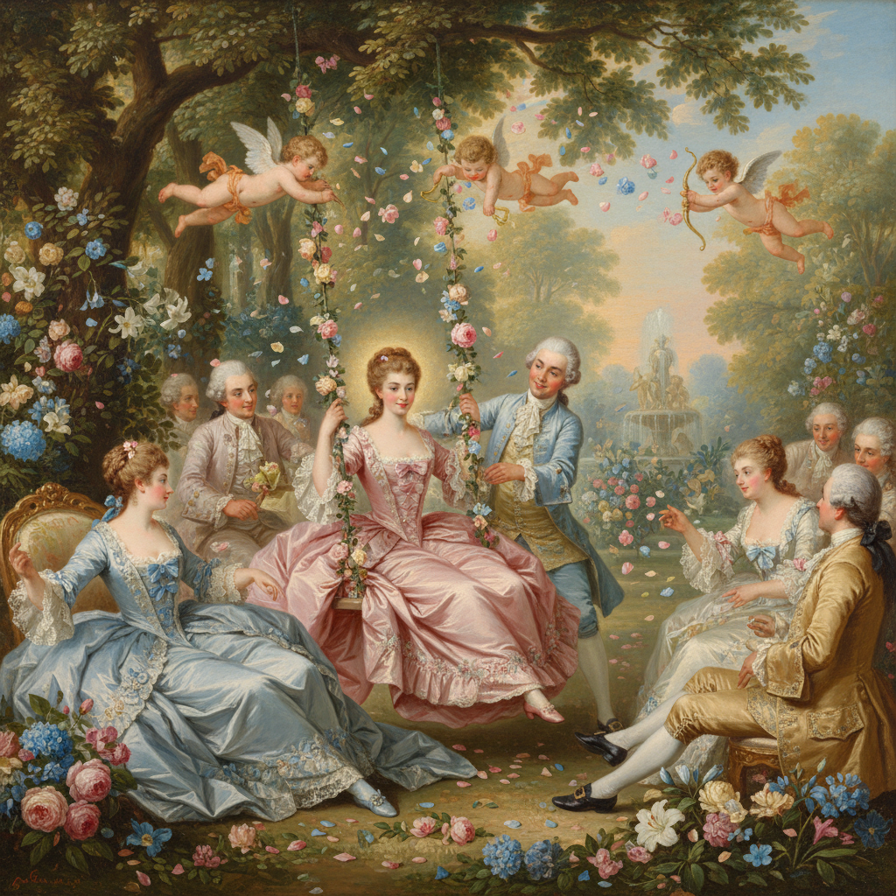

# Rococo Painting 洛可可绘画

> **时期：** 1720年代–1780年代  
> **关键词：** 轻盈优雅、贵族享乐、粉彩色调、爱情主题、装饰性

## 概述

Rococo Painting（洛可可绘画）是18世纪法国贵族文化的视觉表达——在路易十五的宫廷中，画家们用轻盈的笔触、粉嫩的色彩和优雅的曲线描绘贵族的田园游戏、爱情冒险和感官愉悦。华托的雅宴、布歇的牧歌、弗拉戈纳尔的秋千——洛可可是巴洛克的轻盈化身，用甜美取代了庄严，用私密取代了宏大。

## 风格特征

- **粉彩色调**：粉红、淡蓝、奶油白、金色
- **轻盈笔触**：羽毛般的柔软质感
- **曲线构图**：S形和C形的优雅韵律
- **爱情主题**：调情、约会、田园牧歌
- **装饰融合**：绘画与室内装饰一体化

## 代表人物与作品

- 让-安托万·华托《发舟西苔岛》
- 弗朗索瓦·布歇 牧歌场景
- 让-奥诺雷·弗拉戈纳尔《秋千》
- 托马斯·庚斯博罗 肖像画

## 概念图

