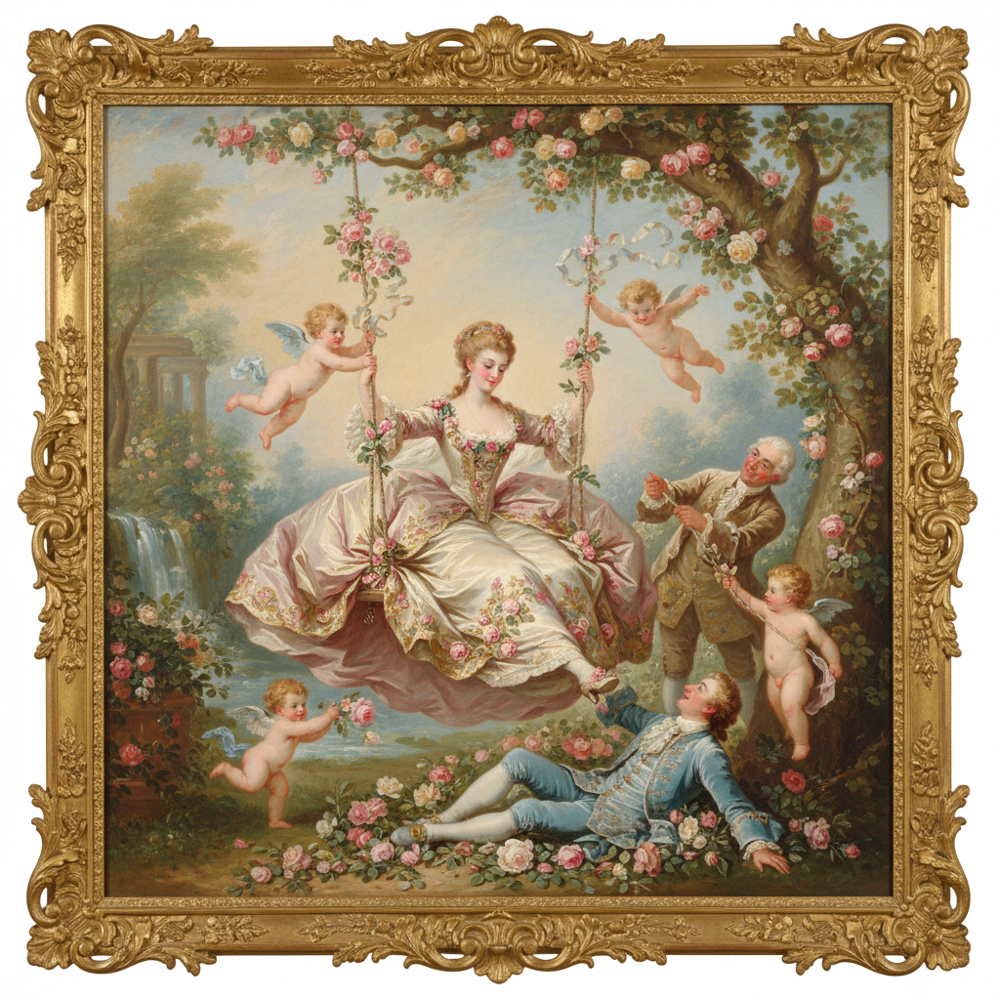

# Rococo 洛可可



> **"轻盈、甜美、精致——贝壳曲线、粉色天使、镀金一切——巴洛克的女儿选择了快乐。"**

## 概述

| 维度 | 描述 |
|------|------|
| 时期 | 1720–1780/影响至今 |
| 别名 | Rococo, Rocaille, Late Baroque, 洛可可 |
| 核心色彩 | 粉色、淡蓝、奶油白、金色、薰衣草紫 |
| 关键元素 | 贝壳曲线(rocaille)、不对称装饰、田园牧歌、轻盈优雅 |
| 代表人物 | Fragonard, Boucher, Watteau, Tiepolo |
| 关联风格 | Baroque, Coquette, Fairycore, Marie Antoinette aesthetic |

---

## 历史脉络

| 年份 | 事件 |
|------|------|
| 1715 | 路易十四去世——从巴洛克的沉重转向轻盈 |
| 1720s | Watteau《发舟西苔岛》——洛可可绘画开始 |
| 1740s | Boucher——洛可可的甜美巅峰 |
| 1767 | Fragonard《秋千》——洛可可经典 |
| 1780s | 新古典主义取代洛可可——"太轻浮了" |
| 2020s | "Rococo aesthetic"在社交媒体复兴 |

### 核心哲学

洛可可的精神是**"生活应该是美的——美应该是轻盈的"**：
- 轻盈 = 快乐（"巴洛克太沉重了——我们要跳舞"）
- 装饰 = 生活（"每一个角落都值得被装饰"）
- 甜美 = 合法（"粉色不是肤浅——粉色是选择快乐"）
- 私密 = 自由（"从宫殿到沙龙——从公共到私密"）
- "洛可可是贵族的最后一场派对——在革命之前"

---

## 视觉语法

### 色彩系统

```
主色：
  粉色 (#FFB6C1) — 甜美、浪漫
  淡蓝 (#ADD8E6) — 天空、轻盈
  奶油白 (#FFFDD0) — 优雅、柔和
  金色 (#FFD700) — 装饰、奢华

辅色：
  薰衣草 (#E6E6FA) — 梦幻
  薄荷绿 (#98FB98) — 田园
  珊瑚色 (#FF7F50) — 温暖

规则：
  - 柔和、粉彩色调
  - 金色装饰点缀
  - 白色/奶油色为基底
  - 没有黑色（太沉重）

质感：
  丝绸 — 光泽、褶皱
  镀金 — 装饰、边框
  瓷器 — 光滑、精致
  花卉 — 玫瑰、蔷薇
```

### 标志性元素

| 类别 | 元素 |
|------|------|
| 装饰 | 贝壳曲线(rocaille)、不对称、C形/S形 |
| 题材 | 田园牧歌、爱情、宴会、天使(putti) |
| 人物 | 贵族女性、牧羊女、丘比特 |
| 材料 | 镀金、瓷器、丝绸、蕾丝 |
| 空间 | 沙龙、闺房、花园、凉亭 |
| 态度 | 轻盈、甜美、精致、私密、享乐 |

---

## 与千禧怀旧的关系

### "Coquette"美学的源头
- 2020s "Coquette aesthetic" = 洛可可的数字后代
- 粉色+蝴蝶结+蕾丝+珍珠 = 洛可可DNA
- Marie Antoinette = 洛可可的流行文化符号
- Sofia Coppola《绝代艳后》= 洛可可美学的当代诠释

### 对当代设计的影响
- 洛可可 → Coquette → Fairycore → 当代"甜美"美学
- 奢侈品品牌的洛可可元素
- "洛可可教会了设计师：装饰不是罪——装饰是快乐"
- 婚礼设计中的洛可可影响

---

## 中国语境

- 洛可可与中国风(Chinoiserie)的关系
- 中国瓷器对洛可可装饰的影响
- 中国当代设计中的洛可可元素
- "中国风"在18世纪欧洲的流行

---

## 设计应用

| 场景 | 应用方式 |
|------|----------|
| 时尚 | 蕾丝+蝴蝶结+粉色+珍珠+精致 |
| 品牌 | 奢华+甜美+女性+浪漫+精致 |
| 空间 | 酒店+甜品店+婚礼+沙龙 |
| 包装 | 化妆品+香水+巧克力+礼品 |

---

## 相关风格

← [Baroque 巴洛克](baroque.md) | [Coquette Y2K](coquette-y2k.md) →

↑ [返回千禧怀旧目录](README.md) | [返回总目录](../README.md)
