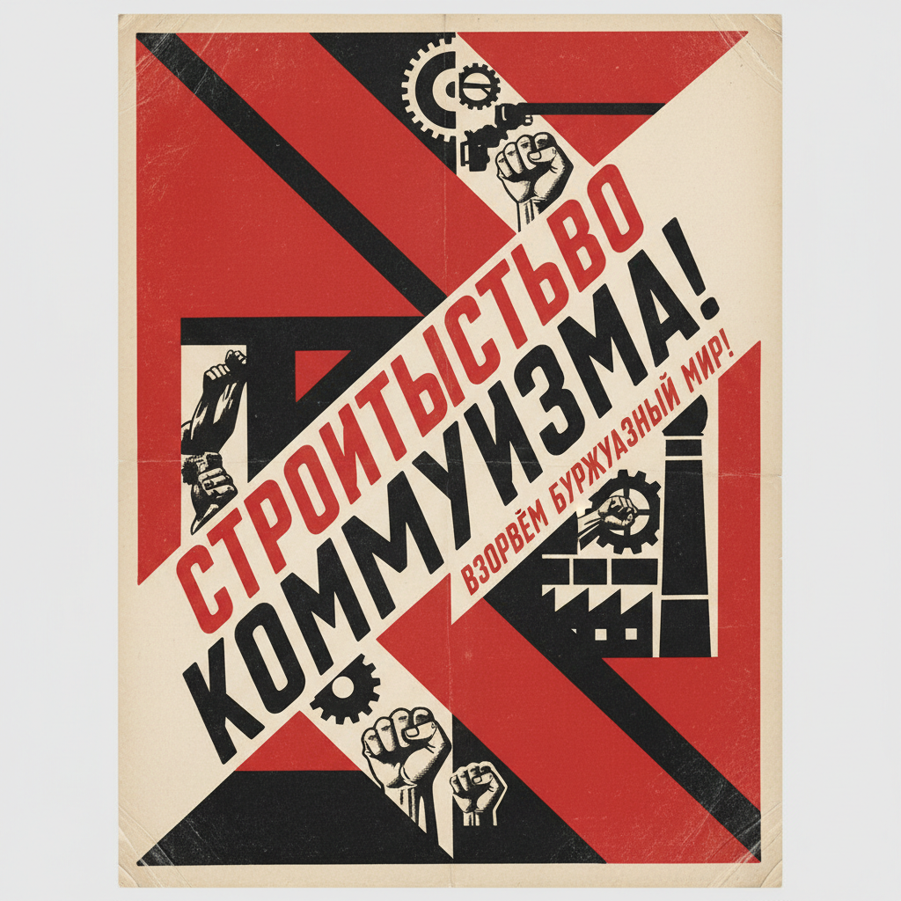

# Rodchenko Art 罗德钦科艺术

> "One has to take several shots of a subject, from different points of view and in different situations, as if one examined it in the round rather than looked through the same key-hole again and again." — Alexander Rodchenko

## 概述

罗德钦科艺术（Rodchenko Art）是20世纪初俄罗斯构成主义艺术家亚历山大·米哈伊洛维奇·罗德钦科（Alexander Mikhailovich Rodchenko, 1891-1956）创立的多媒介构成主义风格。罗德钦科是20世纪最具影响力的多面手艺术家之一——他在绑画、摄影、平面设计、海报、家具设计和舞台设计等领域都做出了开创性的贡献。他将构成主义的理念从纯艺术扩展到了日常生活的方方面面。

罗德钦科最著名的贡献是他的摄影和平面设计。他开创了"新视角"摄影——从极端的俯视或仰视角度拍摄，打破了传统的平视构图。他与诗人马雅可夫斯基合作设计的广告海报——以大胆的几何构图、鲜明的红黑配色和有力的字体——成为20世纪平面设计的经典。他的绑画作品《纯红色、纯黄色、纯蓝色》（1921）宣告了绑画的"终结"——此后他转向了实用设计。

罗德钦科艺术的核心要素包括：1）多媒介——跨越绑画、摄影、设计的全面实践；2）新视角——极端角度的摄影革命；3）平面设计——构成主义海报和排版；4）功能主义——艺术服务于生活；5）几何构成——严格的几何构图；6）红黑配色——标志性的色彩方案；7）反精英——艺术的民主化和大众化。

## 核心特征

| 特征 | 描述 |
|------|------|
| 多媒介 | 跨越绑画摄影设计 |
| 新视角 | 极端角度摄影革命 |
| 平面设计 | 构成主义海报排版 |
| 功能主义 | 艺术服务于生活 |
| 几何构成 | 严格几何构图 |
| 红黑配色 | 标志性色彩方案 |

## 视觉特征

- **极端角度**：俯视和仰视的摄影
- **红黑白**：红色、黑色、白色的强烈对比
- **几何排版**：大胆的几何字体和排版
- **对角线**：动态的对角线构图
- **蒙太奇**：照片蒙太奇拼贴
- **工业感**：机器和工业的美学

## 代表作品

| 作品 | 年代 | 意义 |
|------|------|------|
| *纯红色、纯黄色、纯蓝色* (Pure Colors) | 1921 | 绑画的终结宣言 |
| *列宁格勒出版社海报* (Books!) | 1924 | 平面设计经典 |
| *楼梯* (Stairs) | 1930 | 新视角摄影 |
| *先锋杂志封面* (LEF/Novyi LEF) | 1923-1928 | 杂志设计 |
| *工人俱乐部设计* | 1925 | 空间设计 |
| *马雅可夫斯基肖像* | 1924 | 摄影肖像 |

## 历史时间线

| 时期 | 事件 |
|------|------|
| 1891年 | 出生于圣彼得堡 |
| 1910-1914年 | 喀山美术学校学习 |
| 1915-1921年 | 绑画和雕塑创作 |
| 1921年 | 宣告绑画终结，转向设计 |
| 1923-1928年 | 与马雅可夫斯基合作 |
| 1924-1930年代 | 摄影创作巅峰 |
| 1956年 | 在莫斯科去世 |

## 中国语境

罗德钦科在中国设计教育中有着重要的地位。他的构成主义平面设计——大胆的几何构图、强烈的色彩对比和有力的字体——对中国现代平面设计产生了深远的影响。中国革命时期的宣传海报在视觉语言上与罗德钦科的设计有明显的渊源关系——红色、黑色的配色方案和动态的对角线构图。他的"新视角"摄影理念——从非常规角度观察世界——也影响了中国当代摄影的创作方法。罗德钦科"艺术服务于生活"的理念与中国"艺术为人民服务"的传统有深层的呼应。他证明了艺术家可以同时是画家、摄影师、设计师和社会活动家——这种多面手的角色定位对中国当代创意工作者有重要的启示。

## 概念图

## 与其他风格的关系

- **Constructivism** → 构成主义
- **Tatlin** → 塔特林（构成主义先驱）
- **Malevich** → 马列维奇（至上主义）
- **Bauhaus** → 包豪斯
- **De Stijl** → 风格派
- **Swiss Design** → 瑞士设计（后继）

---

*浮光艺志 | Chronicle of Artistry*
