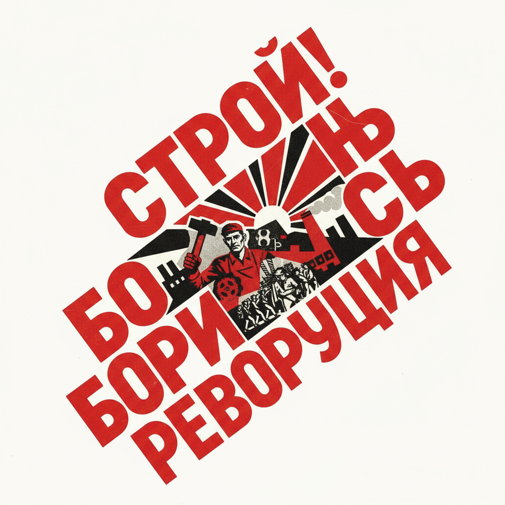

# Alexander Rodchenko 罗德琴科

> "One has to take several different shots of a subject, from different points of view and in different situations." — Alexander Rodchenko

## 概述

亚历山大·罗德琴科（Alexander Rodchenko，1891–1956）是俄国构成主义的核心人物，集画家、雕塑家、摄影师和平面设计师于一身。他以极端的几何抽象、大胆的摄影角度和革命性的平面设计闻名，将艺术从画架上解放，投入到海报、书籍和建筑的社会实践中。

## 核心特征

| 特征 | 描述 |
|------|------|
| 几何抽象 | 圆规和直尺创造的纯粹形式 |
| 极端角度 | 俯拍仰拍的革命性摄影 |
| 红黑配色 | 革命色彩的强烈冲击 |
| 蒙太奇 | 照片拼贴的叙事实验 |
| 功能主义 | 艺术为社会服务 |
| 字体设计 | 无衬线几何字体的先驱 |

## 代表作品

| 作品 | 年代 | 意义 |
|------|------|------|
| *Books (Please)!* | 1924 | 构成主义海报的经典 |
| *Pure Red Color, Pure Yellow Color, Pure Blue Color* | 1921 | 绘画的终结宣言 |
| *Pioneer with a Trumpet* | 1930 | 极端角度摄影的代表 |
| *Spatial Construction* | 1920–21 | 悬挂雕塑的先驱 |

## AI生成概念图

## 与其他风格的关系

- **Constructivism** → 俄国构成主义核心成员
- **Malevich** → 从至上主义出发走向构成
- **El Lissitzky** → 同代构成主义设计师
- **Bauhaus** → 影响了包豪斯设计教育
