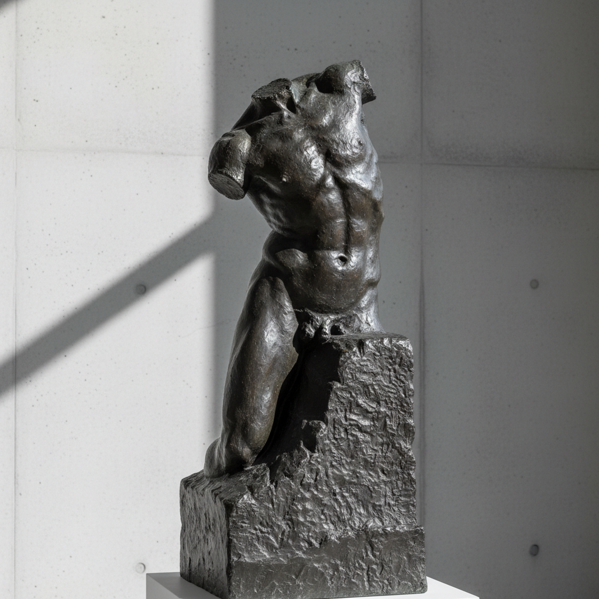

# Auguste Rodin 罗丹

> "I choose a block of marble and chop off whatever I don't need." — Auguste Rodin

## 概述

奥古斯特·罗丹（Auguste Rodin，1840–1917）是现代雕塑之父，他打破了学院派雕塑的光滑理想化传统，以粗犷的表面、未完成感和强烈的情感表达开创了雕塑的现代纪元。

罗丹证明了雕塑不必是完美光滑的——残缺的肢体、粗糙的表面、扭曲的姿态同样可以传达深刻的人类情感。

## 核心特征

| 特征 | 描述 |
|------|------|
| 表面肌理 | 保留手指和工具的痕迹 |
| 未完成感 | 刻意的残缺——身体从石块中浮现 |
| 情感强度 | 扭曲的姿态表达内在的精神状态 |
| 反学院 | 打破新古典主义的光滑理想 |
| 局部独立 | 手、躯干可以独立成为完整作品 |
| 光影雕塑 | 粗糙表面捕捉光线的变化 |

## 视觉特征

- **表面**：粗糙的、保留指痕的青铜或大理石
- **姿态**：扭曲的、充满张力的人体
- **完成度**：从精细到粗犷的渐变——未完成的边缘
- **材质**：青铜的深色光泽或白色大理石
- **比例**：有时夸张的手部和头部
- **基座**：身体与基座/石块的融合

## 代表作品

| 作品 | 年代 | 意义 |
|------|------|------|
| *The Thinker* | 1880 | 人类思想的象征 |
| *The Kiss* | 1882 | 爱情的永恒瞬间 |
| *The Gates of Hell* | 1880–1917 | 一生未完成的巨作 |
| *The Burghers of Calais* | 1884–89 | 纪念碑雕塑的革命 |
| *Walking Man* | 1907 | 无头无臂的现代雕塑宣言 |

## 真实作品（公共领域）

| 作品 | 来源 |
|------|------|
| *The Thinker* | [Musée Rodin](https://www.musee-rodin.fr/en/museum/collections/thinker) |
| *The Kiss* | [Musée Rodin](https://www.musee-rodin.fr/en/museum/collections/kiss) |
| *The Gates of Hell* | [Musée Rodin](https://www.musee-rodin.fr/en/museum/collections/gates-hell) |

> ⚠️ 本条目优先使用真实作品。

## AI生成概念图

## 与其他风格的关系

- **Modern Sculpture** → 现代雕塑的开创者
- **Impressionism** → 雕塑中的印象主义——捕捉光线
- **Expressionism** → 情感表达优先于形式完美
- **Brancusi** → 布朗库西从罗丹出发走向极简
