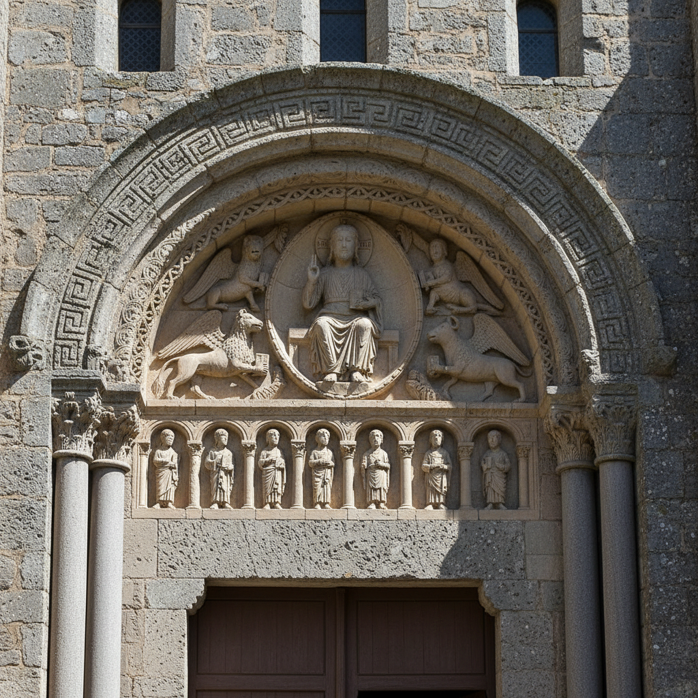

# 罗马式艺术 · Romanesque Art

> "石头是信仰的语言，拱门是通往天国的门户。" —— 中世纪修道院格言

## 概述

罗马式艺术（Romanesque Art）是10世纪末至12世纪在西欧发展起来的建筑与视觉艺术风格，以厚重的石墙、半圆拱、筒形穹顶和丰富的雕塑装饰为特征。"罗马式"一词源于其对古罗马建筑元素（拱、穹顶、柱式）的继承与再创造。这一风格伴随着修道院运动的扩张和朝圣路线的繁荣而传播，从法国克吕尼修道院到西班牙圣地亚哥之路，从意大利比萨到德国莱茵河畔，构成了中世纪欧洲第一个真正的国际性艺术风格。

## 核心特征

| 特征 | 描述 |
|------|------|
| 时期 | 约1000年–1200年 |
| 地域 | 法国、西班牙、意大利、德国、英格兰 |
| 媒介 | 建筑、石雕、壁画、手抄本彩饰、金属工艺 |
| 核心理念 | 以坚固的石头建筑表达基督教信仰的永恒 |
| 色彩 | 壁画中的赭石、群青、金色；建筑以石材本色为主 |

## 视觉特征

- **半圆拱**：门窗和拱廊统一使用半圆形拱
- **厚重墙体**：承重墙极厚，窗户小而深
- **柱头雕刻**：柱头上的圣经故事和怪兽图案
- **门楣浮雕（Tympanum）**：教堂正门上方的半圆形叙事浮雕
- **程式化人物**：人物造型扁平、正面化，表情庄严

## 代表作品

| 作品 | 地点 | 年代 | 类型 |
|------|------|------|------|
| 克吕尼第三修道院 | 法国勃艮第 | 1088-1130 | 建筑 |
| 圣塞尔南教堂 | 法国图卢兹 | 1080-1120 | 建筑 |
| 比萨大教堂及斜塔 | 意大利比萨 | 1063-1350 | 建筑群 |
| 奥坦大教堂门楣浮雕 | 法国奥坦 | 约1130 | 石雕 |
| 贝叶挂毯 | 英格兰/诺曼底 | 约1070 | 刺绣叙事 |

## 发展时间线

| 时期 | 事件 |
|------|------|
| 约1000 | "千年恐惧"过后，欧洲大规模教堂建设开始 |
| 1050-1100 | 早期罗马式，克吕尼修道院改革推动建筑发展 |
| 1088 | 克吕尼第三修道院开工，中世纪最大教堂 |
| 1095 | 第一次十字军东征，促进东西方艺术交流 |
| 1100-1150 | 盛期罗马式，雕塑装饰达到巅峰 |
| 1140s | 圣德尼修道院改建，哥特式萌芽 |
| 1200后 | 哥特式逐渐取代罗马式 |

## 中国语境

罗马式艺术与中国宋代（960-1279）大致同期。两者都经历了宗教建筑的黄金时代——欧洲的修道院教堂与中国的佛教寺院和石窟（如大足石刻）。罗马式柱头雕刻的叙事性与大足石刻的佛教故事浮雕在功能上异曲同工。当代中国建筑史研究中，罗马式建筑作为西方建筑史的重要环节被纳入比较研究框架。

## AI 概念图

*AI 生成概念图：罗马式艺术风格*

## 关联词条

- [[byzantine-art]] - 拜占庭艺术
- [[gothic-art]] - 哥特式艺术
- [[celtic-art]] - 凯尔特艺术
- [[russian-icon-art]] - 俄罗斯圣像画

---

*浮光艺志 · Chronicle of Artistry*
