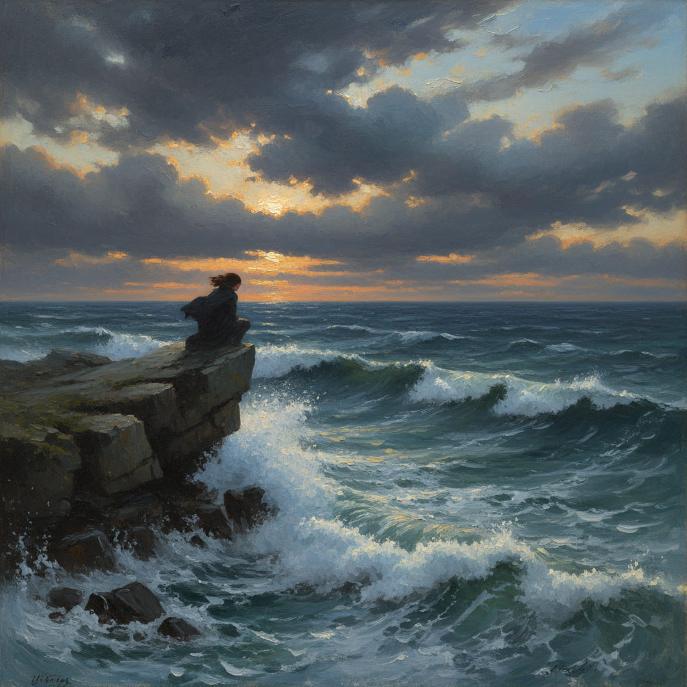

# Romanticism Painting 浪漫主义绘画

> **时期：** 1780年代–1850年代  
> **关键词：** 情感至上、崇高自然、个人主义、革命精神、想象力

## 概述

Romanticism Painting（浪漫主义绘画）是18世纪末对启蒙理性和新古典主义秩序的情感反叛——画家们将个人情感、想象力和自然的崇高力量置于理性规则之上。德拉克洛瓦的革命激情、弗里德里希的孤独背影、透纳的暴风雨海洋——浪漫主义相信感受比规则更真实，自然比文明更伟大，个人比集体更重要。

## 风格特征

- **情感爆发**：强烈的色彩和动态构图
- **崇高自然**：暴风雨、山峰、废墟的压倒性力量
- **戏剧光线**：极端的明暗对比
- **异域题材**：东方、中世纪、神话
- **个人视角**：艺术家的主观感受优先

## 代表人物与作品

- 欧仁·德拉克洛瓦《自由引导人民》
- 卡斯帕·大卫·弗里德里希《雾海上的旅人》
- J.M.W.透纳 暴风雨海景
- 弗朗西斯科·戈雅《1808年5月3日》

## 概念图

