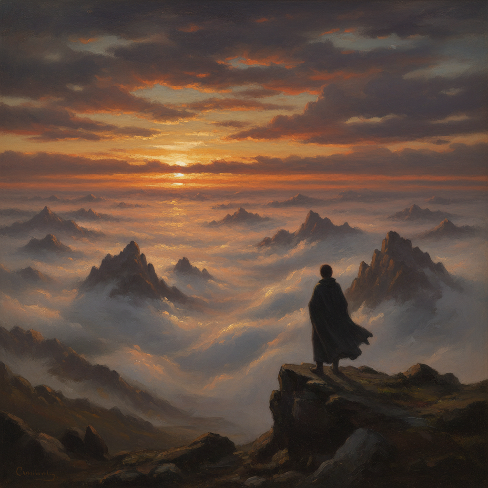

# Romanticism 浪漫主义



> **"理性太冷了——让情感、自然、崇高和想象力重新统治艺术。"**

## 概述

| 维度 | 描述 |
|------|------|
| 时期 | 1780–1850/影响至今 |
| 别名 | Romanticism, Romantic Art, 浪漫主义 |
| 核心色彩 | 戏剧性自然色——暴风雨灰、日落金红、深海蓝、森林绿 |
| 关键元素 | 崇高自然、强烈情感、个人主义、异国情调、想象力 |
| 代表人物 | Caspar David Friedrich, J.M.W. Turner, Eugène Delacroix, Francisco Goya |
| 关联风格 | Baroque, Pre-Raphaelite, Expressionism, Gothic, Sublime |

---

## 历史脉络

| 年份 | 事件 |
|------|------|
| 1780s | 对启蒙运动理性主义的反动 |
| 1818 | Friedrich《雾海上的旅人》——浪漫主义图标 |
| 1819 | Géricault《梅杜萨之筏》——情感的力量 |
| 1830 | Delacroix《自由引导人民》 |
| 1840s | Turner 的光与暴风雨——走向抽象 |
| 1850s | 写实主义取代浪漫主义 |
| 2020s | "Sublime"美学在摄影和设计中复兴 |

### 核心哲学

浪漫主义的精神是**"感受比思考更真实——自然比城市更伟大"**：
- 崇高 = 敬畏（"站在暴风雨面前——感受人的渺小"）
- 情感 = 真理（"理性是冷的——情感才是活的"）
- 自然 = 神圣（"自然不是资源——是灵魂的镜子"）
- 个人 = 英雄（"天才、孤独者、反叛者——浪漫主义的主角"）
- Friedrich: "艺术家应该画他内心看到的——不只是眼前看到的"

---

## 视觉语法

### 色彩系统

```
主色：
  暴风雨灰 (#4A4A4A) — 崇高、恐惧
  日落金红 (#FF6347) — 激情、壮丽
  深海蓝 (#000080) — 无限、神秘
  森林绿 (#006400) — 自然、生命

辅色：
  闪电白 (#FFFFFF) — 力量、启示
  血红 (#8B0000) — 革命、牺牲
  月光银 (#C0C0C0) — 神秘、夜晚

规则：
  - 戏剧性光线（暴风雨、日落、月光）
  - 自然色彩但极端化
  - 对比强烈（光与暗）
  - 色彩 = 情绪

质感：
  厚涂 — Turner的光
  精细 — Friedrich的细节
  动态 — Delacroix的笔触
  氛围 — 雾、云、水汽
```

### 标志性元素

| 类别 | 元素 |
|------|------|
| 自然 | 暴风雨、山脉、大海、废墟、森林 |
| 情感 | 崇高、恐惧、狂喜、忧郁、孤独 |
| 人物 | 孤独旅人、英雄、反叛者、天才 |
| 题材 | 自然、革命、死亡、异国、中世纪 |
| 光线 | 戏剧性、日落、暴风雨、月光 |
| 态度 | 情感、崇高、个人、反叛、想象 |

---

## 与千禧怀旧的关系

### "Sublime"美学的当代复兴
- Friedrich《雾海上的旅人》= 最被引用的"孤独"图像
- 自然摄影中的"崇高"美学
- "在气候危机时代——浪漫主义对自然的敬畏更有意义"
- 冥想/正念文化 = 浪漫主义"回归自然"的当代版本

### 对流行文化的影响
- 浪漫主义 → 哥特小说 → 恐怖电影
- → 英雄叙事 → 超级英雄
- → "天才艺术家"的神话
- "每一个'孤独天才'的故事——都是浪漫主义的后代"

---

## 中国语境

- 中国浪漫主义文学传统（屈原、李白）
- 中国山水画与浪漫主义的对话
- 中国当代摄影中的"崇高"美学
- 中国风景旅游中的浪漫主义视角

---

## 设计应用

| 场景 | 应用方式 |
|------|----------|
| 摄影 | 自然+崇高+戏剧光线+孤独 |
| 品牌 | 自然+情感+深度+力量+探险 |
| 游戏 | 世界观+氛围+自然+史诗 |
| 音乐 | 专辑封面+MV+情绪+氛围 |

---

## 相关风格

← [Baroque 巴洛克](baroque.md) | [Impressionism 印象派](impressionism.md) →

↑ [返回千禧怀旧目录](README.md) | [返回总目录](../README.md)
