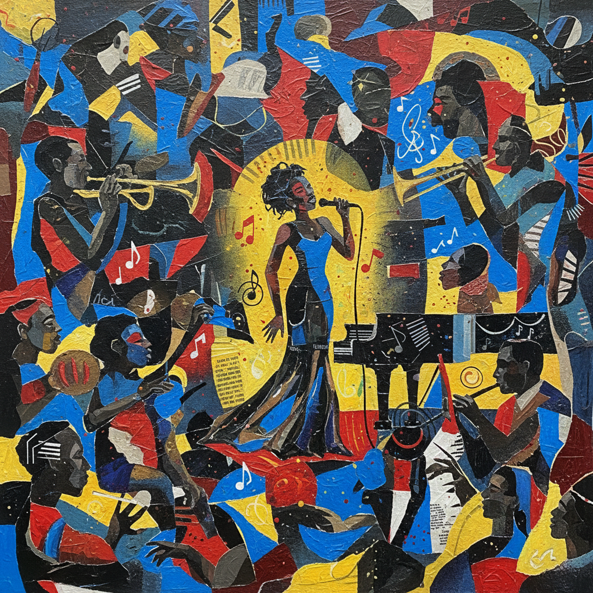

# Romare Bearden 罗马尔·比尔登

> **时期：** 1911–1988  
> **关键词：** 拼贴叙事、哈莱姆文艺复兴、爵士视觉、非裔美国现代主义

## 概述

Romare Bearden 是美国艺术家，以将照片拼贴、绘画和纸张组合为复杂叙事场景的独特方法闻名。他的作品融合了立体主义的碎片化构图、爵士乐的即兴节奏和非裔美国社区的日常生活，创造出20世纪最具辨识度的视觉语言之一。

## 风格特征

- **照片拼贴**：将杂志照片、彩纸和绘画碎片组合为统一场景
- **碎片化空间**：不同尺度和视角的元素并置，如同立体主义的当代延伸
- **爵士结构**：构图具有音乐般的节奏——重复、变奏和即兴
- **社区叙事**：描绘教堂、爵士俱乐部、厨房和街角等非裔美国社区空间
- **色彩对比**：鲜艳的蓝、红、黄与深色调并置，创造视觉活力

## 代表作品

- *The Block*（1971）
- *Prevalence of Ritual*（1964，系列）
- *Pittsburgh Memory*（1964）
- *The Dove*（1964）

## 历史意义

Bearden 将拼贴从达达主义的破坏性工具转化为建设性的叙事媒介，他的作品证明了非裔美国经验可以用最前卫的形式语言来表达，同时保持情感的温度和社区的记忆。

## 概念图

