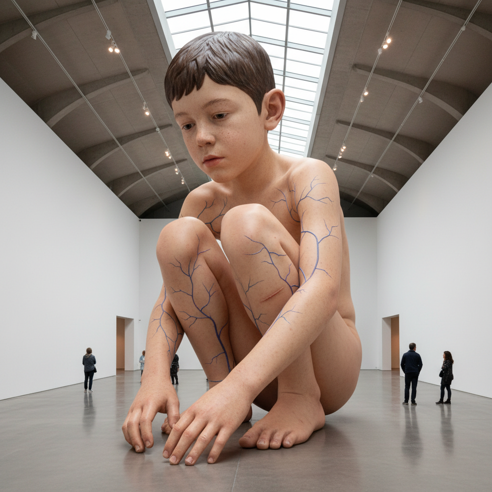

# Ron Mueck 罗恩·穆克

> **时期：** 1958–至今  
> **关键词：** 超写实主义雕塑、尺度变异、硅胶人体、存在主义

## 概述

Ron Mueck 是澳大利亚裔英国雕塑家，以极度逼真但尺度异常的人体雕塑闻名。他的人物要么被放大到巨人尺度，要么被缩小到玩偶大小，这种尺度的错位迫使观者重新审视人体的脆弱性和存在的荒诞。

## 风格特征

- **尺度变异**：人物被放大或缩小，打破正常比例的舒适感
- **极度逼真**：硅胶皮肤、植入毛发、手绘血管等超越真实的细节
- **存在主义主题**：出生、衰老、孤独、死亡等人类基本处境
- **安静姿态**：人物常处于沉思、蜷缩或休息的安静状态

## 代表作品

- *Dead Dad*（1996-1997）
- *Boy*（1999）
- *A Girl*（2006）
- *Mask II*（2001-2002）

## 概念图

