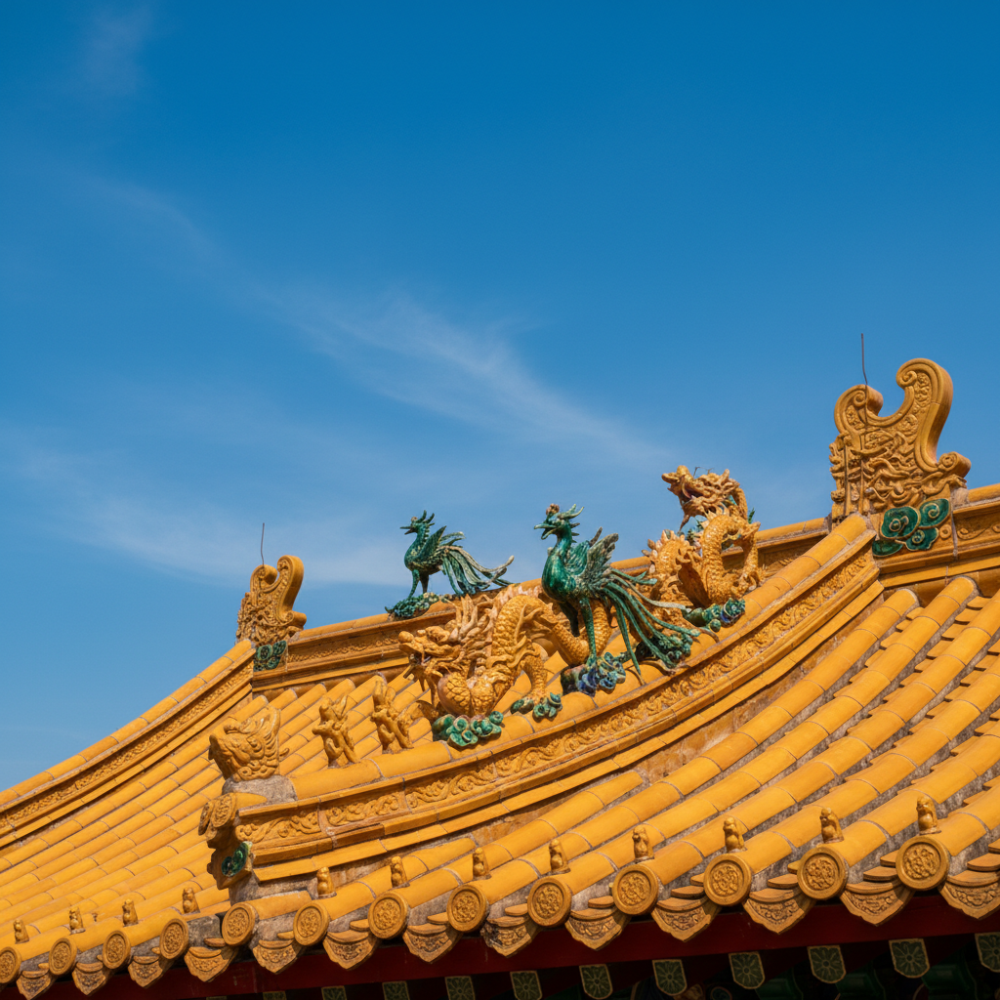

# Roof Tile Art 瓦当艺术

> "Roof tiles are the skin of architecture — clay shaped into overlapping scales that shed rain and snow while giving a building its crown and character, from the simple curve of a Roman imbrex to the glazed dragons of a Chinese palace, each tile a small sculpture multiplied by thousands into a rhythm that defines the skyline, the most visible yet least noticed of all ceramic arts." — Unknown

## 概述

瓦当艺术（Roof Tile Art）是一种将陶瓷材料用于建筑屋顶装饰和防护的艺术形式。瓦当是中国传统建筑中覆盖在屋檐前端的圆形或半圆形装饰性瓦片，广义上包括各种文化中的装饰性屋顶陶瓷构件。瓦当艺术将建筑功能与装饰美学完美结合——既保护建筑免受风雨侵蚀，又以其精美的图案和造型为建筑增添艺术魅力。

瓦当艺术的核心要素包括：1）建筑功能——保护屋顶防水排水；2）装饰美学——精美的图案装饰；3）大量重复——单元重复形成韵律；4）文化符号——承载文化象征意义；5）耐久性——经受百年风雨；6）工艺传承——代代相传的制作技艺；7）地域特色——不同地区的独特风格。

## 核心特征

| 特征 | 描述 |
|------|------|
| 建筑功能 | 防水排水保护 |
| 装饰美学 | 精美图案装饰 |
| 重复韵律 | 单元重复的韵律 |
| 文化符号 | 承载文化象征 |
| 极耐久 | 经受百年风雨 |
| 地域特色 | 各地独特风格 |

## 视觉特征

- **圆形图案**：瓦当的圆形装饰面
- **浮雕纹样**：凸起的浮雕图案
- **重复排列**：屋檐上的重复排列
- **琉璃色彩**：琉璃瓦的鲜艳色彩
- **天际线**：屋顶轮廓的天际线
- **脊兽装饰**：屋脊上的动物装饰

## 代表作品

| 作品 | 艺术家/文化 | 年代 | 意义 |
|------|-------------|------|------|
| *秦汉瓦当* | 中国秦汉 | 秦汉 | 瓦当艺术的巅峰 |
| *故宫琉璃瓦* | 中国明清 | 明清 | 琉璃瓦的辉煌 |
| *日本�的瓦* | 日本 | 各时期 | 日本瓦当传统 |
| *罗马瓦* | 罗马 | 古罗马 | 罗马屋瓦传统 |
| *西班牙瓦* | 西班牙 | 各时期 | 地中海瓦传统 |

## 历史时间线

| 时期 | 事件 |
|------|------|
| 西周 | 中国最早的瓦当出现 |
| 秦汉 | 瓦当艺术的鼎盛 |
| 唐宋 | 琉璃瓦的发展 |
| 明清 | 琉璃瓦的辉煌 |
| 当代 | 传统瓦当的保护与传承 |

## 中国语境

瓦当是中国建筑陶瓷中最具代表性的艺术形式之一。中国瓦当的历史可以追溯到西周——最早的瓦当是半圆形的素面瓦。秦汉时期是中国瓦当艺术的巅峰——出现了大量精美的文字瓦当（如"长乐未央"）和图案瓦当（如四神瓦当）。中国的琉璃瓦是瓦当艺术的华丽升级——黄色琉璃瓦是皇家建筑的专用，绿色、蓝色琉璃瓦用于王府和寺庙。故宫的金色琉璃瓦顶是中国建筑陶瓷最壮观的景象之一。中国传统建筑的屋脊装饰——脊兽、鸱吻、走兽等——也是瓦当艺术的重要组成部分。瓦当艺术是中国建筑文化的重要载体——每一片瓦当都记录着一个时代的审美和信仰。

## AI生成概念图

## 与其他风格的关系

- **Architectural Ceramics** → 建筑陶瓷
- **Glazed Tile** → 琉璃瓦
- **Relief Sculpture** → 浮雕
- **Chinese Architecture** → 中国建筑
- **Terracotta** → 赤陶
- **Decorative Arts** → 装饰艺术

---

*浮光艺志 | Chronicle of Artistry*
