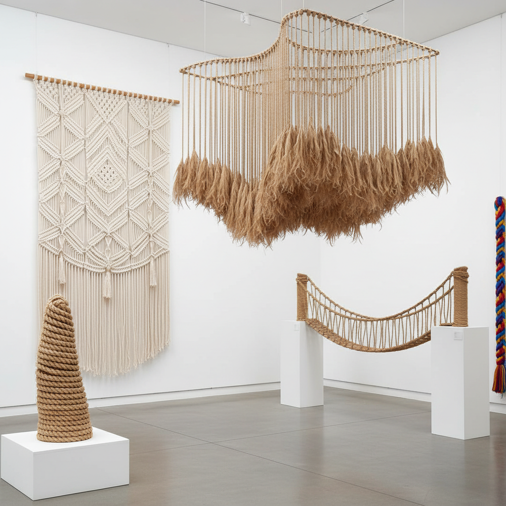

# Rope Art 绳艺术

> "Rope is one of humanity's oldest inventions — twisted fibers that together become stronger than any single strand. When an artist takes rope and coils it, knots it, suspends it, or weaves it into form, they work with a material that carries the memory of ships and mountains, of bridges and wells, of binding and releasing. Rope art transforms the utilitarian into the sublime." — Unknown

## 概述

绳艺术（Rope Art）是以绳索为主要媒介进行艺术创作的实践——利用绳的柔韧性、张力和质感，通过缠绕、悬挂、编织、打结等技法创造雕塑、装置和空间作品。绳艺术探索了线性材料在空间中的无限可能性。

绳艺术的实践包括：1）绳雕塑——用绳索创造的三维造型；2）绳装置——大型绳索空间装置；3）宏观编结（Macramé）——用绳结技法创造的装饰品；4）绳编织——用绳索编织的平面和立体作品；5）悬挂绳艺——利用重力悬挂的绳索造型；6）绳桥和绳网——功能性与艺术性结合的绳结构；7）当代绳艺——将绳索作为当代艺术媒介的实验性创作。

## 核心特征

| 特征 | 描述 |
|------|------|
| 线性 | 线性材料的空间表达 |
| 张力 | 张力和重力的平衡 |
| 柔韧 | 柔韧可变形 |
| 质感 | 丰富的触觉质感 |
| 结构 | 自我支撑的结构 |
| 空间 | 定义和划分空间 |

## 视觉特征

- **线条**：连续的线条感
- **曲线**：重力形成的悬链线
- **纹理**：绳的捻制纹理
- **密度**：疏密变化的视觉效果
- **阴影**：绳索投射的阴影
- **色彩**：天然或染色的色彩

## 代表作品

| 作品 | 艺术家 | 年代 | 意义 |
|------|--------|------|------|
| *Rope installations* | Janaina Mello Landini | 当代 | 绳索分形雕塑 |
| *Macramé revival* | Various | 2010年代 | 宏观编结复兴 |
| *Rope bridges* | Various | 古代至今 | 功能性绳桥 |
| *Fiber sculptures* | Various | 当代 | 纤维雕塑 |
| *Suspended rope* | Various | 当代 | 悬挂绳装置 |

## 历史时间线

| 时期 | 事件 |
|------|------|
| 史前 | 人类最早的绳索制作 |
| 古代 | 绳索在航海和建筑中的应用 |
| 1970年代 | 宏观编结的流行 |
| 2010年代 | 宏观编结的复兴 |
| 当代 | 绳索作为当代艺术媒介 |

## 中国语境

绳艺术在中国有深厚的文化根基。中国古代的"结绳记事"是人类最早的信息记录方式之一。中国传统的绳索工艺极其丰富——从航海用的缆绳到建筑用的麻绳，从中国结的装饰绳到戏曲中的水袖绳技。中国当代的一些艺术家将绳索作为创作媒介——用绳索创造大型装置、将绳索与中国传统美学结合、以及用绳索探索空间和张力的关系。中国的宏观编结（Macramé）在近年来也经历了复兴——许多年轻人将其作为手工爱好。中国传统建筑中的绳索应用——如吊桥、井绳、纤绳——也为绳艺术提供了丰富的文化参照。

## AI生成概念图

## 与其他风格的关系

- **Knot Art** → 绳结艺术
- **Fiber Art** → 纤维艺术
- **Installation Art** → 装置艺术
- **Macramé** → 宏观编结
- **Textile Art** → 纺织艺术
- **Sculpture** → 雕塑

---

*浮光艺志 | Chronicle of Artistry*
