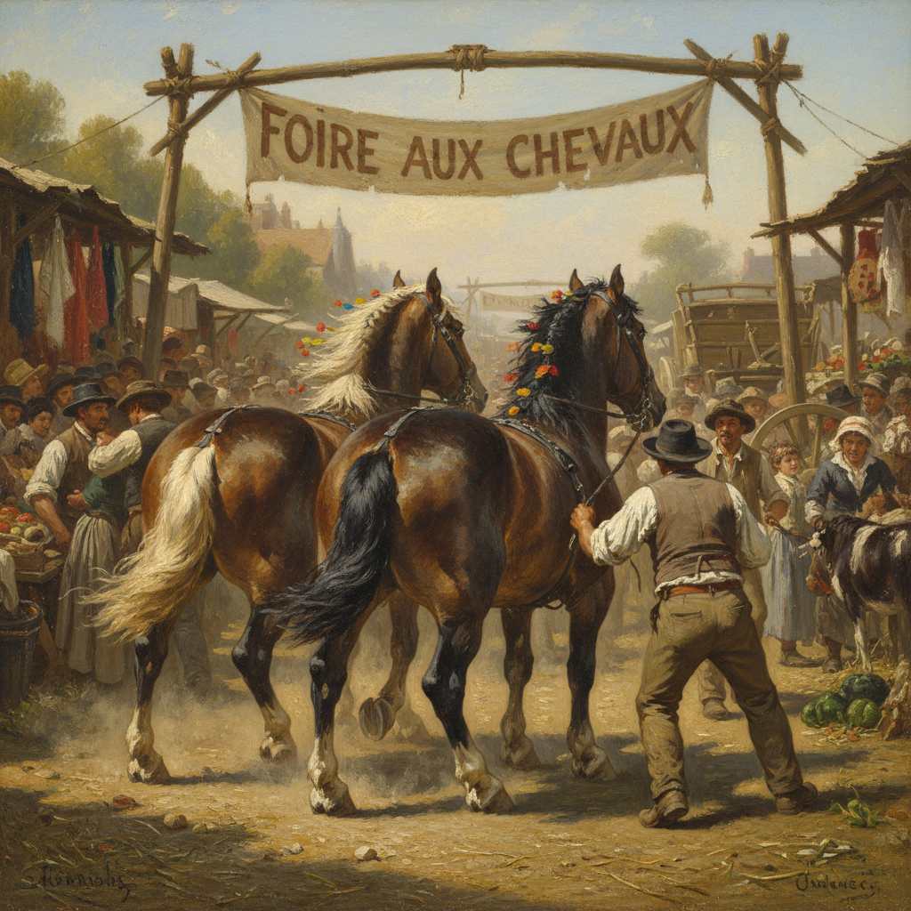

# Rosa Bonheur 罗莎·博纳尔

> "I have no patience for women who ask permission to think." — Rosa Bonheur

## 概述

罗莎·博纳尔（Rosa Bonheur，1822–1899）是法国画家和雕塑家，19世纪最著名的女性艺术家。她以精确而充满力量的动物画闻名——尤其是马匹、牛群和野生动物，用写实主义的精确和浪漫主义的能量捕捉动物的肌肉、运动和生命力。

## 核心特征

| 特征 | 描述 |
|------|------|
| 动物力量 | 马匹和牛群的肌肉运动 |
| 写实精确 | 解剖学知识的精准应用 |
| 动态构图 | 奔跑、拉车的运动瞬间 |
| 户外写生 | 在马市和农场的直接观察 |
| 巨幅画作 | 与历史画同等的尺幅 |
| 女性先驱 | 打破性别壁垒的艺术家 |

## 代表作品

| 作品 | 年代 | 意义 |
|------|------|------|
| *The Horse Fair* | 1852–55 | 动物画的史诗巨作 |
| *Ploughing in the Nivernais* | 1849 | 农耕的力量与诗意 |
| *The King of the Forest* | 1878 | 雄鹿的威严 |
| *Buffalo Bill* | 1889 | 美国西部的野性 |

## AI生成概念图

## 与其他风格的关系

- **Realism** → 法国写实主义的动物画分支
- **Stubbs** → 继承英国动物画传统
- **Barbizon** → 与巴比松画派共享自然主题
- **Courbet** → 同代写实主义画家
