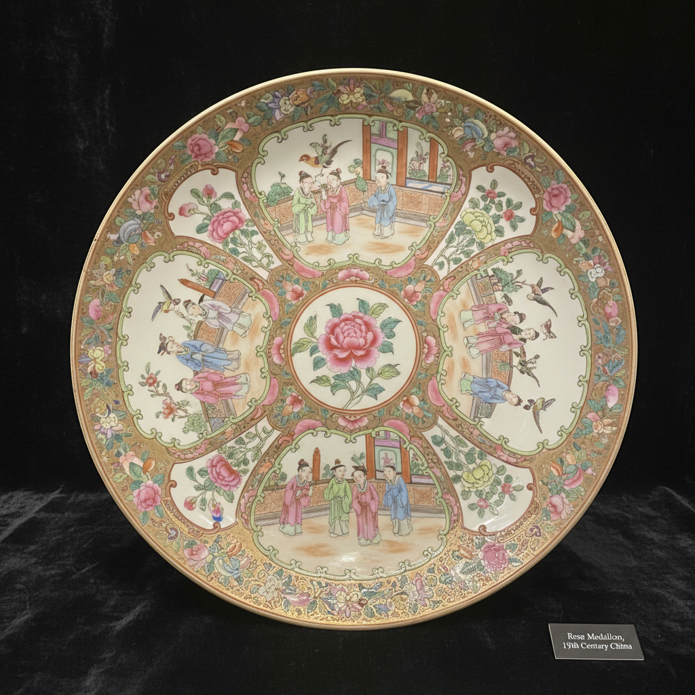

# Rose Medallion Art 玫瑰勋章瓷艺术

> "Rose Medallion is Canton's signature pattern — four panels alternating figures and flowers around a central peony medallion, all in the characteristic palette of rose pink, green, and gold that made Chinese export porcelain instantly recognizable on Western dinner tables, a pattern so popular it was produced continuously for over a century and remains collected today." — Unknown

## 概述

玫瑰勋章瓷艺术（Rose Medallion Art）是19世纪中国广州生产的一种经典外销瓷装饰风格。玫瑰勋章瓷以其标志性的四开光构图著称——器面被分为四个扇形开光区域，交替绘有人物场景和花鸟图案，中心为一个牡丹花圆形勋章。玫瑰勋章瓷是广彩瓷器中最具辨识度的品类——其标准化的构图和色彩方案使其成为中国外销瓷的代名词。

玫瑰勋章瓷艺术的核心要素包括：1）四开光构图——四个交替的开光区域；2）中心勋章——中心的圆形花卉勋章；3）人物花鸟——人物与花鸟交替出现；4）粉红绿金——标志性的色彩组合；5）标准化图案——高度标准化的装饰；6）广州生产——在广州彩绘加工；7）西方市场——主要面向西方市场。

## 核心特征

| 特征 | 描述 |
|------|------|
| 四开光构图 | 四个交替开光区域 |
| 中心勋章 | 中心圆形花卉勋章 |
| 人物花鸟 | 人物与花鸟交替 |
| 粉红绿金 | 标志性色彩组合 |
| 标准化图案 | 高度标准化装饰 |
| 西方市场 | 面向西方市场 |

## 视觉特征

- **四分构图**：四个扇形开光区域
- **中心圆章**：中心的牡丹圆章
- **人物场景**：庭院中的人物活动
- **花鸟图案**：牡丹、蝴蝶、鸟类
- **粉红基调**：以粉红色为主调
- **金色边饰**：金色的分隔线和边饰

## 代表作品

| 作品 | 艺术家/文化 | 年代 | 意义 |
|------|-------------|------|------|
| *玫瑰勋章大盘* | 广州 | 19世纪 | 经典大盘 |
| *玫瑰勋章花瓶* | 广州 | 19世纪 | 装饰花瓶 |
| *玫瑰勋章茶具* | 广州 | 19世纪 | 成套茶具 |
| *玫瑰勋章餐具* | 广州 | 19世纪 | 成套餐具 |
| *玫瑰勋章灯座* | 广州 | 19世纪 | 装饰灯具 |

## 历史时间线

| 时期 | 事件 |
|------|------|
| 1800年代 | 玫瑰勋章风格的形成 |
| 1820-1860年 | 玫瑰勋章瓷的鼎盛期 |
| 19世纪末 | 生产的持续但品质下降 |
| 20世纪 | 仿制品的大量出现 |
| 当代 | 成为收藏热门品类 |

## 中国语境

玫瑰勋章瓷是中国广彩瓷器中最成功的商业品类之一。它的标准化设计使得大规模生产成为可能——广州的彩绘作坊可以高效地批量生产这种图案。玫瑰勋章瓷的命名来自西方收藏界——中国传统上并没有这个专门的名称，它属于广彩的一个子类。玫瑰勋章瓷在19世纪的美国特别受欢迎——许多美国家庭都拥有这种瓷器，它成为了中产阶级家庭的标配。玫瑰勋章瓷的"Rose"指的是其标志性的粉红色调——这种粉红色来自胭脂红（金红）颜料。今天，玫瑰勋章瓷是西方古董市场上最常见的中国外销瓷品类之一——从几十美元到数千美元不等，取决于年代、品质和稀有程度。

## AI生成概念图

## 与其他风格的关系

- **Canton Ware** → 广彩
- **Famille Rose** → 粉彩
- **Export Porcelain** → 外销瓷
- **Rose Canton** → 玫瑰广彩
- **Mandarin Pattern** → 官人图案
- **Overglaze Enamel** → 釉上彩

---

*浮光艺志 | Chronicle of Artistry*
