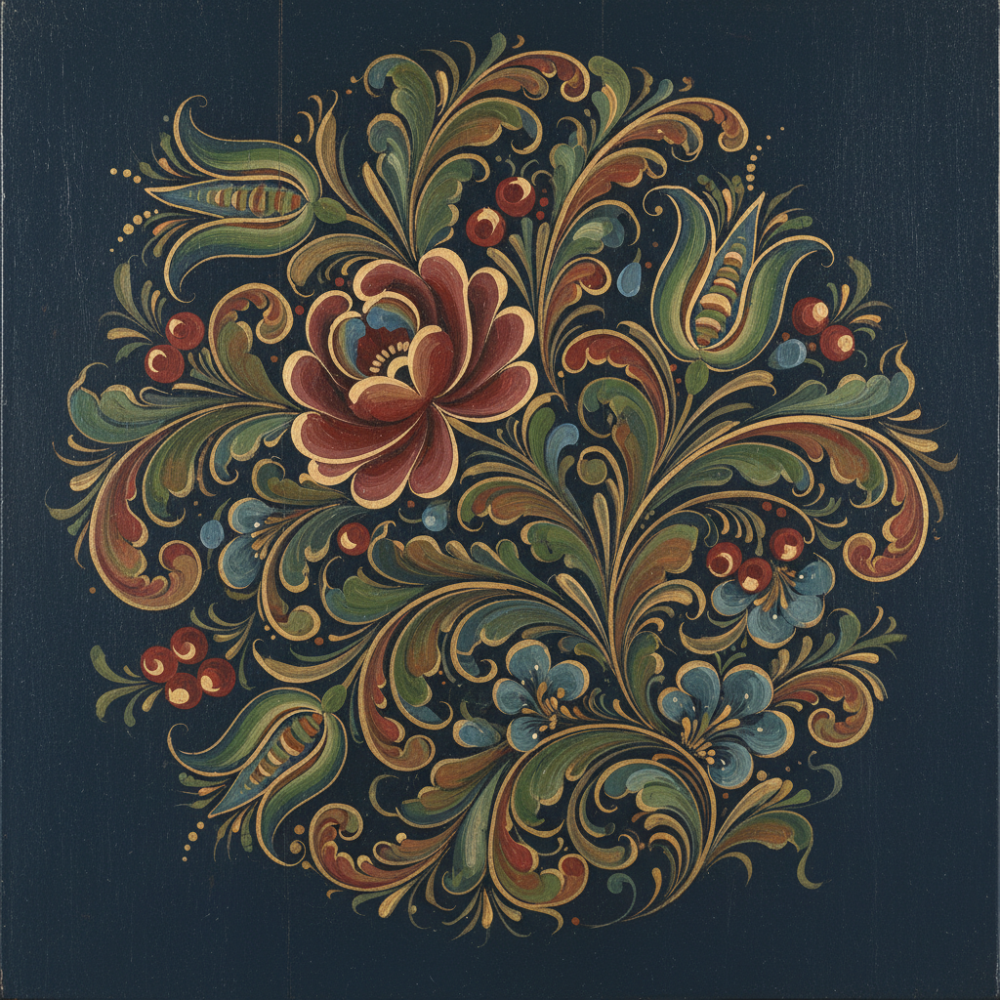

# Rosemaling 挪威玫瑰彩绘 | Rosemaling / Rosemåling

> **"峡湾里的花园——挪威农民在黑暗的冬天用卷曲的花藤把木屋变成春天。"**

## 概述

Rosemaling（挪威玫瑰彩绘 / Rosemåling）是挪威的传统装饰绘画艺术，用流动的卷曲线条（C形和S形曲线）绘制花卉、藤蔓和叶片图案，装饰在木制家具、器皿、墙壁和天花板上。"Rosemaling"意为"玫瑰绘画"或"装饰绘画"。这种艺术在18-19世纪的挪威农村达到鼎盛，每个山谷（dal）发展出独特的地区风格。Rosemaling随挪威移民传入美国中西部，至今仍是挪威裔美国人的重要文化传统。

## 主要地区风格

| 地区 | 特征 |
|------|------|
| Telemark | 最华丽，不对称，流动 |
| Hallingdal | 对称，大花，厚重 |
| Rogaland | 几何化，规整 |
| Valdres | 精细，小花 |
| Os | 简洁，蓝色调 |

## 核心特征

- **C形S形曲线**：流动的卷曲线条
- **花卉藤蔓**：玫瑰、郁金香、卷叶
- **木器装饰**：家具、箱子、碗、勺
- **深色底色**：通常在深蓝或深红底上
- **层次感**：从底色到亮色的层次
- **地区差异**：每个山谷有独特风格

## 视觉特征

- 流动的卷曲花藤
- 深色底上的鲜艳花卉
- C形和S形的节奏感
- 不对称的动态平衡
- 丰富的色彩层次
- 木器表面的温暖质感

## 与其他风格的关系

| 风格 | 关系 |
|------|------|
| Bauernmalerei | 共享欧洲农民彩绘 |
| Zhostovo俄罗斯托盘画 | 共享花卉装饰传统 |
| Art Nouveau | 共享曲线美学 |
| Fileteado | 共享卷曲装饰线条 |
| 当代装饰艺术 | Rosemaling的现代应用 |

## 概念图

---

*浮光艺志 | Chronicle of Artistry*
