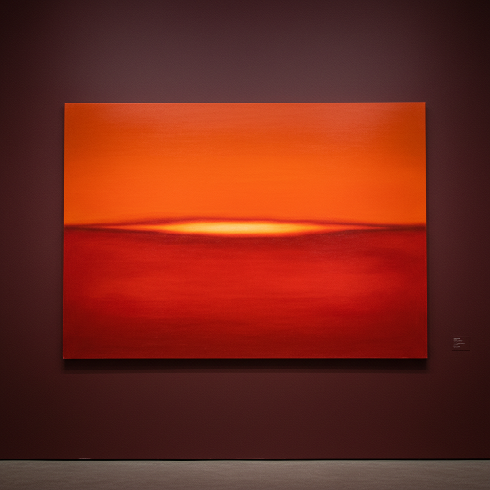

# Mark Rothko 罗斯科

> "I'm not an abstractionist. I'm not interested in the relationship of color or form or anything else." — Mark Rothko

## 概述

马克·罗斯科（Mark Rothko，1903–1970）是美国抽象表现主义的核心人物，以巨大的、模糊边缘的色块绘画闻名。他的作品追求的不是形式美，而是直接触动人类最深层的情感——悲剧、狂喜、命运。

罗斯科坚持认为他的画不是关于色彩的，而是关于人类的基本情感。他要求观者站在画前18英寸处，让巨大的色块包围并吞没你。

## 核心特征

| 特征 | 描述 |
|------|------|
| 色块构图 | 两到三个水平色块堆叠 |
| 模糊边缘 | 色块边缘柔和渗透——无硬边 |
| 巨大尺幅 | 画面大到包围观者 |
| 情感深度 | 追求悲剧性的情感共鸣 |
| 发光感 | 多层薄涂产生的内在光芒 |
| 沉思性 | 要求安静的、冥想式的观看 |

## 视觉特征

- **构图**：两到三个水平矩形色块
- **边缘**：柔和的、呼吸般的模糊边界
- **色彩**：深红、橙、黑、紫——晚期越来越暗
- **表面**：多层薄涂的半透明效果
- **尺度**：巨大的——高度超过人的身高
- **光感**：色彩从内部发光的效果

## 代表作品

| 作品 | 年代 | 意义 |
|------|------|------|
| *No. 61 (Rust and Blue)* | 1953 | 经典的双色块 |
| *Orange, Red, Yellow* | 1961 | 最贵的罗斯科 |
| *Rothko Chapel* 壁画 | 1964–67 | 精神性的终极表达 |
| *Black in Deep Red* | 1957 | 暗色调的力量 |
| *Untitled (Black on Grey)* | 1970 | 最后的作品——死亡前的黑暗 |

## 真实作品（公共领域）

| 作品 | 来源 |
|------|------|
| *No. 61 (Rust and Blue)* | [MoCA](https://www.moca.org/) |
| Rothko Chapel | [Rothko Chapel](https://www.rothkochapel.org/) |
| *Untitled, 1949* | [National Gallery](https://www.nga.gov/collection/art-object-page.56762.html) |

> ⚠️ 本条目优先使用真实作品。

## AI生成概念图

## 与其他风格的关系

- **Abstract Expressionism** → 抽象表现主义的核心
- **Color Field Painting** → 色域绘画的定义者
- **Minimalism** → 极简主义的精神先驱
- **Sublime** → 浪漫主义崇高美学的抽象化
