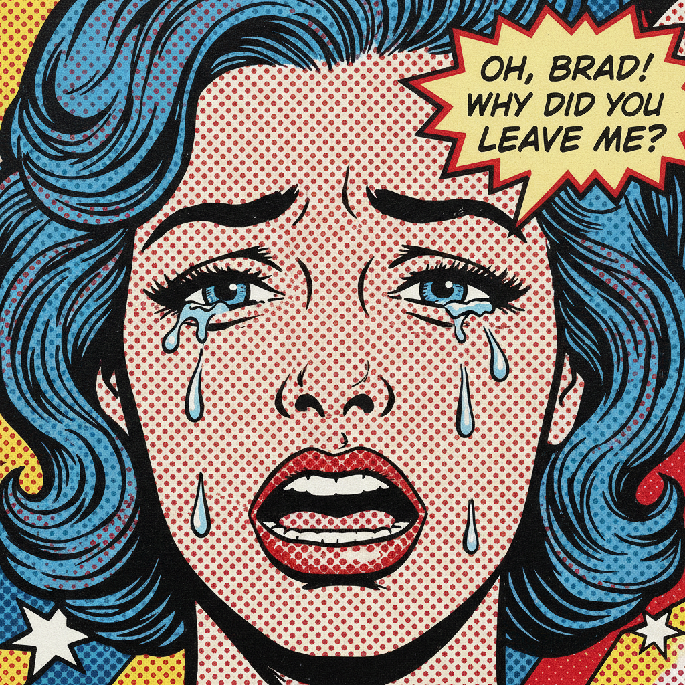

# Roy Lichtenstein 罗伊·利希滕斯坦

> **流派**: 波普艺术  
> **时期**: 1923–1997 美国  
> **关键词**: 本戴点、漫画风格、商业图像、反讽挪用

## 概述

罗伊·利希滕斯坦是波普艺术运动的核心人物。他将廉价漫画书中的单格画面放大为巨幅油画，保留了印刷品特有的本戴点(Ben-Day dots)、粗黑轮廓线和有限的原色。这种将"低俗"商业图像提升为"高雅"美术馆作品的策略，既是对艺术等级制度的嘲讽，也是对大众视觉文化的致敬。

## 视觉特征

- **本戴点**: 规则排列的圆点模拟印刷半调效果
- **粗黑轮廓**: 漫画式的强烈黑色边线
- **原色限制**: 主要使用红、黄、蓝加黑白
- **漫画对话框**: 保留漫画中的文字气泡
- **平面化处理**: 消除笔触，追求机械复制感

## 代表作品

- 《哇！》(Whaam!, 1963)
- 《溺水女孩》(Drowning Girl, 1963)
- 《看，米奇》(Look Mickey, 1961)
- 《在车中》(In the Car, 1963)
- 《笔触》(Brushstroke) 系列

## 历史影响

利希滕斯坦证明了漫画和商业图像可以成为严肃艺术的素材。他的本戴点技法成为波普艺术最具辨识度的视觉标志，影响了后来的图像挪用艺术、街头艺术和数字艺术。

## 相关风格

- [Pop Art 波普艺术](pop-art.md)
- [Andy Warhol 安迪·沃霍尔](andy-warhol.md)
- [Comic Art 漫画艺术](comic-art.md)
