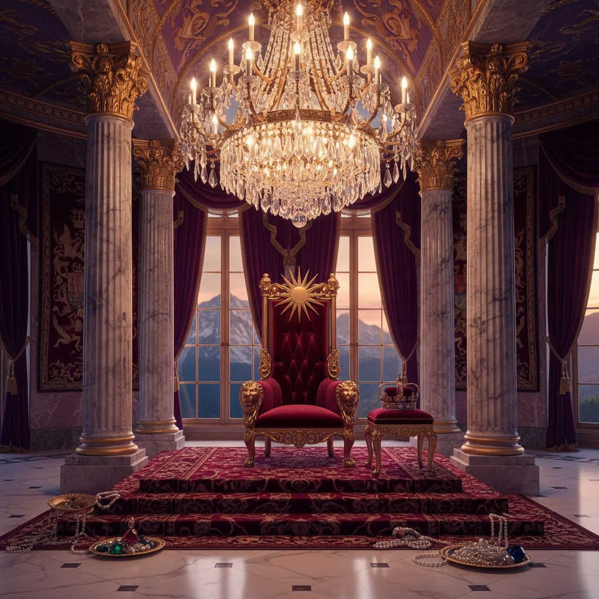

# Royalcore 皇室核



> **"天鹅绒王座、金色王冠、宫殿走廊——每个人都值得像皇室一样生活。"**

## 概述

| 维度 | 描述 |
|------|------|
| 时期 | 2020–至今 |
| 别名 | Royalcore, Royal Aesthetic, Palace Core |
| 核心色彩 | 深红、金色、深紫、宝蓝、象牙白 |
| 关键元素 | 天鹅绒、王冠、宫殿、烛台、纹章、宝石 |
| 代表人物 | 《The Crown》、凡尔赛宫、Marie Antoinette |
| 关联风格 | Regencycore, Dark Academia, Baroque, Maximalism |

---

## 历史脉络

### 从历史剧到 TikTok

| 年份 | 事件 |
|------|------|
| 2016 | Netflix《The Crown》开播 |
| 2020 | TikTok 上 Royalcore 标签兴起 |
| 2020 | 疫情期间的"逃避主义"需求 |
| 2021 | 与 Dark Academia、Regencycore 并行发展 |
| 2022–至今 | 时尚、家居、摄影领域扩展 |

### 它满足什么需求？

| 需求 | Royalcore 的回应 |
|------|-----------------|
| 逃避现实 | 宫殿比公寓好 |
| 权力幻想 | "我值得被像皇室一样对待" |
| 美学享受 | 巴洛克的极致美 |
| 仪式感 | 日常生活也可以"加冕" |
| 历史浪漫 | 过去比现在更美 |

### 核心哲学

Royalcore 的精神是**"奢华不是罪过——是对生活的尊重"**：
- 每个人都值得美丽的事物
- 仪式感让日常变得特别
- 历史的美不应该被遗忘
- 装饰是人类的本能
- "像皇室一样生活"是一种心态

---

## 视觉语法

### 色彩系统

```
主色：
  深红 (#8B0000) — 权力、天鹅绒
  金色 (#FFD700) — 王冠、装饰
  深紫 (#4B0082) — 皇室、神秘
  宝蓝 (#0000CD) — 贵族、忠诚
  象牙白 (#FFFFF0) — 大理石、蕾丝

辅色：
  翡翠绿 (#50C878) — 宝石
  玫瑰金 (#B76E79) — 柔和奢华
  黑色 (#000000) — 戏剧

规则：
  - 深色为主
  - 金色作为装饰
  - 高对比度
  - 宝石色调
  - 奢华感

质感：
  天鹅绒 — 王座、窗帘
  丝绸 — 礼服、床品
  大理石 — 地板、柱子
  金属 — 金色、铜色
  水晶 — 吊灯、珠宝
```

### 标志性元素

| 类别 | 元素 |
|------|------|
| 建筑 | 宫殿、城堡、大理石柱、穹顶 |
| 家具 | 王座、四柱床、镀金镜 |
| 配饰 | 王冠、宝石、纹章、权杖 |
| 纺织 | 天鹅绒、丝绸、锦缎、流苏 |
| 照明 | 水晶吊灯、烛台、壁灯 |
| 符号 | 狮子、鹰、百合花、纹章 |

---

## 与千禧怀旧的关系

### 对"平等主义"的浪漫反叛
- 现代社会强调"平等"和"普通"
- 但人们内心渴望"特别"和"被尊重"
- Royalcore = "我值得被像皇室一样对待"
- 这不是真的想当国王——是想要那种"被重视"的感觉

### 与 Dark Academia 的交叉
- 两者都热爱历史和传统
- Dark Academia = 学者的贵族
- Royalcore = 真正的贵族
- 共同点：深色调、古老建筑、仪式感

---

## 中国语境

- "皇室核"/"宫廷风"在小红书的讨论
- 与"中国宫廷风"的交叉（故宫、汉服）
- 中国版 Royalcore：龙袍、凤冠、紫禁城
- 古装剧（《甄嬛传》《如懿传》）的视觉影响
- 婚纱/礼服设计中的宫廷元素

---

## 设计应用

| 场景 | 应用方式 |
|------|----------|
| 空间 | 天鹅绒+金色+水晶灯+深色墙面 |
| 时尚 | 天鹅绒+宝石+王冠配饰+深色 |
| 品牌 | 金色+纹章+衬线字体+深色背景 |
| 活动 | 宫殿主题+烛光+红毯+仪式感 |

---

## 相关风格

← [Regencycore 摄政核](regencycore.md) | [Dark Academia 暗黑学院](dark-academia.md) →

↑ [返回千禧怀旧目录](README.md) | [返回总目录](../README.md)
