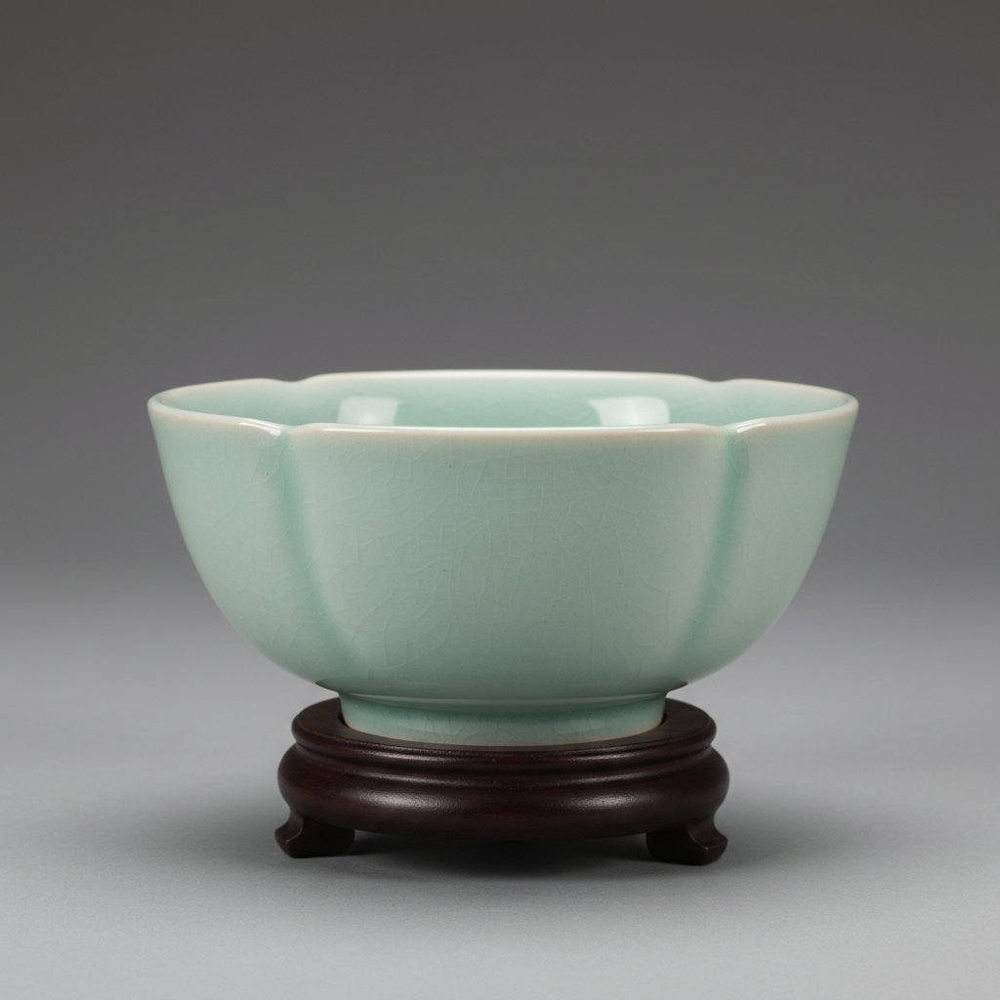

# Ru Ware Art 汝窑艺术

> "Ru ware is the rarest of the rare — fewer than a hundred pieces survive from a kiln that operated for perhaps twenty years, each one glazed in a color the Chinese describe as 'the blue of the sky after rain,' a pale blue-green so subtle it seems to exist at the threshold of color itself, the most coveted of all Chinese ceramics, where scarcity and perfection meet in a glaze that looks like solidified air." — Unknown

## 概述

汝窑艺术（Ru Ware Art）是中国宋代五大名窑之首，被誉为中国陶瓷艺术的最高成就。汝窑位于今河南省宝丰县清凉寺，烧造时间极短（约1086-1106年），存世仅约90件，是中国陶瓷中最珍贵稀有的品种。汝窑以其独特的"天青色"釉色著称——一种介于蓝色和绿色之间的极淡色调，如同"雨过天晴云破处"的天空颜色。

汝窑艺术的核心要素包括：1）天青釉色——"雨过天晴"的天青色；2）极度稀有——存世仅约90件；3）玛瑙入釉——传说以玛瑙为釉料；4）满釉支烧——底部满釉芝麻钉支烧；5）含蓄之美——极致含蓄的美学；6）皇家御用——北宋宫廷专用；7）至高地位——中国陶瓷的最高成就。

## 核心特征

| 特征 | 描述 |
|------|------|
| 天青釉色 | 雨过天晴的天青色 |
| 极度稀有 | 存世仅约90件 |
| 玛瑙入釉 | 传说玛瑙为釉料 |
| 满釉支烧 | 芝麻钉支烧痕 |
| 含蓄之美 | 极致含蓄的美学 |
| 皇家御用 | 北宋宫廷专用 |

## 视觉特征

- **天青色**：极淡的蓝绿色调
- **温润如玉**：如玉般温润的质感
- **细密开片**：细密的冰裂纹开片
- **芝麻钉**：底部细小的支烧痕
- **含蓄内敛**：不张扬的含蓄美
- **如凝脂**：如凝固的脂肪般温润

## 代表作品

| 作品 | 艺术家/文化 | 年代 | 意义 |
|------|-------------|------|------|
| *汝窑天青釉洗* | 北宋汝窑 | 北宋 | 汝窑的经典 |
| *汝窑莲花碗* | 北宋汝窑 | 北宋 | 造型的典范 |
| *汝窑三足奁* | 北宋汝窑 | 北宋 | 精致的文房器 |
| *汝窑水仙盆* | 北宋汝窑 | 北宋 | 台北故宫藏品 |
| *汝窑纸槌瓶* | 北宋汝窑 | 北宋 | 优雅的器形 |

## 历史时间线

| 时期 | 事件 |
|------|------|
| 约1086年 | 汝窑开始为宫廷烧造 |
| 约1106年 | 汝窑因战乱停烧 |
| 南宋 | 汝窑已被视为珍品 |
| 明清 | 大量仿汝釉的生产 |
| 1987年 | 清凉寺汝窑遗址发现 |

## 中国语境

汝窑是中国陶瓷艺术的至高象征——"汝窑为魁"是中国陶瓷界的共识。汝窑的天青色被认为源自宋徽宗的一个梦——他梦见雨过天晴的天空颜色，醒来后命窑工烧制这种颜色的瓷器，并批示"雨过天晴云破处，这般颜色做将来"。汝窑的珍贵不仅在于其稀有——更在于其美学的极致。汝窑的天青色代表了中国美学中"淡"的最高境界——不浓不淡、不冷不暖、不张不扬，恰到好处。汝窑在国际拍卖市场上屡创天价——2017年一件汝窑天青釉洗以2.94亿港元成交。汝窑证明了中国陶瓷美学的核心不是华丽的装饰，而是对色彩和质感的极致追求——一种"大道至简"的美学理想。

## AI生成概念图

## 与其他风格的关系

- **Song Dynasty Kilns** → 宋代名窑
- **Celadon** → 青瓷
- **Monochrome Glaze** → 单色釉
- **Imperial Ware** → 御用瓷
- **Chinese Aesthetics** → 中国美学
- **Guan Ware** → 官窑

---

*浮光艺志 | Chronicle of Artistry*
