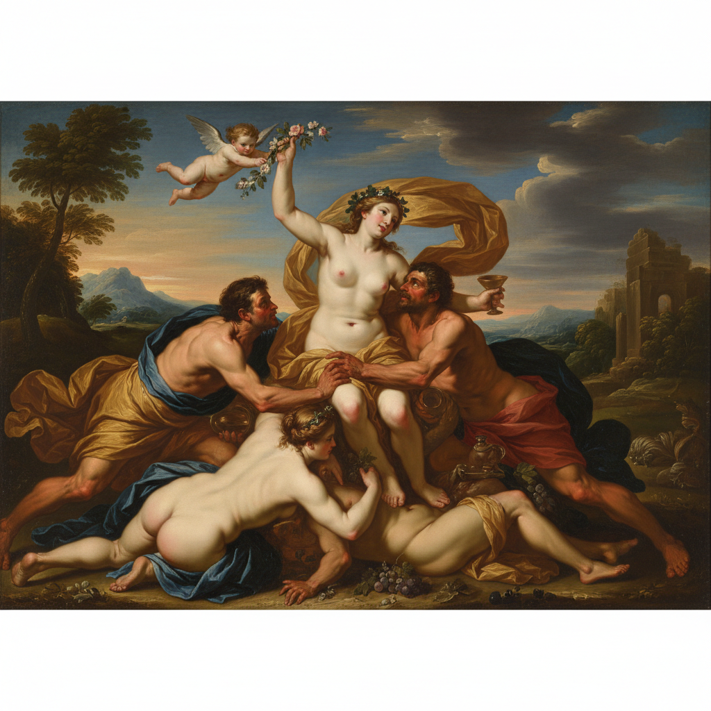

# Peter Paul Rubens 鲁本斯

> "My passion comes from the heavens, not from earthly musings." — Peter Paul Rubens

## 概述

彼得·保罗·鲁本斯（Peter Paul Rubens，1577–1640）是佛兰德斯巴洛克绑画的最伟大代表，也是西方艺术史上最成功的画家之一——外交官、学者、收藏家和拥有大型工作室的企业家。他以充满活力的肉体、戏剧性的构图和华丽的色彩创造了巴洛克绘画的最高标准。

鲁本斯将提香的色彩、米开朗基罗的力量和卡拉瓦乔的戏剧性融为一体，创造了一种充满生命力、运动感和感官愉悦的绘画语言。

## 核心特征

| 特征 | 描述 |
|------|------|
| 生命力 | 充满活力的、丰满的人体 |
| 运动感 | 旋转的、对角线的动态构图 |
| 华丽色彩 | 温暖的、饱满的巴洛克色彩 |
| 肉感 | "鲁本斯式"的丰满女性身体 |
| 大规模 | 巨幅画作和大型装饰项目 |
| 工作室体系 | 高效的工作室协作生产 |

## 视觉特征

- **人体**：丰满的、充满活力的肉体
- **构图**：旋转的对角线和S形曲线
- **色彩**：温暖的金色、深红、翡翠绿
- **光线**：戏剧性的巴洛克光影
- **运动**：一切都在运动——飘动的布料、奔腾的马
- **质感**：丝绸、珍珠、肌肤的极致表现

## 代表作品

| 作品 | 年代 | 意义 |
|------|------|------|
| *The Descent from the Cross* | 1612-14 | 安特卫普大教堂的巴洛克巅峰 |
| *The Garden of Love* | c.1633 | 感官愉悦的极致 |
| *The Massacre of the Innocents* | 1611-12 | 暴力与美的巴洛克结合 |
| *Marie de' Medici cycle* | 1622-25 | 24幅巨型历史画 |
| *Samson and Delilah* | 1609-10 | 戏剧性的叙事 |

## 真实作品（公共领域）

| 作品 | 来源 |
|------|------|
| *The Descent from the Cross* | [Wikimedia](https://commons.wikimedia.org/wiki/File:Descent_from_the_Cross_(Rubens).jpg) |
| *Samson and Delilah* | [National Gallery](https://www.nationalgallery.org.uk/paintings/peter-paul-rubens-samson-and-delilah) |

> ⚠️ 本条目优先使用真实作品。

## AI生成概念图

## 与其他风格的关系

- **Baroque** → 北方巴洛克的最高代表
- **Titian** → 直接继承提香的色彩传统
- **Caravaggio** → 吸收了卡拉瓦乔的戏剧性光影
- **Delacroix** → 德拉克洛瓦深受鲁本斯影响
- **Renoir** → 雷诺阿继承了鲁本斯的肉感美学

---

*浮光艺志 | Chronicle of Artistry*
