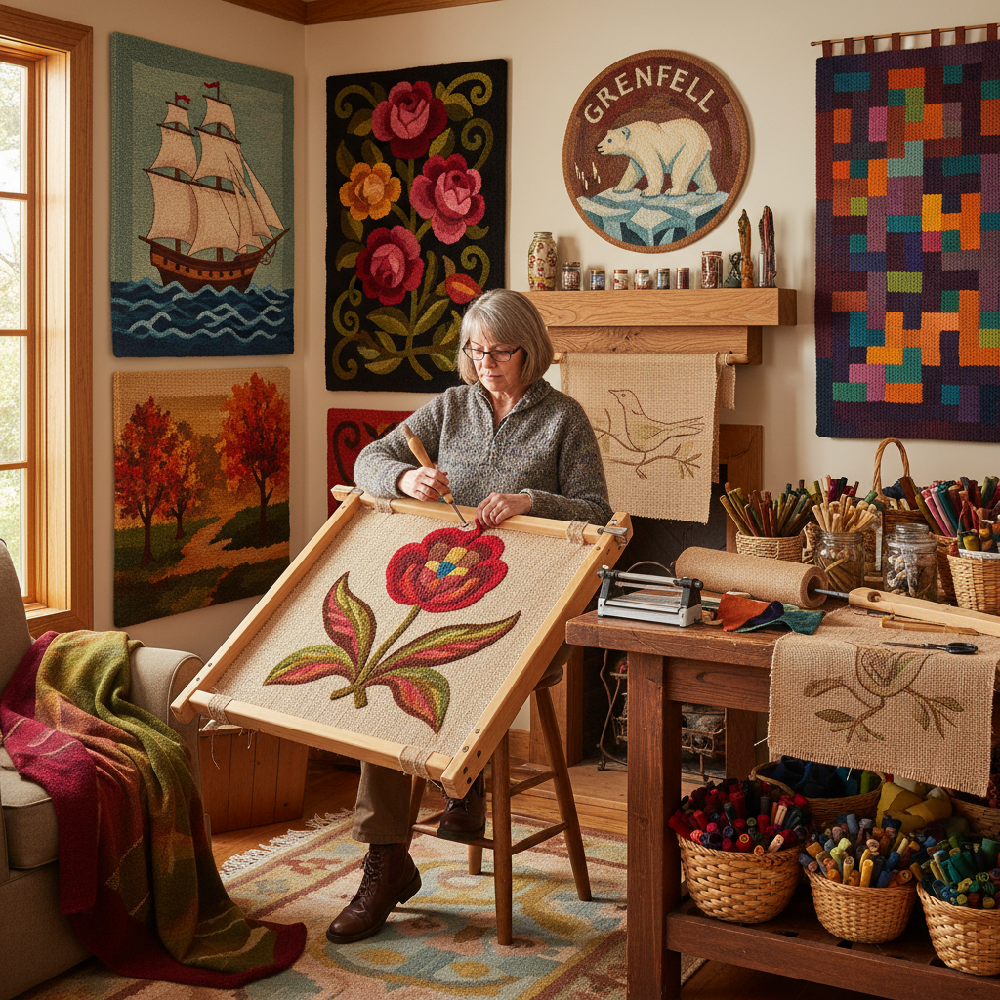

# Rug Hooking Art 钩毯艺术

> "Rug hooking is painting with fabric — strips of wool or cotton pulled through a burlap foundation, loop by loop, building color and texture from recycled cloth. It began as a thrifty craft of the poor, turning worn-out garments into warm floor coverings, but became an art form capable of extraordinary expression — from naive folk scenes to sophisticated abstract compositions, all built from the humble loop." — Unknown

## 概述

钩毯艺术（Rug Hooking Art）是使用钩针将布条或毛线从粗麻布（burlap）底布的背面拉到正面形成环圈，逐行逐列地填充图案的纺织工艺——通过不同颜色布条的排列组合，在粗麻布上创造出如同绘画般的图案效果。钩毯是北美最具代表性的民间工艺之一。

钩毯艺术的实践包括：1）传统钩毯——使用布条的传统钩毯；2）原始钩毯——粗犷风格的宽条钩毯；3）精细钩毯——使用细布条的精细画面；4）抽象钩毯——抽象图案的当代钩毯；5）立体钩毯——带有立体质感的钩毯；6）挂毯钩毯——作为墙面装饰的钩毯；7）当代钩毯——将传统技法与现代艺术结合的创作。

## 核心特征

| 特征 | 描述 |
|------|------|
| 环圈 | 基于环圈的结构 |
| 回收 | 传统上使用回收布料 |
| 色彩 | 丰富的色彩混合 |
| 质感 | 独特的毛绒质感 |
| 民间 | 强烈的民间艺术特色 |
| 叙事 | 叙事性的图案 |

## 视觉特征

- **环圈**：密集的布条环圈
- **质感**：柔软的毛绒质感
- **色彩**：丰富的色彩混合
- **图案**：民间风格的图案
- **纹理**：布条的纹理变化
- **温暖**：温暖的视觉感受

## 代表作品

| 作品 | 艺术家/文化 | 年代 | 意义 |
|------|-------------|------|------|
| *Maritime folk rugs* | 加拿大海洋省 | 19世纪至今 | 加拿大民间钩毯 |
| *Grenfell mats* | 纽芬兰 | 1900s至今 | 格伦费尔钩毯 |
| *Deanne Fitzpatrick* | Deanne Fitzpatrick | 当代 | 当代钩毯艺术 |
| *New England hooked rugs* | 美国新英格兰 | 19世纪至今 | 美国民间钩毯 |
| *Contemporary fiber art rugs* | Various | 当代 | 当代纤维艺术钩毯 |

## 历史时间线

| 时期 | 事件 |
|------|------|
| 1840s | 钩毯在北美的起源 |
| 19世纪后期 | 钩毯的广泛流行 |
| 20世纪初 | 钩毯作为民间艺术被认可 |
| 1960s-70s | 钩毯的工艺复兴 |
| 当代 | 钩毯的当代艺术化 |

## 中国语境

钩毯艺术在中国是一个相对较新的手工艺领域——主要通过网络和手工社区从北美传入。中国传统的地毯制作（如藏毯、新疆地毯）使用的是编织技法而非钩毯技法——但两者在功能和审美上有相似之处。中国当代的手工爱好者中，钩毯（rug hooking）和簇绒（tufting）正在快速流行——各种工作室提供体验课程。中国的一些城市出现了专门的簇绒/钩毯工作室——提供工具、材料和教学。中国的社交媒体上，钩毯和簇绒作品的分享非常活跃——年轻人将其作为一种创意表达和减压方式。中国的一些设计师将中国传统图案（如祥云、锦鲤）融入钩毯设计——创造具有中国特色的钩毯作品。中国的家居装饰市场对手工钩毯有越来越大的需求——作为个性化家居装饰品。

## AI生成概念图

## 与其他风格的关系

- **Tufting** → 簇绒艺术
- **Textile Art** → 纺织艺术
- **Folk Art** → 民间艺术
- **Fiber Art** → 纤维艺术
- **Tapestry** → 挂毯艺术
- **Painting** → 绘画

---

*浮光艺志 | Chronicle of Artistry*
