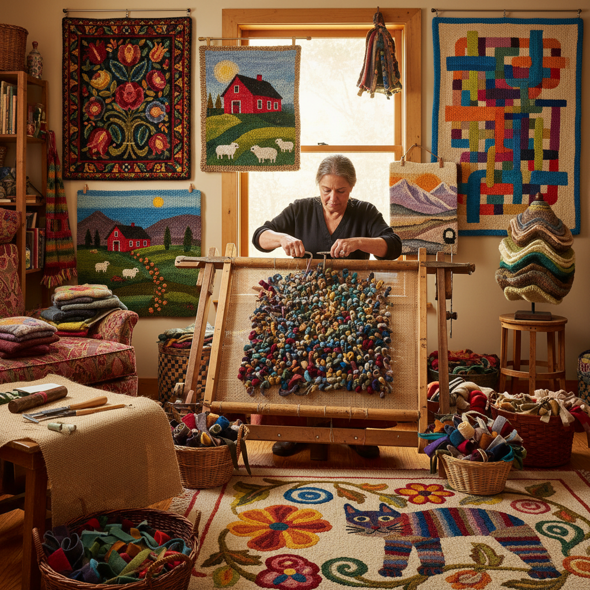

# Rug Hooking 钩毯艺术

> "Rug hooking is painting with fabric — strips of wool or cotton pulled through a burlap foundation with a simple hook, each loop a brushstroke of color building up images and patterns with the texture and warmth that only fiber can give, transforming humble rags into art underfoot." — Unknown

## 概述

钩毯艺术（Rug Hooking）是一种使用钩针（hook）将布条或毛线从织物基底（通常是粗麻布/burlap）的背面拉到正面形成环圈（loops）的纤维艺术技法。通过控制环圈的高度、密度和颜色，艺术家可以创造出从简单的几何图案到复杂的绘画性图像的各种作品。钩毯艺术起源于19世纪北美的家庭手工艺——妇女们将旧衣物撕成布条，钩制成实用的地毯。

钩毯艺术的两种主要风格：传统钩毯（使用宽布条，创造质朴的民间艺术风格图案）和精细钩毯（fine hooking，使用窄布条或毛线，创造精细的绘画性图像）。当代钩毯艺术已经从实用的地毯发展为独立的纤维艺术形式——壁挂、雕塑、装置等。

## 核心特征

| 特征 | 描述 |
|------|------|
| 钩针 | 使用钩针拉环 |
| 布条 | 使用布条或毛线 |
| 基底 | 粗麻布基底 |
| 环圈 | 环圈形成图案 |
| 纹理 | 丰富的纹理 |
| 色彩 | 丰富的色彩混合 |

## 视觉特征

- **纹理**：环圈的丰富纹理
- **色彩**：布条的色彩混合
- **温暖**：纤维的温暖质感
- **质朴**：民间艺术的质朴
- **绘画性**：可达绘画级精细
- **立体**：环圈的立体感

## 代表作品

| 作品 | 艺术家 | 年代 | 意义 |
|------|--------|------|------|
| *Traditional hooked rugs* | 北美妇女 | 19世纪 | 传统钩毯 |
| *Grenfell hooked mats* | Grenfell Mission | 1900s | 纽芬兰钩毯 |
| *Contemporary fiber art rugs* | Various | 当代 | 当代纤维艺术钩毯 |
| *Fine hooking paintings* | Various | 当代 | 精细钩毯绘画 |
| *Sculptural hooked art* | Various | 当代 | 雕塑性钩毯艺术 |

## 历史时间线

| 时期 | 事件 |
|------|------|
| 19世纪初 | 北美钩毯的起源 |
| 19世纪中后期 | 钩毯在北美家庭中的普及 |
| 20世纪初 | 钩毯作为民间艺术的认可 |
| 20世纪中期 | 钩毯的衰落和复兴 |
| 当代 | 钩毯作为纤维艺术的发展 |

## 中国语境

钩毯艺术在中国相对小众，但随着全球纤维艺术的流行，中国的手工创作社区开始关注钩毯技法。中国的传统地毯工艺（如新疆地毯、藏毯）使用不同的技法（打结），但与钩毯有相似的视觉效果。中国的一些纤维艺术家和手工爱好者通过社交媒体了解并实践钩毯艺术。中国的手工材料市场上开始出现钩毯工具和材料。钩毯的"废物利用"理念（使用旧衣物布条）与中国当代的可持续手工艺理念契合。

## AI生成概念图

## 与其他风格的关系

- **Tufting** → 簇绒
- **Punch Needle** → 戳针绣
- **Weaving** → 编织
- **Fiber Art** → 纤维艺术
- **Folk Art** → 民间艺术
- **Textile Art** → 纺织艺术

---

*浮光艺志 | Chronicle of Artistry*
