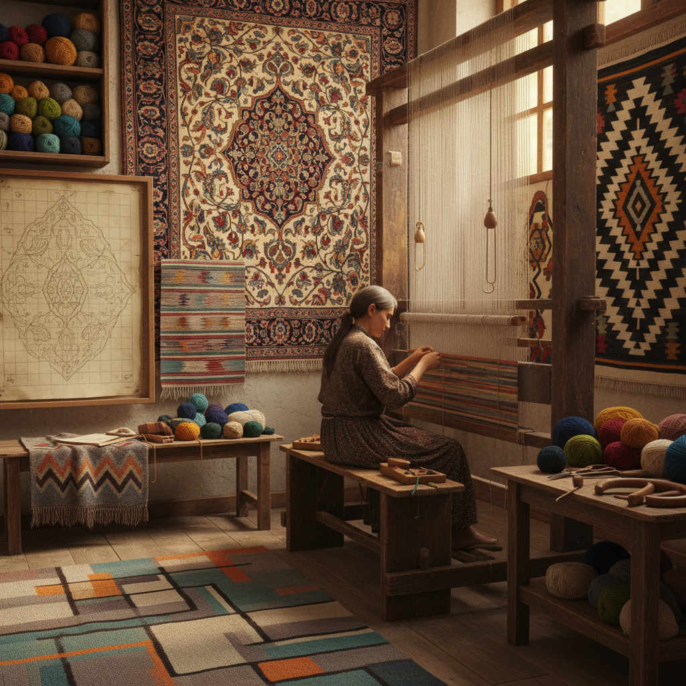

# Rug Making 织毯

> "Rug making is painting with knots — thousands of tiny loops tied by hand, each one a pixel of color in a composition that may take years to complete and centuries to wear out." — Unknown

## 概述

织毯（Rug Making）是使用纤维（羊毛、丝绸、棉等）通过打结、编织或簇绒等技法制作地毯和挂毯的工艺。手工织毯是人类最古老的纺织艺术之一——从中亚游牧民族的帐篷地毯到波斯宫廷的精美丝毯，织毯承载着文化身份、宗教象征和审美追求。

织毯的主要技法包括：手工打结（hand-knotting，在经线上逐个打结形成绒面）、平织（flat weave / kilim，经纬交织无绒面）、簇绒（tufting，将纱线插入底布形成绒面）和钩针（hooking，将布条或纱线钩入底布）。手工打结毯的密度以"结数"衡量——每平方英寸的结数越多，图案越精细，价值越高。一块精美的波斯毯可能每平方英寸有数百个结，整块毯子包含数百万个手工打结。

## 核心特征

| 特征 | 描述 |
|------|------|
| 打结 | 手工打结成绒 |
| 密度 | 结数决定精细度 |
| 耐久 | 极其耐久 |
| 图案 | 丰富的图案传统 |
| 文化 | 承载文化身份 |
| 耗时 | 极其耗时的工艺 |

## 视觉特征

- **绒面**：柔软的绒面质感
- **图案**：复杂的几何或花卉图案
- **色彩**：丰富的色彩
- **对称**：对称的构图
- **边框**：装饰性的边框
- **深度**：绒面的深度感

## 代表作品

| 作品 | 艺术家 | 年代 | 意义 |
|------|--------|------|------|
| *Pazyryk carpet* | 匿名 | 公元前5世纪 | 最古老的手工毯 |
| *Persian Ardabil carpet* | 匿名 | 1539 | 波斯毯的巅峰 |
| *Turkish Ushak carpets* | 匿名 | 15-17世纪 | 土耳其毯传统 |
| *Navajo rugs* | 匿名 | 传统 | 美洲原住民织毯 |
| *Contemporary art rugs* | Various | 当代 | 当代艺术地毯 |

## 历史时间线

| 时期 | 事件 |
|------|------|
| 公元前5世纪 | 最早的手工毯（帕兹里克） |
| 萨珊王朝 | 波斯织毯传统的确立 |
| 16世纪 | 波斯毯的黄金时代 |
| 奥斯曼帝国 | 土耳其毯的繁荣 |
| 19世纪 | 工业化对手工毯的冲击 |
| 当代 | 手工毯的艺术复兴 |

## 中国语境

织毯在中国有着悠久的传统——中国的手工毯主要产自西北地区（新疆、宁夏、甘肃、西藏）。新疆的和田毯以丝绸和羊毛混织著称，宁夏毯以其独特的蓝白配色闻名，藏毯则以其厚实的质感和藏传佛教图案为特色。中国的手工毯传统受到了中亚和波斯的影响，同时发展出了独特的中国风格——龙凤、云纹、寿字等中国传统图案。当代中国的手工毯产业正在向高端艺术毯方向发展。

## AI生成概念图

## 与其他风格的关系

- **Tapestry** → 挂毯
- **Weaving** → 编织
- **Kilim** → 平织毯
- **Textile Art** → 纺织艺术
- **Dyeing** → 染色
- **Needlepoint** → 针绣

---

*浮光艺志 | Chronicle of Artistry*
