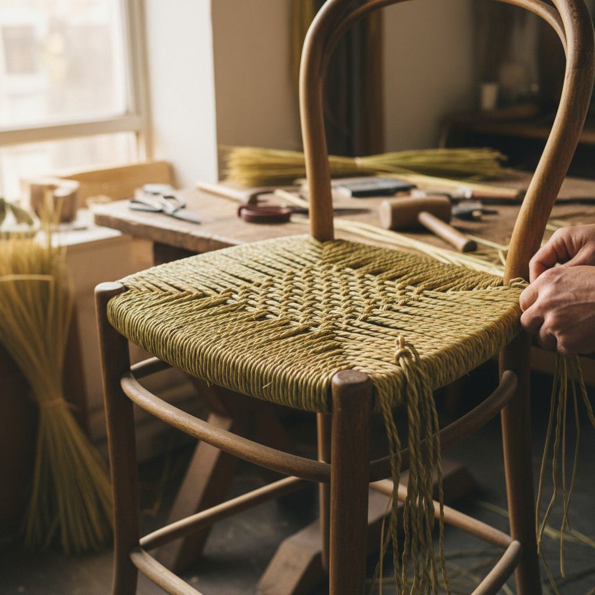

# Rush Weaving Art 灯芯草编织艺术

> "Rush weaving is the art of turning marshland into furniture — the long, supple stems of rushes harvested from wetlands are twisted, plaited, and woven into seats, mats, and baskets that carry the scent of water meadows and the memory of seasons. Each strand must be worked while still damp and pliable, making rush weaving a race against drying, a conversation between the maker's hands and the material's willingness to bend." — Unknown

## 概述

灯芯草编织艺术（Rush Weaving Art）是一种使用灯芯草（rush）等湿地植物茎秆进行编织的传统手工艺——将采集的灯芯草在湿润状态下编织成座椅面、地垫、篮筐和各种日用器物。灯芯草编织是人类最古老的编织技艺之一，在世界各地的湿地文化中都有悠久的传统，以其自然的质感和实用的功能著称。

灯芯草编织艺术的实践包括：1）材料采集——在适当季节采集灯芯草；2）处理准备——浸泡使草茎柔软；3）搓绳——将草茎搓成绳索；4）编织座面——传统椅子座面的编织；5）编织地垫——平面编织的地垫和席子；6）篮筐编织——立体的篮筐和容器；7）当代灯芯草编织——将传统技法与现代设计结合的创作。

## 核心特征

| 特征 | 描述 |
|------|------|
| 天然 | 使用天然植物材料 |
| 湿润 | 需要在湿润状态下工作 |
| 古老 | 数千年的传统 |
| 实用 | 高度实用的器物 |
| 季节 | 与季节相关的采集 |
| 芳香 | 天然的草本芳香 |

## 视觉特征

- **纹理**：规律的编织纹理
- **自然**：天然的草绿/金黄色
- **温暖**：温暖自然的质感
- **规律**：规律重复的图案
- **质朴**：质朴自然的美感
- **触感**：令人愉悦的触感

## 代表作品

| 作品 | 艺术家/文化 | 年代 | 意义 |
|------|-------------|------|------|
| *English rush-seated chairs* | 英国 | 17世纪起 | 英国灯芯草椅 |
| *Japanese tatami* | 日本 | 传统 | 日本榻榻米 |
| *Egyptian rush mats* | 埃及 | 古代 | 古埃及草席 |
| *Shaker rush seats* | 美国 | 18-19世纪 | 震教徒草编椅 |
| *Contemporary rush work* | 国际 | 当代 | 当代灯芯草编织 |

## 历史时间线

| 时期 | 事件 |
|------|------|
| 古代 | 各文明的灯芯草编织起源 |
| 中世纪 | 欧洲灯芯草地垫的普及 |
| 17-18世纪 | 灯芯草椅面的黄金时代 |
| 19世纪 | 工业化对传统的冲击 |
| 当代 | 灯芯草编织的艺术化复兴 |

## 中国语境

灯芯草编织在中国有极其悠久的传统。中国的草编工艺是重要的民间手工艺——从草席、草鞋到草帽都使用各种草本植物编织。中国浙江的草编是国家级非物质文化遗产——以精细的编织技法和丰富的产品种类著称。中国的蒲草编织（蒲团、蒲扇）是传统的日用品——在佛教文化中蒲团有特殊的意义。中国山东的草编产业是重要的出口产业——将传统草编技法与现代设计结合。中国的一些设计师将传统草编与现代家具设计结合——创造出具有东方美学的当代草编家具。中国的乡村振兴中，草编作为一种可持续的手工艺产业——为农村地区提供就业和收入。

## AI生成概念图

## 与其他风格的关系

- **Basket Weaving** → 篮筐编织
- **Willow Weaving** → 柳条编织
- **Textile Art** → 纺织艺术
- **Folk Craft** → 民间工艺
- **Sustainable Design** → 可持续设计
- **Furniture Design** → 家具设计

---

*浮光艺志 | Chronicle of Artistry*
