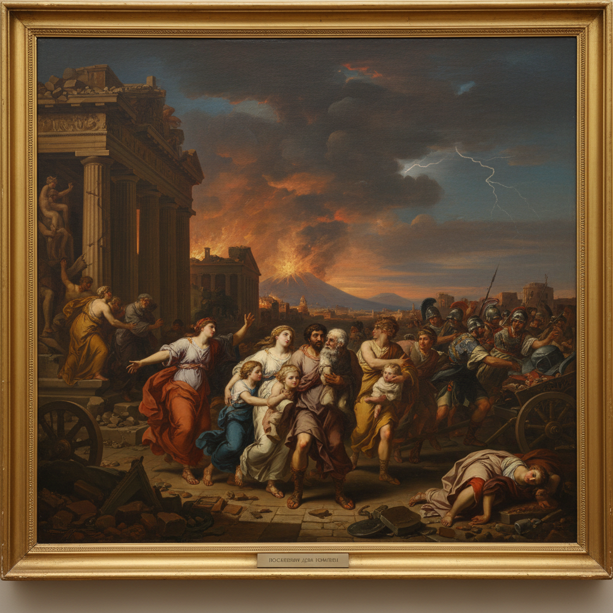

# Russian Academic Art 俄罗斯学院派艺术

> "The Academy teaches the hand to obey the eye, and the eye to see the ideal." — Imperial Academy of Arts tradition

## 概述

俄罗斯学院派艺术（Russian Academic Art）是18-19世纪俄罗斯帝国美术学院（Imperial Academy of Arts, 1757年建立）培养和推广的官方艺术风格。俄罗斯学院派以古典主义和新古典主义为基础——强调精确的素描、理想化的人体、古典神话和历史题材，以及严格的等级制度（历史画最高，风俗画最低）。

俄罗斯帝国美术学院由伊丽莎白女皇于1757年在圣彼得堡创立——它是俄罗斯艺术教育的最高殿堂，也是官方艺术标准的制定者。学院的教学体系完全模仿法国和意大利的学院传统——学生从石膏像素描开始，经过人体写生，最终创作大型历史画。学院派的代表画家包括卡尔·布留洛夫（Karl Bryullov）——他的《庞贝城的末日》（1833年）是俄罗斯学院派的巅峰之作，也是第一幅在欧洲引起轰动的俄罗斯绘画。

俄罗斯学院派艺术的核心要素包括：1）古典理想——追求古希腊罗马的美学理想；2）历史画——以历史和神话题材为最高等级；3）精确素描——严格的素描训练和精确造型；4）理想化——对人体和自然的理想化处理；5）学院体制——严格的教学等级和评审制度；6）官方艺术——沙皇政府支持的官方风格；7）意大利影响——深受意大利文艺复兴和巴洛克影响。

## 核心特征

| 特征 | 描述 |
|------|------|
| 古典理想 | 追求古希腊罗马美学理想 |
| 历史画 | 历史神话题材最高等级 |
| 精确素描 | 严格素描训练精确造型 |
| 理想化 | 人体自然理想化处理 |
| 学院体制 | 严格教学等级评审制度 |
| 官方艺术 | 沙皇政府支持官方风格 |

## 视觉特征

- **精确造型**：严谨的人体解剖和透视
- **古典构图**：金字塔形和对称构图
- **戏剧光线**：强烈的明暗对比
- **理想人体**：理想化的人体比例
- **历史场景**：宏大的历史和神话场景
- **细腻质感**：精细的材质和肌肤表现

## 代表作品

| 作品 | 画家 | 意义 |
|------|------|------|
| *庞贝城的末日* | 布留洛夫 | 学院派巅峰 |
| *铜蛇* | 布鲁尼 | 宗教历史画 |
| *基督在旷野* | 克拉姆斯柯依 | 学院与现实主义过渡 |
| *意大利正午* | 布留洛夫 | 理想化人体 |
| *最后的庞贝日* | 布留洛夫 | 国际声誉 |
| *学院毕业作品* | 各时期 | 教学传统 |

## 历史时间线

| 时期 | 事件 |
|------|------|
| 1757年 | 帝国美术学院建立 |
| 18世纪后期 | 新古典主义风格确立 |
| 1830年代 | 布留洛夫黄金时代 |
| 1863年 | "十四人事件"，学院派受到挑战 |
| 1870年代 | 巡回派兴起，学院派衰落 |
| 19世纪末 | 学院改革 |
| 1947年 | 更名为列宾美术学院 |

## 中国语境

俄罗斯学院派对中国美术教育有着决定性的影响——虽然这种影响主要是通过苏联时期的列宾美术学院传递的。1950年代中国派遣大批留学生到列宾美术学院学习——他们带回的正是学院派的教学体系：从石膏像素描到人体写生，从色彩训练到创作构图。中国美术学院至今仍然保留着这一教学传统——素描基础训练、人体解剖课程、毕业创作制度都可以追溯到俄罗斯学院派的传统。中国"全国美展"的评审标准在很长时期内也深受学院派等级观念的影响——历史画和主题性创作被视为最高等级。当代中国美术教育正在反思和改革这一传统——但学院派的基础训练体系仍然是中国美术教育的重要组成部分。

## 概念图

## 与其他风格的关系

- **French Academy** → 法国学院派（模仿对象）
- **Neoclassicism** → 新古典主义（风格基础）
- **Peredvizhniki** → 巡回展览画派（反对者）
- **Repin Academy** → 列宾美术学院（继承机构）
- **Italian Renaissance** → 意大利文艺复兴（灵感来源）
- **Chinese Academy** → 中国美术学院（受其影响）

---

*浮光艺志 | Chronicle of Artistry*
