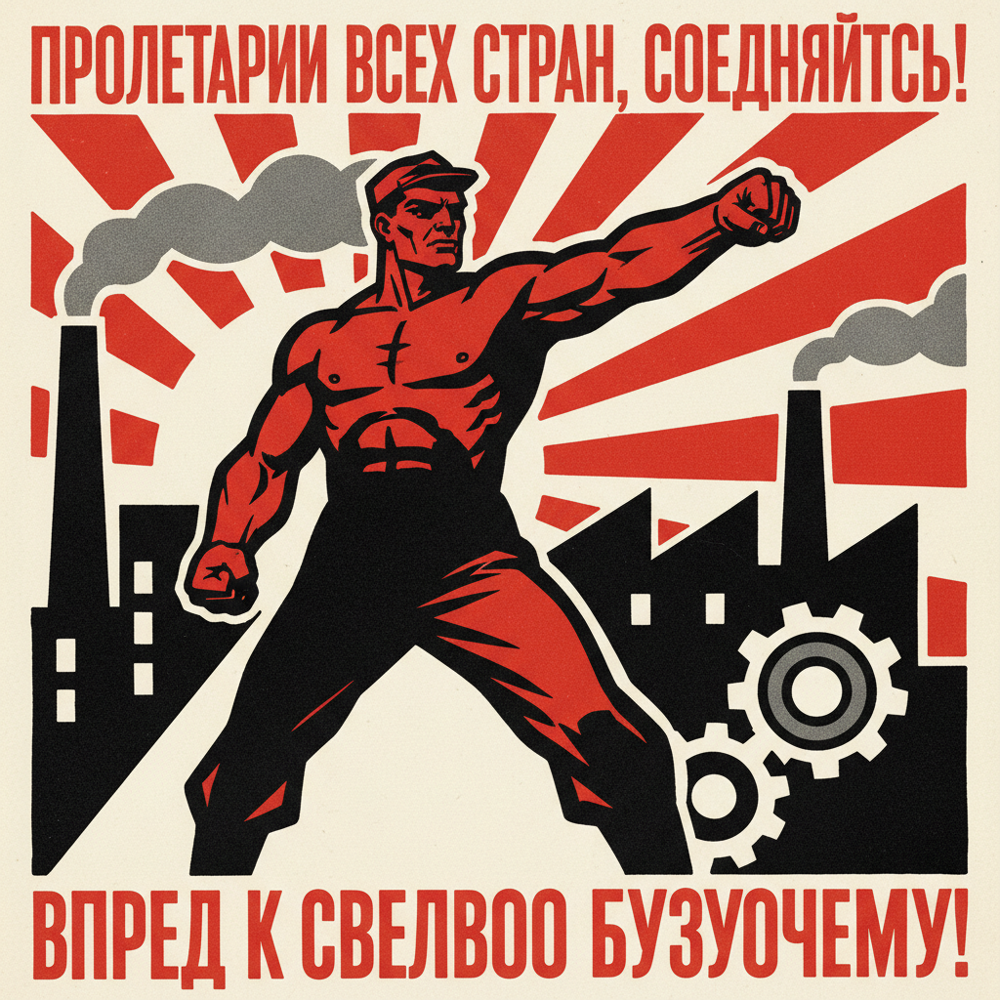

# 俄罗斯宣传鼓动艺术 · Russian Agitprop Art

> "街道是我们的画笔，广场是我们的调色板。" —— 弗拉基米尔·马雅科夫斯基

## 概述

俄罗斯宣传鼓动艺术（Agitprop Art / Агитпроп）是1917年十月革命后苏维埃政权为动员群众、传播革命理念而发展的视觉宣传艺术形式。"Agitprop"一词由"鼓动"（agitation）和"宣传"（propaganda）合成。从"ROSTA之窗"（罗斯塔橱窗海报）到革命列车上的流动壁画，从大规模群众节日装饰到政治海报，宣传鼓动艺术将先锋派的形式创新与革命的政治内容结合，创造了20世纪最具影响力的政治视觉语言。

## 核心特征

| 特征 | 描述 |
|------|------|
| 时期 | 1917年–1930年代 |
| 地域 | 全苏联，尤其莫斯科、彼得格勒 |
| 媒介 | 海报、橱窗画、列车壁画、瓷器、纺织、节日装饰 |
| 核心理念 | 以视觉艺术动员群众参与革命建设 |
| 色彩 | 红、黑、白为主色调，强烈对比 |

## 视觉特征

- **简洁有力的图形**：高度概括的人物和符号，远距离可辨识
- **红黑白三色体系**：革命红、力量黑、纯洁白的经典组合
- **动态构图**：斜线、对角线构图传达革命的动势
- **文字与图像融合**：标语口号作为画面核心元素
- **连环叙事**：ROSTA之窗采用多格漫画式叙事

## 代表作品

| 作品 | 艺术家 | 年代 | 类型 |
|------|--------|------|------|
| 《你参加志愿军了吗？》 | 德米特里·莫尔 | 1920 | 海报 |
| ROSTA之窗系列 | 马雅科夫斯基等 | 1919-1921 | 橱窗海报 |
| 《用红楔打白军》 | 利西茨基 | 1919 | 海报 |
| 革命瓷器 | 切赫宁等 | 1918-1923 | 宣传瓷器 |
| 宣传列车装饰 | 多位艺术家 | 1918-1920 | 流动壁画 |

## 发展时间线

| 时期 | 事件 |
|------|------|
| 1917 | 十月革命，列宁提出"纪念碑宣传计划" |
| 1918 | 革命节日大规模城市装饰，先锋派艺术家参与 |
| 1919-1921 | ROSTA之窗运动，马雅科夫斯基创作数百幅 |
| 1918-1920 | 宣传列车和宣传轮船巡回全国 |
| 1920s | 构成主义海报设计达到高峰 |
| 1930s | 宣传艺术转向社会主义现实主义风格 |
| 1941-1945 | 卫国战争时期宣传海报复兴 |

## 中国语境

苏联宣传鼓动艺术对中国革命美术影响极为深远。延安时期的木刻运动、新中国成立后的政治宣传画、文革时期的"红海洋"运动，都直接继承了苏联agitprop的视觉策略。中国宣传画中的红色基调、工农兵形象、斜线动态构图，与苏联宣传鼓动艺术一脉相承。当代中国艺术家对这一遗产的反思性挪用（如王广义"大批判"系列）也构成了重要的艺术史对话。

## AI 概念图

*AI 生成概念图：俄罗斯宣传鼓动艺术风格*

## 关联词条

- [[russian-constructivism-art]] - 俄罗斯构成主义
- [[russian-productivism-art]] - 俄罗斯生产主义
- [[sots-art]] - 苏茨艺术
- [[russian-avant-garde-art]] - 俄罗斯先锋派

---

*浮光艺志 · Chronicle of Artistry*
