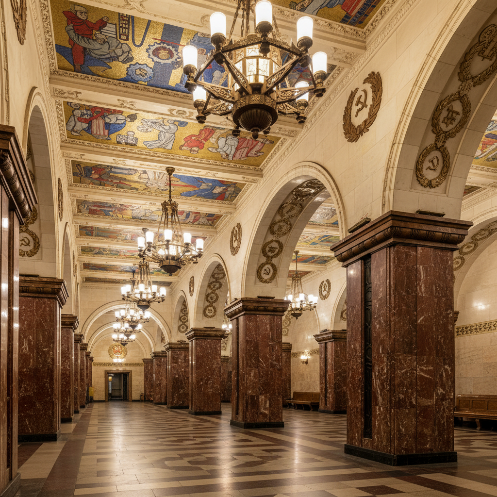

# 俄罗斯装饰艺术 · Russian Art Deco

> "革命的形式需要革命的装饰。" —— 亚历山大·罗钦科

## 概述

俄罗斯装饰艺术（Russian Art Deco）是1920年代至1930年代在苏联发展起来的装饰风格，融合了西方Art Deco的几何化美学与苏联构成主义的革命精神。这一风格广泛应用于建筑、室内设计、海报、纺织品和工业设计中，以莫斯科地铁站、全联盟农业展览馆（VDNKh）和斯大林式高层建筑的装饰为代表。苏联Art Deco将工业化的力量感与帝国式的庄严融为一体，形成了独特的"斯大林帝国风格"。

## 核心特征

| 特征 | 描述 |
|------|------|
| 时期 | 1925年–1950年代 |
| 地域 | 莫斯科、列宁格勒、各加盟共和国首都 |
| 媒介 | 建筑装饰、室内设计、海报、纺织、陶瓷 |
| 核心理念 | 以现代几何形式表达社会主义建设的力量与荣耀 |
| 色彩 | 大理石白、金色、深红、黑色、铜绿 |

## 视觉特征

- **几何化装饰**：锯齿形、放射线、阶梯状图案
- **工业符号美化**：齿轮、麦穗、五角星的装饰化处理
- **纪念碑尺度**：建筑装饰追求压倒性的宏大感
- **材料奢华**：大理石、花岗岩、青铜、马赛克的大量使用
- **对称与秩序**：严格的轴线对称构图

## 代表作品

| 作品 | 设计者 | 年代 | 类型 |
|------|--------|------|------|
| 莫斯科地铁马雅科夫斯基站 | 杜什金 | 1938 | 建筑/室内 |
| 全联盟农业展览馆主入口 | 多位建筑师 | 1939 | 建筑装饰 |
| 莫斯科大学主楼 | 鲁德涅夫 | 1949-1953 | 斯大林式建筑 |
| 《工人与集体农庄女庄员》 | 穆希娜 | 1937 | 纪念雕塑 |
| 苏联纺织品设计 | 波波娃、斯捷潘诺娃 | 1920s | 纺织图案 |

## 发展时间线

| 时期 | 事件 |
|------|------|
| 1925 | 巴黎国际装饰艺术博览会，苏联馆获大奖 |
| 1920s | 构成主义向实用装饰设计转化 |
| 1930s | 斯大林时期转向古典主义与装饰艺术融合 |
| 1935-1938 | 莫斯科地铁第一期建成，装饰艺术巅峰 |
| 1937 | 巴黎世博会苏联馆，穆希娜雕塑成为标志 |
| 1947-1957 | "斯大林七姐妹"高层建筑群建成 |
| 1955 | 赫鲁晓夫反对"建筑中的浪费"，装饰风格终结 |

## 中国语境

苏联装饰艺术风格对1950年代中国建筑影响深远。北京"十大建筑"（1959）中的人民大会堂、中国历史博物馆等，在室内装饰上大量借鉴了苏联Art Deco的手法——几何化的天花板图案、大理石柱廊、铜质灯具。哈尔滨、大连等城市保留的苏联时期建筑也体现了这一风格。

## AI 概念图

*AI 生成概念图：俄罗斯装饰艺术风格*

## 关联词条

- [[russian-constructivism-art]] - 俄罗斯构成主义
- [[russian-baroque-art]] - 俄罗斯巴洛克艺术
- [[russian-mosaic-art]] - 俄罗斯马赛克艺术
- [[severe-style-art]] - 严厉风格

---

*浮光艺志 · Chronicle of Artistry*
