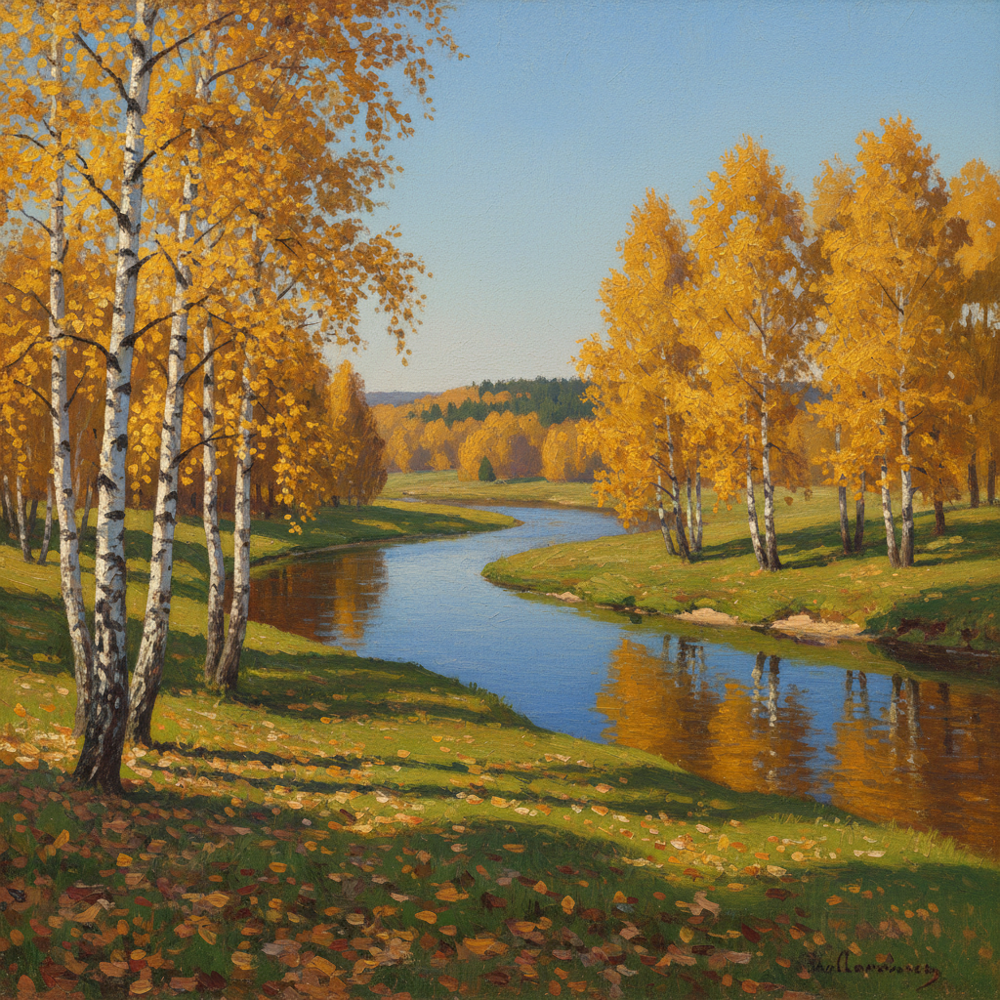

# 俄罗斯秋景绘画 · Russian Autumn Art

> "秋天是俄罗斯最美的季节——金色的白桦、深红的枫叶、透明的空气，一切都在告别中变得珍贵。" —— 伊萨克·列维坦

## 概述

俄罗斯秋景绘画（Russian Autumn Art）是俄罗斯风景画中最富诗意的子题材之一。俄罗斯的秋天——"金秋"（Золотая осень）——以其短暂而绚烂的色彩成为画家们最钟爱的季节。列维坦的《金秋》是这一传统的最高代表，将白桦的金黄、河水的深蓝和天空的澄澈凝结为永恒的诗意瞬间。从萨夫拉索夫对秋日乡村的忧郁描绘，到波列诺夫温暖的秋日庭院，再到奥斯特鲁霍夫《金秋》中铺满落叶的林间小路，俄罗斯画家将秋天发展为一个完整的视觉与情感体系。

## 核心特征

| 特征 | 描述 |
|------|------|
| 时期 | 1870s–1910s |
| 地域 | 莫斯科郊外、伏尔加河流域、中俄罗斯 |
| 媒介 | 油画 |
| 核心理念 | 以秋色表达生命的绚烂与时光的流逝 |
| 色彩 | 金黄、橙红、深绿（针叶）、天蓝、褐色 |

## 视觉特征

- **金色主调**：白桦和落叶松的金黄色统领画面
- **色彩对比**：暖色树叶与冷色天空、水面的对比
- **透明空气**：秋日特有的清澈空气使远景格外清晰
- **落叶意象**：地面的落叶层增添时间流逝感
- **倒影**：秋色在河面的镜像倒映
- **光线质感**：秋日低角度阳光的温暖金色调

## 代表作品

| 作品 | 作者 | 年代 | 特点 |
|------|------|------|------|
| 《金秋》 | 列维坦 | 1895 | 白桦河畔的经典秋景 |
| 《金秋》 | 奥斯特鲁霍夫 | 1886 | 落叶林间的金色 |
| 《秋日·庄园》 | 波列诺夫 | 1890s | 温暖的秋日庄园 |
| 《十月》 | 列维坦 | 1891 | 深秋的萧瑟与宁静 |
| 《秋天的乡村》 | 萨夫拉索夫 | 1870s | 秋日乡村的忧郁 |

## 发展时间线

| 时期 | 事件 |
|------|------|
| 1870s | 萨夫拉索夫开始系统描绘俄罗斯四季变化 |
| 1886 | 奥斯特鲁霍夫《金秋》确立秋景画的色彩范式 |
| 1890s | 列维坦在伏尔加河畔和莫斯科郊外创作秋景系列 |
| 1895 | 列维坦《金秋》成为俄罗斯秋景画的最高典范 |
| 1900s | 秋景主题融入俄罗斯印象主义和象征主义 |
| 苏联时期 | "金秋"成为苏联风景画的经典题材 |

## 中国语境

秋天在中国文化中同样承载着丰富的情感——"自古逢秋悲寂寥""停车坐爱枫林晚"。俄罗斯秋景画的色彩表现方法深刻影响了中国油画家对秋天的描绘。中国东北和华北的秋色与俄罗斯相似，白桦林的金黄、枫叶的深红为中国画家提供了天然的创作对象。当代中国风景油画中的秋景作品，在色彩构成和情感表达上仍以列维坦的"金秋"传统为重要参照。

## AI 概念图

*AI 生成概念图：俄罗斯秋景绘画风格*

## 关联词条

- [[levitan-art]] - 列维坦艺术
- [[russian-birch-art]] - 俄罗斯白桦绘画
- [[russian-landscape-art]] - 俄罗斯风景画
- [[russian-plein-air-art]] - 俄罗斯外光派
- [[russian-twilight-art]] - 俄罗斯黄昏绘画

---

*浮光艺志 · Chronicle of Artistry*
