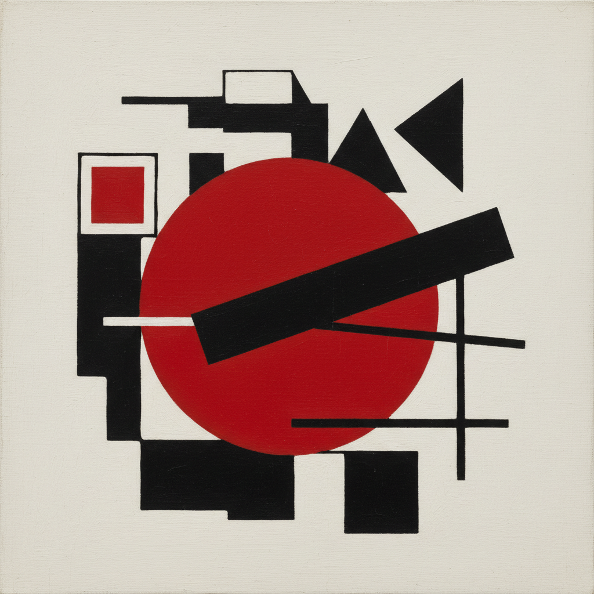

# Russian Avant-Garde Art 俄罗斯先锋派艺术

> "We declare that the splendor of the world has been enriched by a new beauty — the beauty of speed, of the machine, of pure form." — Russian Futurism

## 概述

俄罗斯先锋派艺术（Russian Avant-Garde Art）是20世纪初（约1910-1930年代）俄罗斯艺术家创造的一系列革命性艺术运动的总称。俄罗斯先锋派是20世纪最激进、最具创造力的艺术运动之一——它几乎同时在绘画、雕塑、建筑、设计、戏剧、电影、文学等所有艺术领域发起了全面的革命，彻底改变了人类对艺术的理解。

俄罗斯先锋派包含多个相互关联的运动：新原始主义（Neoprimitivism）、射线主义（Rayonism）、至上主义（Suprematism）、构成主义（Constructivism）、未来主义（Futurism）等。马列维奇的《黑色方块》（1915年）宣告了纯粹抽象艺术的诞生；康定斯基的理论和实践开创了抽象表现主义；塔特林的"第三国际纪念塔"设计代表了构成主义的乌托邦理想；罗钦科的摄影和设计重新定义了视觉传达。

俄罗斯先锋派艺术的核心要素包括：1）激进创新——彻底打破传统艺术观念；2）纯粹抽象——走向纯粹的几何抽象；3）艺术与生活——消除艺术与日常生活的界限；4）革命精神——与社会政治革命的紧密联系；5）跨媒介——在所有艺术领域同时革命；6）乌托邦理想——通过艺术改造社会的理想；7）国际影响——对全球现代艺术的深远影响。

## 核心特征

| 特征 | 描述 |
|------|------|
| 激进创新 | 彻底打破传统艺术观念 |
| 纯粹抽象 | 走向纯粹几何抽象 |
| 艺术与生活 | 消除艺术日常生活界限 |
| 革命精神 | 与社会政治革命紧密联系 |
| 跨媒介 | 所有艺术领域同时革命 |
| 乌托邦理想 | 通过艺术改造社会 |

## 视觉特征

- **几何形式**：方块、圆、三角的纯粹几何
- **强烈色彩**：红、黑、白的强烈对比
- **动态构图**：对角线和不对称的动态感
- **无物象**：完全脱离自然物象
- **字体设计**：革命性的字体和排版
- **摄影蒙太奇**：拼贴和蒙太奇手法

## 代表作品

| 作品 | 艺术家 | 意义 |
|------|------|------|
| *黑色方块* | 马列维奇 | 至上主义宣言 |
| *构成第七号* | 康定斯基 | 抽象绘画 |
| *第三国际纪念塔* | 塔特林 | 构成主义理想 |
| *用红色楔子打白军* | 利西茨基 | 政治设计 |
| *空间构成* | 罗钦科 | 摄影革命 |
| *画家与模特* | 冈察洛娃 | 新原始主义 |

## 历史时间线

| 时期 | 事件 |
|------|------|
| 1910年 | 新原始主义和射线主义兴起 |
| 1913年 | 马列维奇开始至上主义实验 |
| 1915年 | 《黑色方块》展出 |
| 1917年 | 十月革命，先锋派获得官方支持 |
| 1920年代 | 构成主义鼎盛 |
| 1932年 | 斯大林推行社会主义现实主义 |
| 1930年代 | 先锋派被压制 |

## 中国语境

俄罗斯先锋派对中国当代艺术有着重要但复杂的影响关系。由于历史原因，中国在20世纪50年代主要接受的是苏联社会主义现实主义——而非更早的先锋派传统。直到1980年代中国"新潮美术"运动时期，中国艺术家才开始系统地了解和学习俄罗斯先锋派。马列维奇的至上主义、构成主义的设计理念对中国当代艺术和设计教育产生了重要影响。俄罗斯先锋派"艺术改造生活"的乌托邦理想与中国革命艺术的"艺术为人民服务"有着某种精神上的联系——虽然两者的美学形式截然不同。当代中国设计教育中的构成基础课程（平面构成、色彩构成、立体构成）可以追溯到俄罗斯构成主义和包豪斯的教学传统。

## 概念图

## 与其他风格的关系

- **Suprematism** → 至上主义（马列维奇）
- **Constructivism** → 构成主义（塔特林）
- **Bauhaus** → 包豪斯（受其影响）
- **De Stijl** → 风格派（平行运动）
- **Futurism** → 未来主义（意大利影响）
- **Socialist Realism** → 社会主义现实主义（取代者）

---

*浮光艺志 | Chronicle of Artistry*
