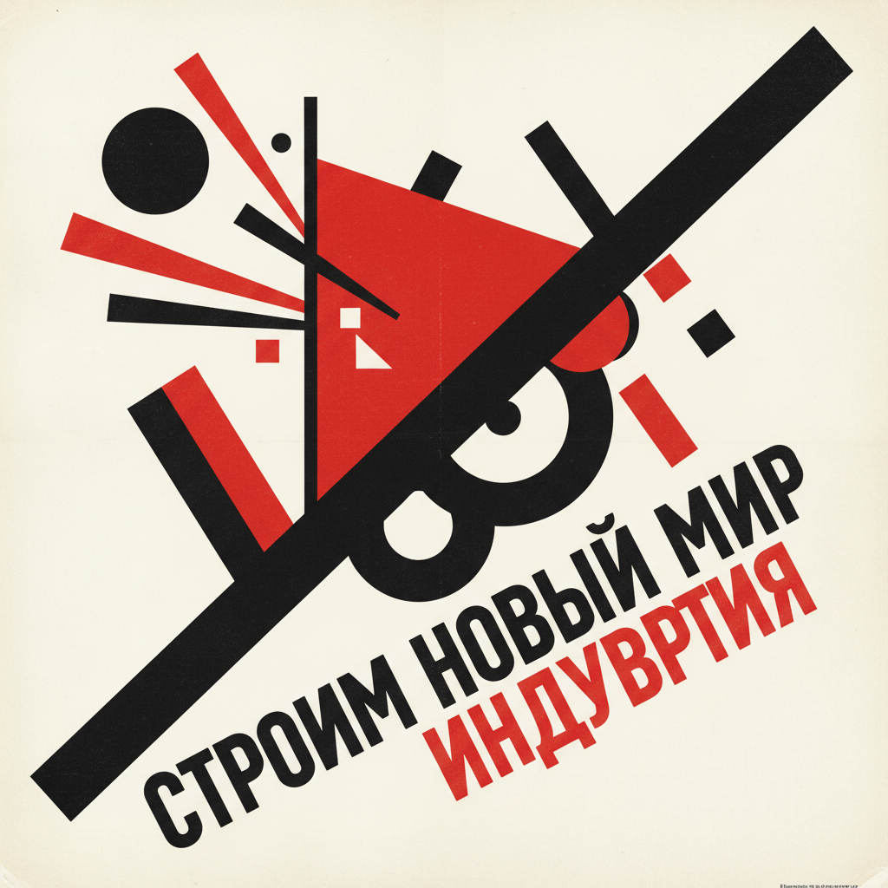

# Russian Avant-Garde 俄罗斯先锋派

> **"艺术融入生活！"** —— Vladimir Tatlin

## 概述

俄罗斯先锋派（Русский авангард / Russian Avant-Garde）是20世纪初最具革命性的艺术运动群，约1910–1932年间在俄国/苏联爆发。它包含多个相互关联又彼此论争的流派——至上主义（Suprematism）、构成主义（Constructivism）、立体未来主义（Cubo-Futurism）、辐射主义（Rayonism）等——共同构成了现代艺术史上最激进的实验场。十月革命后，先锋派艺术家一度获得国家支持，将艺术实验推向建筑、设计、电影、戏剧等一切领域，直到1930年代被社会主义现实主义取代。

## 时间线

| 年份 | 事件 |
|------|------|
| 1910 | 拉里奥诺夫和冈察洛娃发起"驴尾巴"展览 |
| 1913 | 马列维奇为歌剧《战胜太阳》设计舞台 |
| 1915 | 马列维奇展出《黑色方块》，宣告至上主义诞生 |
| 1917 | 十月革命，先锋派艺术家获得官方支持 |
| 1919 | 塔特林设计《第三国际纪念塔》 |
| 1920 | 罗德钦科创作《空间构成》系列 |
| 1921 | "5×5=25"展览，罗德钦科展出三联画《纯红·纯黄·纯蓝》 |
| 1923–1925 | LEF（左翼艺术阵线）杂志出版 |
| 1925 | 罗德钦科"工人俱乐部"在巴黎博览会展出 |
| 1932 | 斯大林解散所有独立艺术团体，先锋派终结 |

## 核心流派

### 至上主义 Suprematism (Malevich)
- 纯粹几何形式的绝对抽象
- 《黑色方块》——"绘画的零度"
- 色彩与平面的组合表达宇宙感知
- 精神性、超越性的艺术追求

### 构成主义 Constructivism (Tatlin, Rodchenko)
- 艺术服务于生产和社会功能
- 反对架上绘画，拥抱工业材料
- 设计、建筑、摄影、排版的全面革新
- "艺术家必须成为技术人员"

### 立体未来主义 Cubo-Futurism
- 法国立体主义 + 意大利未来主义的俄国混合
- 马列维奇《磨刀工》为代表
- 通向至上主义的过渡阶段

## 代表艺术家

| 艺术家 | 领域 | 代表作/贡献 |
|--------|------|------------|
| Kazimir Malevich | 至上主义 | 《黑色方块》、Architectons |
| Vladimir Tatlin | 构成主义 | 《第三国际纪念塔》、反浮雕 |
| Alexander Rodchenko | 构成主义/摄影 | 工人俱乐部、蒙太奇海报 |
| El Lissitzky | 设计/建筑 | Proun 系列、排版革新 |
| Varvara Stepanova | 纺织/设计 | 构成主义纺织品设计 |
| Lyubov Popova | 绘画/舞台 | 立体未来主义绘画 |
| Naum Gabo | 雕塑 | 动态构成、透明材料 |
| Wassily Kandinsky | 抽象 | 《论艺术中的精神》 |

## 视觉特征

- 纯粹几何形式：方块、圆、十字、三角
- 强烈的红、黑、白对比
- 对角线构图的动态张力
- 工业材料：金属、玻璃、木材
- 摄影蒙太奇与大胆排版
- 建筑幻想的乌托邦图景

## 与其他运动的关系

| 运动 | 关系 |
|------|------|
| 包豪斯 | 直接影响，Kandinsky 和 Lissitzky 参与教学 |
| De Stijl | 共享几何抽象，互相影响 |
| 未来主义 | 俄国先锋派的重要灵感来源 |
| 极简主义 | 罗德钦科的三联画预示了极简原则 |
| 瑞士国际主义设计 | 继承构成主义的排版革新 |

## 遗产

- 奠定了现代平面设计的基础
- 影响了全球建筑、工业设计、摄影
- 苏联蒙太奇电影（爱森斯坦、维尔托夫）的视觉语言
- 当代品牌设计中的构成主义复兴
- 证明了艺术与社会变革可以深度结合

## 概念图

---

*浮光艺志 | Chronicle of Artistry*
