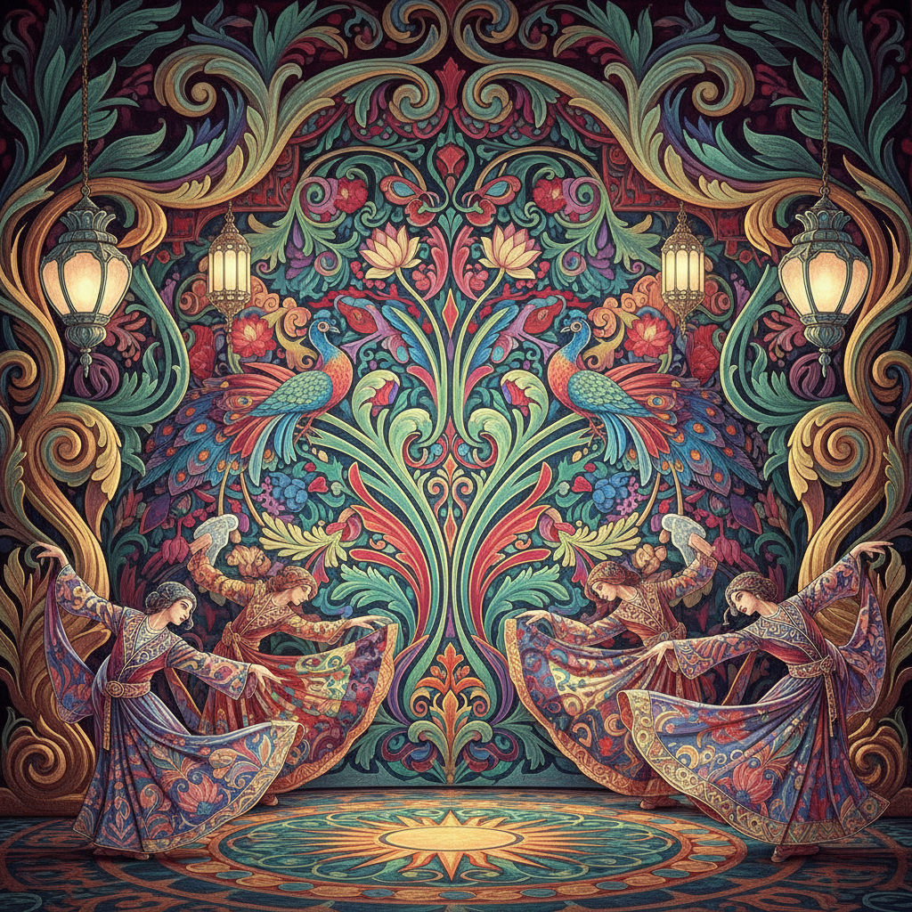

# 俄罗斯芭蕾舞台艺术 · Russian Ballet Art

> "舞蹈是灵魂的诗篇，舞台是梦境的画布。" —— 谢尔盖·佳吉列夫

## 概述

俄罗斯芭蕾舞台艺术（Russian Ballet Art）是19世纪末至20世纪初俄罗斯视觉艺术与表演艺术的辉煌交汇。以佳吉列夫的俄罗斯芭蕾舞团（Ballets Russes）为核心，汇聚了巴克斯特、贝努瓦、冈察洛娃等顶尖画家为舞台设计布景与服装，将绘画、雕塑、音乐与舞蹈融为一体的"总体艺术"（Gesamtkunstwerk）推向巅峰。

## 核心特征

| 特征 | 描述 |
|------|------|
| 时期 | 1890年代–1930年代 |
| 地域 | 俄罗斯、法国巴黎 |
| 媒介 | 舞台布景、服装设计、海报、水彩 |
| 核心理念 | 视觉艺术与表演艺术的总体融合 |
| 色彩 | 浓烈东方色彩、宝石色调、金银装饰 |

## 视觉特征

- **异域风情色彩**：大量使用翠绿、深红、金色、宝蓝等饱和色调
- **东方主义元素**：波斯、印度、拜占庭图案的融合
- **动态构图**：捕捉舞者运动瞬间的流动线条
- **装饰性极强**：繁复的纹样与华丽的面料质感表现
- **戏剧性光影**：舞台灯光效果在画面中的再现

## 代表作品

| 作品 | 艺术家 | 年代 | 类型 |
|------|--------|------|------|
| 《牧神午后》布景设计 | 列昂·巴克斯特 | 1912 | 舞台设计 |
| 《火鸟》服装设计 | 亚历山大·戈洛文 | 1910 | 服装设计 |
| 《彼得鲁什卡》布景 | 亚历山大·贝努瓦 | 1911 | 舞台设计 |
| 《金鸡》布景设计 | 娜塔莉亚·冈察洛娃 | 1914 | 舞台设计 |
| 《天鹅湖》舞台设计 | 康斯坦丁·科罗文 | 1901 | 舞台设计 |

## 发展时间线

| 时期 | 事件 |
|------|------|
| 1890s | 帝国芭蕾舞团黄金时代，彼季帕编舞体系成熟 |
| 1898 | 《艺术世界》杂志创刊，贝努瓦、巴克斯特等参与 |
| 1909 | 佳吉列夫俄罗斯芭蕾舞团巴黎首演 |
| 1910-1914 | 斯特拉文斯基三部曲：火鸟、彼得鲁什卡、春之祭 |
| 1917 | 毕加索为《游行》设计布景，现代主义介入 |
| 1920s | 构成主义风格进入舞台设计 |
| 1929 | 佳吉列夫去世，舞团解散 |

## 中国语境

俄罗斯芭蕾舞台艺术对中国的影响深远。1950年代苏联芭蕾专家来华指导，中央芭蕾舞团的建立直接继承了俄罗斯学派传统。《红色娘子军》《白毛女》等中国芭蕾经典在舞台美术上融合了社会主义现实主义与民族元素，形成独特的中国芭蕾舞台美学。

## AI 概念图

*AI 生成概念图：俄罗斯芭蕾舞台艺术风格*

## 关联词条

- [[world-of-art-movement]] - 艺术世界运动
- [[russian-avant-garde-art]] - 俄罗斯先锋派
- [[russian-folk-art]] - 俄罗斯民间艺术
- [[russian-constructivism-art]] - 俄罗斯构成主义

---

*浮光艺志 · Chronicle of Artistry*
