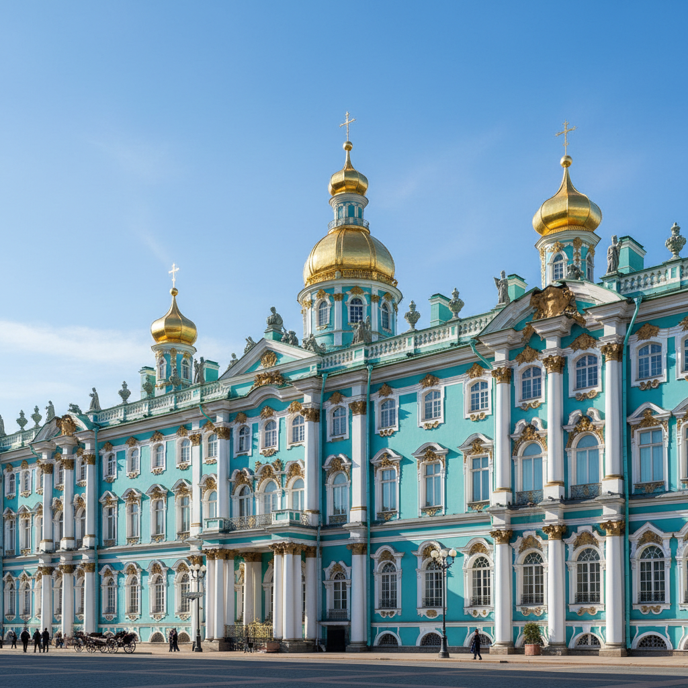

# 俄罗斯巴洛克艺术 · Russian Baroque Art

> "彼得大帝打开了通往欧洲的窗户，巴洛克的光芒便涌入了俄罗斯。" —— 伊戈尔·格拉巴尔

## 概述

俄罗斯巴洛克艺术（Russian Baroque Art）是17世纪末至18世纪中叶在俄罗斯发展起来的建筑与装饰艺术风格，以彼得大帝和伊丽莎白女皇时期为鼎盛。俄罗斯巴洛克融合了西欧巴洛克的华丽动感与俄罗斯本土的色彩传统，形成了独特的"纳雷什金巴洛克"（莫斯科巴洛克）和"伊丽莎白巴洛克"（彼得堡巴洛克）两大分支。拉斯特雷利设计的冬宫、叶卡捷琳娜宫是这一风格的巅峰之作。

## 核心特征

| 特征 | 描述 |
|------|------|
| 时期 | 1680年代–1760年代 |
| 地域 | 莫斯科、圣彼得堡 |
| 媒介 | 建筑、室内装饰、雕塑、绘画 |
| 核心理念 | 以华丽壮观彰显帝国权威与宗教荣耀 |
| 色彩 | 白色与彩色墙面对比（蓝白、绿白、黄白） |

## 视觉特征

- **多色外墙**：建筑外立面使用鲜明色彩（天蓝、翠绿、鹅黄）配白色柱式
- **丰富的雕塑装饰**：女像柱、天使、花环、贝壳纹样
- **洋葱穹顶与巴洛克融合**：传统俄罗斯教堂形制与西欧巴洛克曲线结合
- **金碧辉煌的室内**：大量镀金、镜面、天顶画
- **层叠的建筑体量**：多层退台、塔楼组合的垂直构图

## 代表作品

| 作品 | 建筑师/艺术家 | 年代 | 类型 |
|------|---------------|------|------|
| 冬宫（埃尔米塔日） | 拉斯特雷利 | 1754-1762 | 宫殿建筑 |
| 叶卡捷琳娜宫 | 拉斯特雷利 | 1752-1756 | 宫殿建筑 |
| 斯莫尔尼修道院 | 拉斯特雷利 | 1748-1764 | 宗教建筑 |
| 菲利教堂 | 佚名 | 1690-1694 | 纳雷什金巴洛克 |
| 彼得保罗大教堂 | 特列季尼 | 1712-1733 | 彼得巴洛克 |

## 发展时间线

| 时期 | 事件 |
|------|------|
| 1680s | 纳雷什金巴洛克在莫斯科兴起 |
| 1690s | 菲利教堂等"莫斯科巴洛克"教堂建成 |
| 1703 | 圣彼得堡建城，西欧巴洛克直接引入 |
| 1710s-1720s | 彼得大帝时期的早期彼得堡巴洛克 |
| 1740s-1760s | 伊丽莎白女皇时期，拉斯特雷利巴洛克达到巅峰 |
| 1762 | 叶卡捷琳娜二世即位，新古典主义取代巴洛克 |

## 中国语境

俄罗斯巴洛克建筑对中国的影响主要体现在东北地区。哈尔滨圣索菲亚大教堂（1907）虽为拜占庭风格，但哈尔滨老城区保留了大量俄罗斯巴洛克风格的民用建筑。此外，圆明园中的西洋楼（1747-1760）由意大利传教士郎世宁参与设计，与同时期俄罗斯巴洛克建筑共享欧洲巴洛克的源头。

## AI 概念图

*AI 生成概念图：俄罗斯巴洛克艺术风格*

## 关联词条

- [[russian-neoclassicism-art]] - 俄罗斯新古典主义
- [[russian-icon-art]] - 俄罗斯圣像画
- [[russian-porcelain-art]] - 俄罗斯瓷器艺术
- [[russian-mosaic-art]] - 俄罗斯马赛克艺术

---

*浮光艺志 · Chronicle of Artistry*
