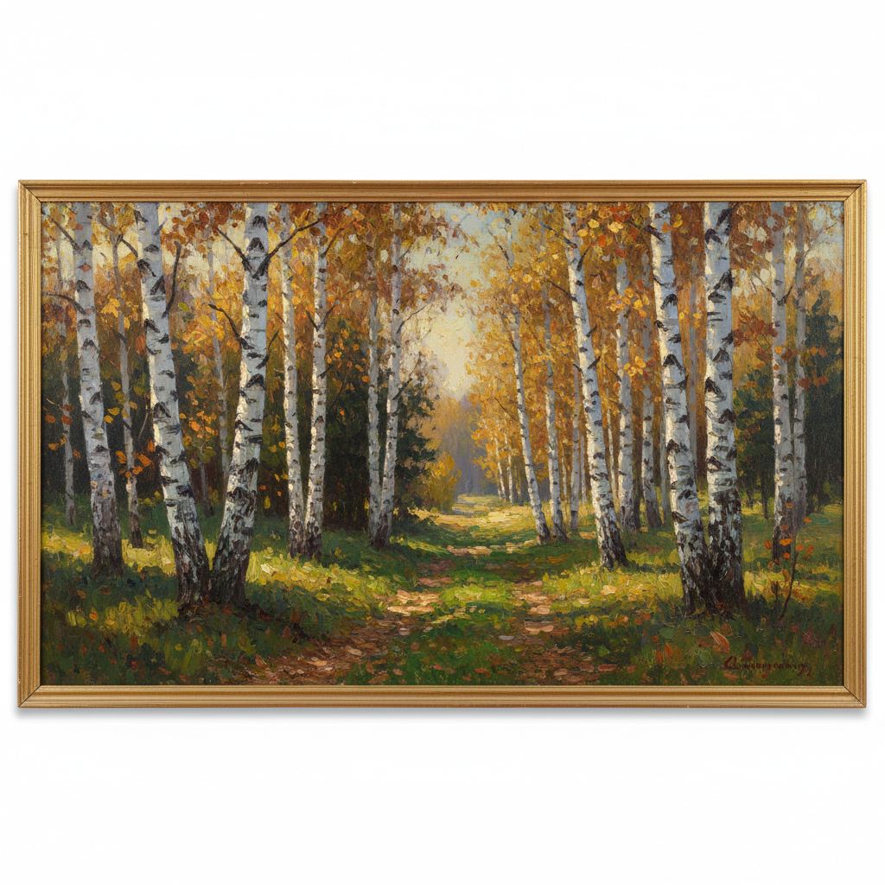

# 俄罗斯白桦绘画 · Russian Birch Art

> "白桦是俄罗斯的灵魂之树——它的白色树干是北方大地的诗行。" —— 伊萨克·列维坦

## 概述

俄罗斯白桦绘画（Russian Birch Art）是俄罗斯风景画中以白桦树为核心意象的绘画传统。白桦（Берёза）是俄罗斯的国树，其洁白的树干、金黄的秋叶和轻盈的姿态使其成为俄罗斯民族精神的视觉象征——纯洁、坚韧、优雅。从库因芝《白桦林》中戏剧性的光影对比，到列维坦《金秋》中白桦与河流的抒情组合，再到格拉巴里《二月的蓝天》中霜挂白桦的印象派色彩，白桦主题贯穿了俄罗斯风景画的整个黄金时代。

## 核心特征

| 特征 | 描述 |
|------|------|
| 时期 | 1870s–1920s（巅峰期） |
| 地域 | 俄罗斯中部、莫斯科郊外、乌拉尔 |
| 媒介 | 油画 |
| 核心理念 | 以白桦为载体表达俄罗斯民族的精神气质 |
| 色彩 | 银白（树干）、翠绿/金黄（树叶）、天蓝（背景） |

## 视觉特征

- **白色树干的韵律**：白桦树干的垂直线条形成音乐般的节奏
- **光斑效果**：阳光穿过白桦叶片形成的斑驳光影
- **季节色彩**：春绿、夏翠、秋金、冬银的四季变化
- **透明感**：白桦林的通透性，光线可以穿透林间
- **对比手法**：白色树干与深色背景的强烈明暗对比
- **群体美感**：白桦林的集体姿态如同舞蹈

## 代表作品

| 作品 | 作者 | 年代 | 特点 |
|------|------|------|------|
| 《白桦林》 | 库因芝 | 1879 | 戏剧性光影对比 |
| 《金秋》 | 列维坦 | 1895 | 白桦与河流的抒情 |
| 《二月的蓝天》 | 格拉巴里 | 1904 | 霜挂白桦的印象派色彩 |
| 《白桦林间》 | 列维坦 | 1885 | 林间散步的诗意 |
| 《秋日·白桦》 | 波列诺夫 | 1890s | 温暖的秋日白桦 |

## 发展时间线

| 时期 | 事件 |
|------|------|
| 1870s | 白桦作为风景画元素开始受到关注 |
| 1879 | 库因芝《白桦林》以光影实验震撼画坛 |
| 1880s | 列维坦将白桦融入抒情风景画体系 |
| 1895 | 《金秋》成为俄罗斯白桦画的经典 |
| 1904 | 格拉巴里《二月的蓝天》以印象派手法革新白桦表现 |
| 苏联时期 | 白桦作为民族象征在风景画中持续出现 |

## 中国语境

白桦在中国东北和新疆也有广泛分布，中国画家对白桦题材有天然的亲近感。1950年代留苏画家将俄罗斯白桦画的技法带回中国，影响了东北画家群体。大兴安岭和长白山的白桦林成为中国北方风景画的重要题材。当代中国油画中的白桦主题——如冷军、王沂东等人的作品——在写实技法上仍可追溯到俄罗斯传统。白桦在中俄两国文化中都承载着纯洁与坚韧的象征意义。

## AI 概念图

*AI 生成概念图：俄罗斯白桦绘画风格*

## 关联词条

- [[kuindzhi-art]] - 库因芝艺术
- [[levitan-art]] - 列维坦艺术
- [[russian-forest-painting-art]] - 俄罗斯森林绘画
- [[russian-landscape-art]] - 俄罗斯风景画
- [[russian-plein-air-art]] - 俄罗斯外光派

---

*浮光艺志 · Chronicle of Artistry*
