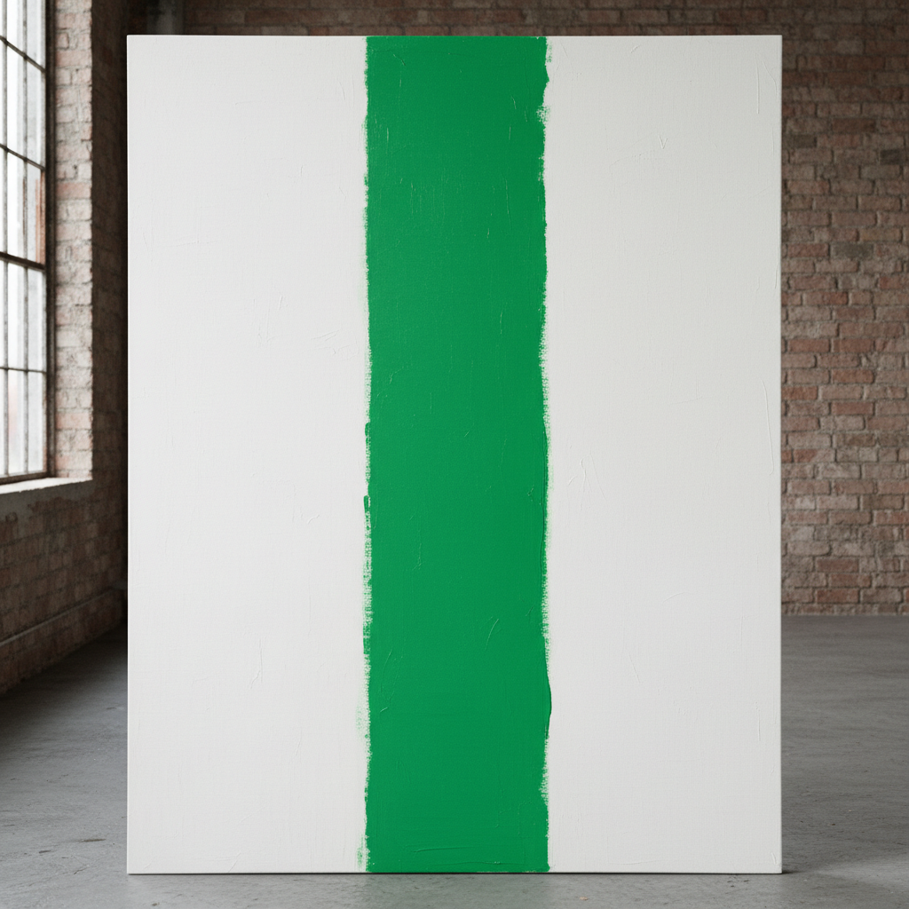

# 俄罗斯色域绘画 · Russian Color Field Art

> "色彩本身就是内容，不需要形象来承载它。" —— 奥尔加·罗扎诺娃

## 概述

俄罗斯色域绘画（Russian Color Field Art）是俄罗斯先锋派中以纯粹色彩体验为核心的艺术探索，从1910年代奥尔加·罗扎诺娃的"色彩绘画"（Tsvetopis）实验到马列维奇的《白上白》，再到当代俄罗斯抽象画家对色彩场域的持续探索。虽然"色域绘画"（Color Field Painting）一词通常指1950-60年代美国抽象表现主义的分支，但俄罗斯艺术家早在1910年代就独立发展出了以大面积纯色平涂为核心的绘画实践，比美国色域绘画早了近四十年。

## 核心特征

| 特征 | 描述 |
|------|------|
| 时期 | 1916年–至今 |
| 地域 | 莫斯科、圣彼得堡 |
| 媒介 | 油画、丙烯、综合材料 |
| 核心理念 | 色彩作为独立的精神与感知力量 |
| 色彩 | 大面积纯色、色彩渐变、色彩对比 |

## 视觉特征

- **大面积平涂**：单一色彩覆盖整个画面或大部分画面
- **色彩即主题**：色彩不再描述物象，而是自身成为内容
- **边缘关系**：色块之间的交界处理成为核心表达
- **精神性追求**：通过色彩营造冥想式的观看体验
- **极简构成**：最少的形式元素，最大的色彩冲击

## 代表作品

| 作品 | 艺术家 | 年代 | 类型 |
|------|--------|------|------|
| 《绿色条纹》 | 奥尔加·罗扎诺娃 | 1917 | 油画 |
| 《白上白》 | 马列维奇 | 1918 | 油画 |
| 《非客观构图》 | 罗扎诺娃 | 1916 | 油画 |
| 色彩构成系列 | 伊万·克留恩 | 1917-1920s | 油画 |
| 《红色》 | 亚历山大·罗钦科 | 1921 | 油画（三联） |

## 发展时间线

| 时期 | 事件 |
|------|------|
| 1916 | 罗扎诺娃发展"色彩绘画"（Tsvetopis）理论 |
| 1917 | 罗扎诺娃创作《绿色条纹》——俄罗斯色域绘画里程碑 |
| 1918 | 马列维奇《白上白》将色域推向极致 |
| 1921 | 罗钦科"最后的绘画"三联画（红、黄、蓝） |
| 1921后 | 苏联官方转向具象，色域实验中断 |
| 1960s | 非官方艺术家重新探索纯色抽象 |
| 当代 | 俄罗斯当代抽象画家延续色域传统 |

## 中国语境

俄罗斯色域绘画对中国当代抽象艺术有间接影响。中国1990年代以来的抽象艺术热潮中，马可鲁、谭平、梁铨等画家的大面积色彩实验，既受美国色域绘画影响，也可追溯到俄罗斯先锋派的色彩解放传统。罗扎诺娃"色彩即内容"的理念，与中国传统水墨中"墨分五色"的色彩哲学形成有趣的跨文化对话。

## AI 概念图

*AI 生成概念图：俄罗斯色域绘画风格*

## 关联词条

- [[russian-suprematism-art]] - 俄罗斯至上主义
- [[russian-avant-garde-art]] - 俄罗斯先锋派
- [[russian-constructivism-art]] - 俄罗斯构成主义
- [[russian-rayonism-art]] - 俄罗斯辐射主义

---

*浮光艺志 · Chronicle of Artistry*
