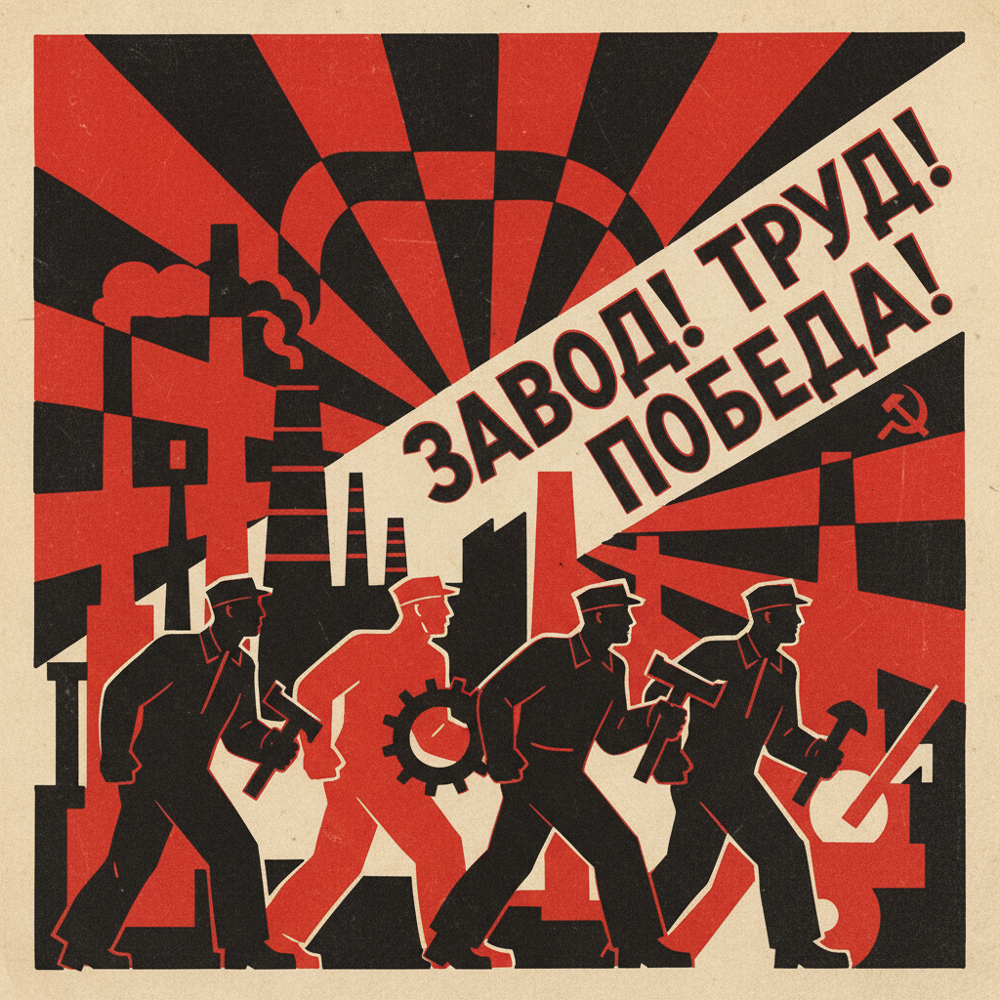

# Russian Constructivism Art 俄罗斯构成主义艺术

> "The artist is now simply a constructor and technician, a leader and foreman." — Aleksei Gan, Constructivism manifesto

## 概述

俄罗斯构成主义艺术（Russian Constructivism Art）是1920年代在苏俄发展的一种将艺术与工业生产、社会建设相结合的激进艺术运动。构成主义是俄罗斯先锋派中最具社会实践性的分支——它主张艺术家应该放弃"纯艺术"的象牙塔，转而成为社会的"工程师"和"建设者"，用艺术的方法解决实际的社会问题。

构成主义的核心理念是"从构图到构成"（from composition to construction）——即从画布上的抽象构图转向真实空间中的物质构造。塔特林的"第三国际纪念塔"模型（1919-1920年）是构成主义的标志性作品——这座从未建成的螺旋形钢铁塔代表了用艺术改造世界的乌托邦理想。罗钦科、斯捷潘诺娃、波波娃、利西茨基等艺术家将构成主义原则应用于平面设计、纺织设计、建筑、摄影、电影等领域——创造了一种全新的视觉语言。

俄罗斯构成主义艺术的核心要素包括：1）艺术即生产——艺术家是社会的生产者；2）功能主义——形式服从功能；3）工业材料——使用工业材料和技术；4）几何抽象——纯粹的几何形式语言；5）社会使命——为新社会服务的艺术；6）跨领域——从绘画到设计到建筑；7）集体创作——反对个人主义的艺术观。

## 核心特征

| 特征 | 描述 |
|------|------|
| 艺术即生产 | 艺术家是社会生产者 |
| 功能主义 | 形式服从功能 |
| 工业材料 | 使用工业材料技术 |
| 几何抽象 | 纯粹几何形式语言 |
| 社会使命 | 为新社会服务的艺术 |
| 跨领域 | 从绘画到设计到建筑 |

## 视觉特征

- **几何形式**：圆、三角、方块的组合
- **红黑白**：红色、黑色、白色的强烈对比
- **对角线**：动态的对角线构图
- **字体排版**：大胆的字体和排版设计
- **摄影蒙太奇**：照片拼贴和蒙太奇
- **工业美学**：钢铁、玻璃的工业感

## 代表作品

| 作品 | 艺术家 | 意义 |
|------|------|------|
| *第三国际纪念塔* | 塔特林 | 构成主义标志 |
| *用红色楔子打白军* | 利西茨基 | 政治海报 |
| *空间构成* | 罗钦科 | 摄影革命 |
| *纺织设计* | 斯捷潘诺娃 | 生产艺术 |
| *舞台设计* | 波波娃 | 戏剧构成 |
| *工人俱乐部* | 罗钦科 | 室内设计 |

## 历史时间线

| 时期 | 事件 |
|------|------|
| 1919年 | 塔特林开始纪念塔设计 |
| 1920年 | "构成主义"一词正式使用 |
| 1921年 | "5×5=25"展览，宣告绘画终结 |
| 1922年 | 阿列克谢·甘发表构成主义宣言 |
| 1923-28年 | 构成主义在设计领域的全面应用 |
| 1932年 | 社会主义现实主义取代构成主义 |

## 中国语境

俄罗斯构成主义对中国设计教育和视觉文化有着深远的影响。中国设计教育中的"三大构成"（平面构成、色彩构成、立体构成）课程体系直接源自构成主义和包豪斯的教学传统——虽然这一传统是通过日本和香港间接传入中国大陆的。构成主义"艺术为社会服务"的理念与中国革命美术的"为人民服务"有着精神上的共鸣——两者都主张艺术应该走出象牙塔，服务于社会建设。中国1950-70年代的政治海报设计在视觉语言上与构成主义有明显的联系——大胆的色彩对比、动态的对角线构图、强烈的字体排版。当代中国平面设计和建筑设计中仍然可以看到构成主义美学的影响——特别是在追求简洁、几何和功能性的设计中。

## 概念图

## 与其他风格的关系

- **Russian Avant-Garde** → 俄罗斯先锋派（母运动）
- **Suprematism** → 至上主义（理论基础）
- **Bauhaus** → 包豪斯（平行发展）
- **De Stijl** → 风格派（荷兰平行）
- **Tatlin** → 塔特林（核心人物）
- **Rodchenko** → 罗钦科（设计实践）

---

*浮光艺志 | Chronicle of Artistry*
