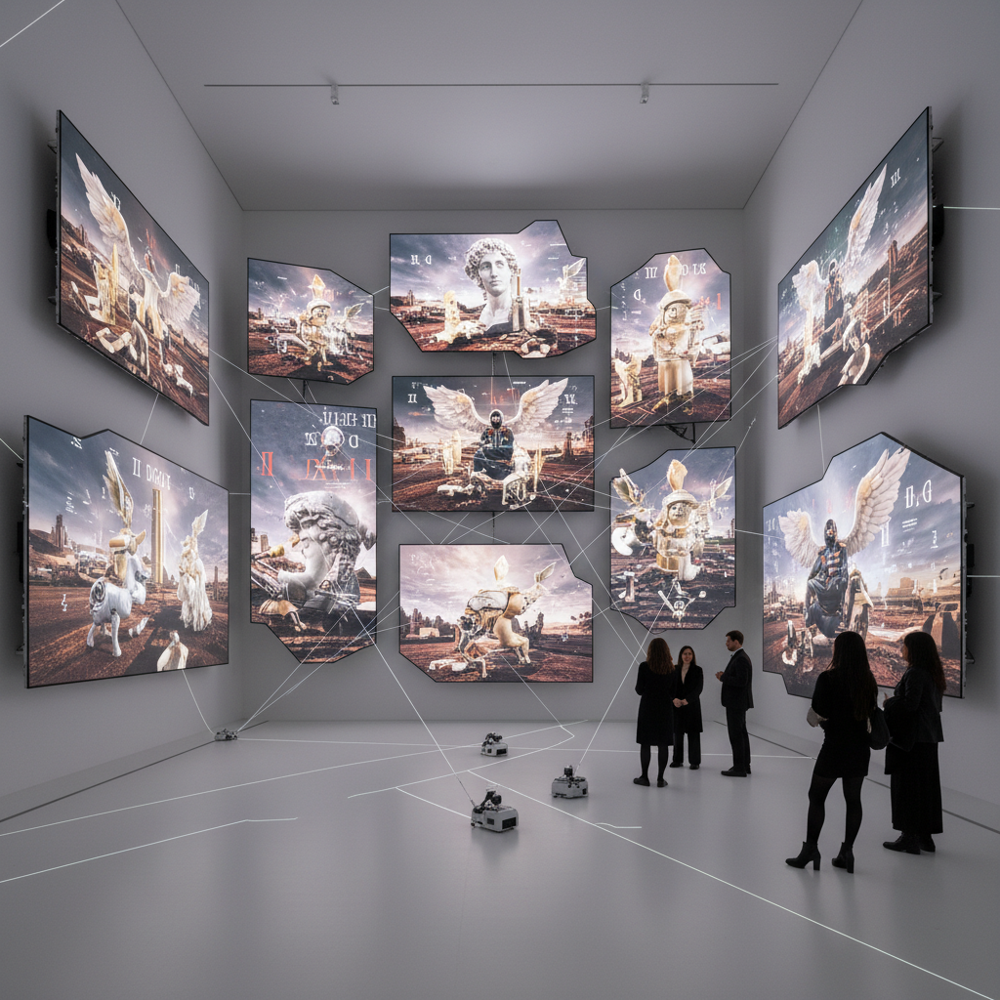

# 俄罗斯当代艺术 · Russian Contemporary Art

> "我们不再需要宣言，我们需要的是行动和对话。" —— AES+F艺术小组

## 概述

俄罗斯当代艺术（Russian Contemporary Art）是1991年苏联解体后在全球化语境中发展起来的多元艺术实践。从莫斯科概念主义和苏茨艺术的遗产出发，俄罗斯当代艺术家在装置、影像、行为、新媒体等领域展开探索，既回应全球当代艺术的议题（身份、全球化、技术），又持续反思苏联遗产、俄罗斯身份和后社会主义转型的独特经验。莫斯科双年展（2005年创办）和车库当代艺术博物馆的建立标志着俄罗斯当代艺术的制度化。

## 核心特征

| 特征 | 描述 |
|------|------|
| 时期 | 1991年–至今 |
| 地域 | 莫斯科、圣彼得堡、全球 |
| 媒介 | 装置、影像、行为、绘画、新媒体、NFT |
| 核心理念 | 在全球化与本土性之间寻找俄罗斯当代艺术的位置 |
| 色彩 | 多元，无统一风格 |

## 视觉特征

- **跨媒介实践**：单一媒介的界限被打破，综合性创作成为常态
- **技术与身体**：数字技术、生物艺术与身体政治的交叉
- **历史反思**：对苏联遗产的持续挖掘、解构和再利用
- **全球对话**：参与国际双年展体系和全球艺术市场
- **社会介入**：行动主义艺术和公共空间干预

## 代表作品

| 作品 | 艺术家 | 年代 | 类型 |
|------|--------|------|------|
| 《最后的审判》 | AES+F | 2006 | 多频影像装置 |
| 《蓝鼻子》行为系列 | 蓝鼻子小组 | 2000s | 行为/摄影 |
| 《乌托邦之城》 | 帕维尔·佩珀斯坦 | 2000s | 绘画/装置 |
| 《圣愚》行为 | 彼得·帕夫伦斯基 | 2012-2016 | 行为艺术 |
| 《纪念碑》系列 | 重组小组 | 2000s | 公共艺术 |

## 发展时间线

| 时期 | 事件 |
|------|------|
| 1991 | 苏联解体，艺术市场和画廊体系开始建立 |
| 1990s | 第一代后苏联艺术家涌现，国际展览增多 |
| 2003 | 俄罗斯首次参加威尼斯双年展国家馆 |
| 2005 | 莫斯科当代艺术双年展创办 |
| 2008 | 车库当代艺术中心成立（2015年迁入新馆） |
| 2010s | 俄罗斯当代艺术在国际市场价格攀升 |
| 2022后 | 地缘政治变化对俄罗斯当代艺术国际交流产生影响 |

## 中国语境

俄罗斯当代艺术与中国当代艺术有深层的结构性相似——两者都经历了从社会主义体制向市场经济的转型，都面临如何处理革命遗产和建构新身份的问题。中俄当代艺术家在威尼斯双年展、卡塞尔文献展等国际平台上频繁交流。莫斯科车库博物馆与北京UCCA等机构的合作项目，推动了两国当代艺术的对话。两国艺术家共同面对的"后社会主义"语境，使得中俄当代艺术比较研究成为学术热点。

## AI 概念图

*AI 生成概念图：俄罗斯当代艺术风格*

## 关联词条

- [[moscow-conceptualism-art]] - 莫斯科概念主义
- [[sots-art]] - 苏茨艺术
- [[soviet-nonconformist-art]] - 苏联非官方艺术
- [[russian-kinetic-art]] - 俄罗斯动力艺术

---

*浮光艺志 · Chronicle of Artistry*
