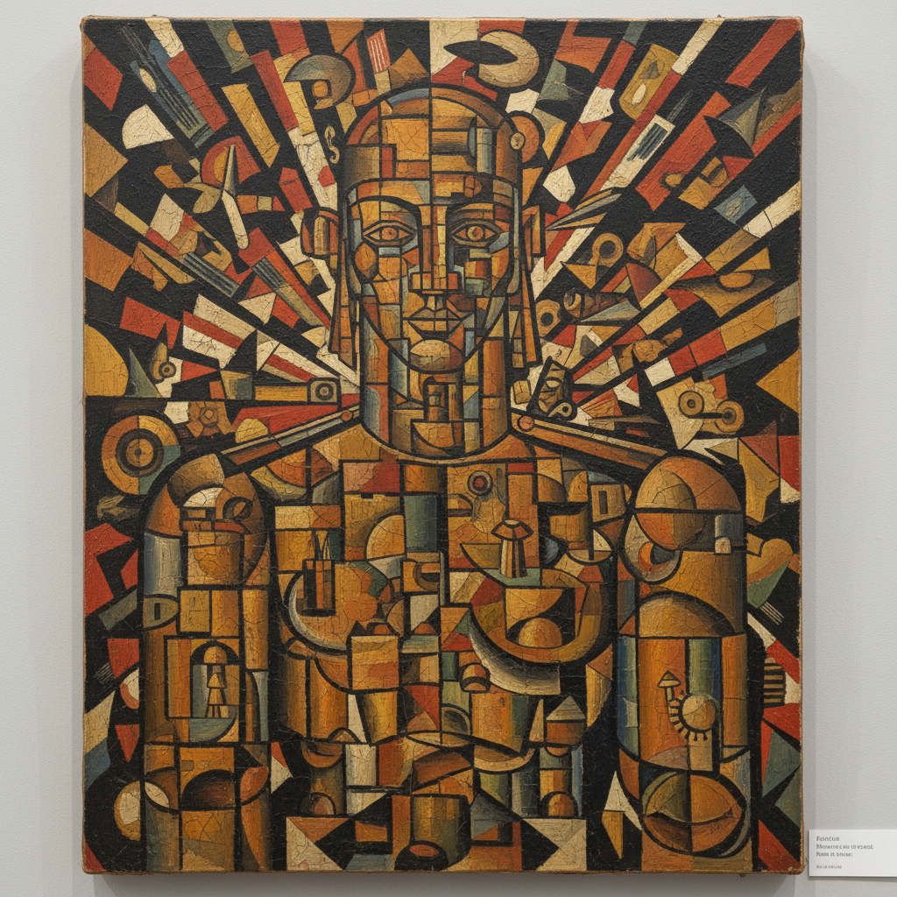

# 俄罗斯立体未来主义 · Russian Cubo-Futurism Art

> "我们把立体主义的结构与未来主义的速度熔为一炉。" —— 大卫·布尔柳克

## 概述

俄罗斯立体未来主义（Cubo-Futurism / Кубофутуризм）是1912年至1915年间在俄罗斯兴起的先锋艺术运动，融合了法国立体主义的几何分解与意大利未来主义的动态表现。这一运动是俄罗斯先锋派从具象走向抽象的关键过渡阶段，马列维奇、冈察洛娃、波波娃等人都经历了立体未来主义阶段，随后各自走向至上主义、辐射主义或构成主义。立体未来主义在绘画之外还深刻影响了俄罗斯未来主义诗歌和戏剧。

## 核心特征

| 特征 | 描述 |
|------|------|
| 时期 | 1912年–1915年 |
| 地域 | 莫斯科、圣彼得堡 |
| 媒介 | 油画、版画、书籍插图、舞台设计 |
| 核心理念 | 以几何分解表达现代生活的动态与碎片化 |
| 色彩 | 金属灰、土褐、深蓝，偶有鲜明红黄 |

## 视觉特征

- **几何碎片化**：物象被分解为锥体、圆柱、平面的组合
- **多视点叠加**：同一物体的多个角度同时呈现
- **动态线条**：斜线和弧线传达运动感和速度
- **金属质感**：工业化的冷硬表面处理
- **文字入画**：俄文字母和数字作为画面构成元素

## 代表作品

| 作品 | 艺术家 | 年代 | 类型 |
|------|--------|------|------|
| 《磨刀人》 | 马列维奇 | 1913 | 油画 |
| 《飞行员》 | 马列维奇 | 1914 | 油画 |
| 《小提琴手》 | 柳博芙·波波娃 | 1914 | 油画 |
| 《电灯》 | 冈察洛娃 | 1913 | 油画 |
| 《战胜太阳》布景 | 马列维奇 | 1913 | 舞台设计 |

## 发展时间线

| 时期 | 事件 |
|------|------|
| 1910 | 布尔柳克兄弟组织"钻石骑士"展览 |
| 1912 | "驴尾巴"展览，立体未来主义作品集中亮相 |
| 1912 | 《给公众趣味一记耳光》宣言发表 |
| 1913 | 歌剧《战胜太阳》首演，马列维奇设计布景 |
| 1913-1914 | 立体未来主义绘画创作高峰 |
| 1915 | "0.10"展览，马列维奇转向至上主义 |
| 1915后 | 立体未来主义作为独立运动结束 |

## 中国语境

立体未来主义在中国的直接影响有限，但其"分解-重构"的方法论通过包豪斯和现代设计教育间接传入。中国1980年代"85新潮"中的一些抽象实验，如丁方早期的几何化风景，与立体未来主义的形式语言有呼应。当代中国数字艺术和动态影像中对速度、碎片化的表达，也可追溯到未来主义的精神遗产。

## AI 概念图

*AI 生成概念图：俄罗斯立体未来主义风格*

## 关联词条

- [[russian-futurism-art]] - 俄罗斯未来主义
- [[russian-suprematism-art]] - 俄罗斯至上主义
- [[russian-avant-garde-art]] - 俄罗斯先锋派
- [[russian-rayonism-art]] - 俄罗斯辐射主义

---

*浮光艺志 · Chronicle of Artistry*
