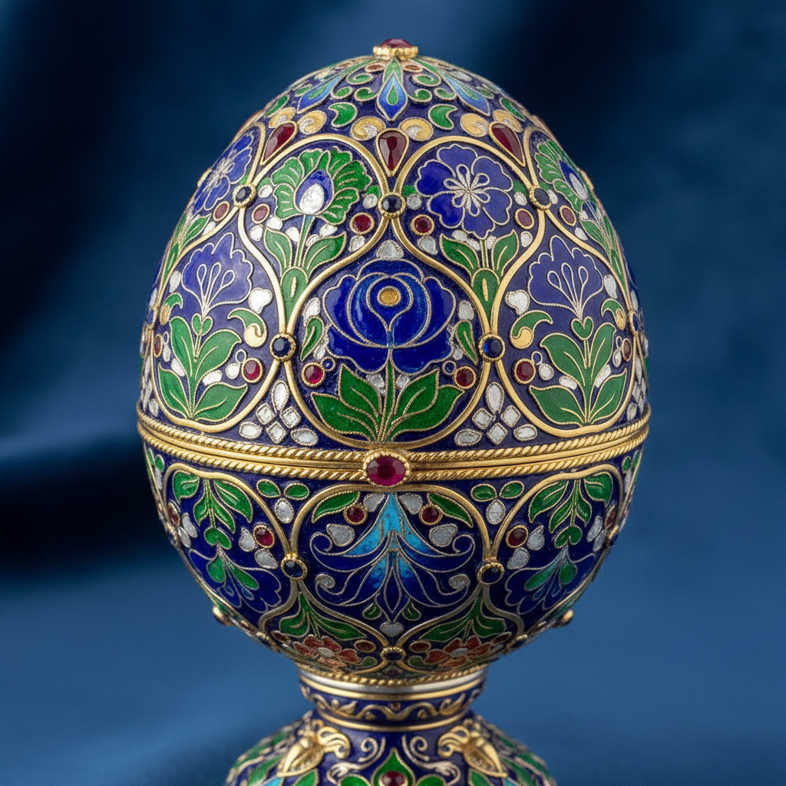

# 俄罗斯珐琅艺术 · Russian Enamel Art

> "火焰赋予金属以色彩，珐琅让冰冷的器物绽放花园般的生命。" —— 卡尔·法贝热

## 概述

俄罗斯珐琅艺术（Russian Enamel Art）是俄罗斯装饰艺术中最精美的门类之一，融合了拜占庭掐丝珐琅（cloisonné）传统与斯拉夫民族装饰风格。从中世纪基辅罗斯的宗教器物，到17世纪莫斯科的彩绘珐琅（painted enamel），再到19世纪法贝热工坊将珐琅工艺推向极致的微型杰作，俄罗斯珐琅艺术以其浓烈的色彩、精密的工艺和独特的民族审美享誉世界。

## 核心特征

| 特征 | 描述 |
|------|------|
| 时期 | 10世纪至今 |
| 地域 | 基辅、莫斯科、圣彼得堡、罗斯托夫 |
| 媒介 | 金属基底（金、银、铜）+ 玻璃质珐琅釉料 |
| 核心理念 | 以火的艺术赋予金属永恒色彩 |
| 色彩 | 宝蓝、翠绿、深红、白色、金色 |

## 视觉特征

- **掐丝珐琅（Cloisonné）**：金属丝分隔色域，填充透明或不透明珐琅
- **彩绘珐琅（Painted Enamel）**：在珐琅底上绘制精细图案，如微型绘画
- **透光珐琅（Plique-à-jour）**：无底托的透明珐琅，如彩色玻璃窗效果
- **浮雕珐琅（Champlevé）**：在金属上凿出凹槽填充珐琅
- **俄罗斯民族纹样**：花卉卷草、鸟兽图案、几何编织纹

## 代表作品

| 作品 | 创作者 | 年代 | 类型 |
|------|--------|------|------|
| 莫诺马赫王冠珐琅装饰 | 佚名 | 13-14世纪 | 掐丝珐琅 |
| 索尔维切戈茨克珐琅器 | 乌索尔斯克工坊 | 17世纪 | 彩绘珐琅 |
| 罗斯托夫微型珐琅画 | 罗斯托夫工匠 | 18世纪 | 微型彩绘 |
| 法贝热复活节彩蛋 | 卡尔·法贝热 | 1885-1917 | 综合珐琅 |
| 赫列布尼科夫银器珐琅 | 赫列布尼科夫工坊 | 1890s | 掐丝珐琅 |

## 发展时间线

| 时期 | 事件 |
|------|------|
| 10-11世纪 | 基辅罗斯从拜占庭引入掐丝珐琅技术 |
| 12-13世纪 | 基辅珐琅工艺达到第一个高峰 |
| 16-17世纪 | 莫斯科克里姆林宫工坊发展彩绘珐琅 |
| 17世纪 | 索尔维切戈茨克成为珐琅艺术中心 |
| 18世纪 | 罗斯托夫微型珐琅画兴起 |
| 1842-1917 | 法贝热工坊将珐琅工艺推向世界巅峰 |
| 苏联时期 | 珐琅艺术转向工业化装饰与纪念品生产 |
| 当代 | 传统珐琅工艺复兴与当代艺术珐琅创作 |

## 中国语境

中国景泰蓝（铜胎掐丝珐琅）与俄罗斯珐琅艺术同源于拜占庭传统，但各自发展出截然不同的美学体系。中国景泰蓝以蓝色为主调、龙凤纹样为特征；俄罗斯珐琅则偏爱多色花卉与斯拉夫编织纹。两国在"一带一路"文化交流中，珐琅艺术成为重要的对话媒介。

## AI 概念图

*AI 生成概念图：俄罗斯珐琅艺术风格*

## 关联词条

- [[russian-porcelain-art]] - 俄罗斯瓷器艺术
- [[russian-lacquer-art]] - 俄罗斯漆器艺术
- [[russian-folk-art]] - 俄罗斯民间艺术
- [[russian-mosaic-art]] - 俄罗斯马赛克艺术

---

*浮光艺志 · Chronicle of Artistry*
