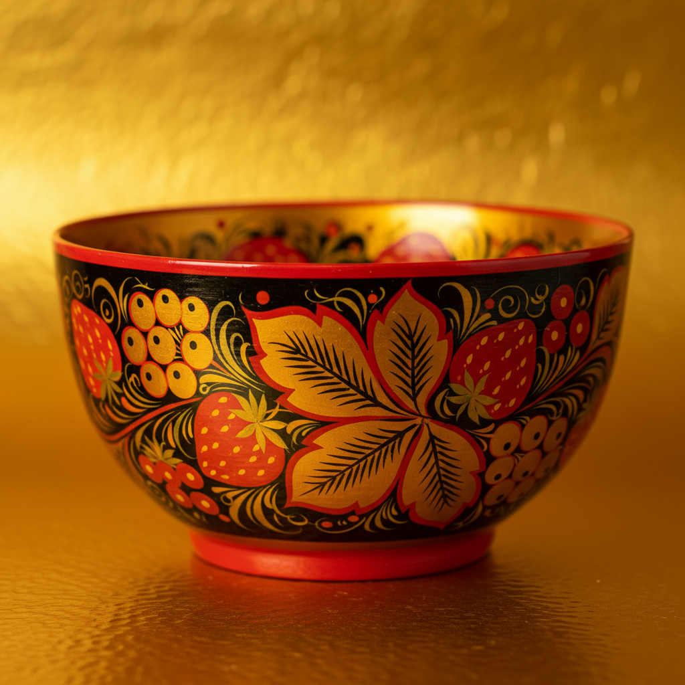

# Russian Folk Art 俄罗斯民间艺术

> "Russian folk art is the soul of the people made visible — in wood, in paint, in thread, in clay." — Russian cultural tradition

## 概述

俄罗斯民间艺术（Russian Folk Art）是俄罗斯各地区民间工匠和艺人世代传承的装饰艺术传统的总称。俄罗斯民间艺术以其丰富的色彩、大胆的装饰和深厚的文化内涵闻名于世——从霍赫洛马的金色木器到格热利的蓝白陶瓷，从帕列赫的漆器细密画到沃洛格达的花边，俄罗斯民间艺术构成了一个庞大而多彩的装饰艺术体系。

俄罗斯民间艺术的根基深植于斯拉夫文化传统——融合了异教时期的自然崇拜符号、东正教的宗教图像和各地区的地方特色。每个产区都发展出了独特的风格：霍赫洛马（Khokhloma）以金色和红色的植物纹样著称；格热利（Gzhel）以蓝白陶瓷闻名；日什托沃（Zhostovo）以金属托盘上的花卉绘画见长；帕列赫（Palekh）以漆器上的细密画传世。这些传统大多起源于17-18世纪，至今仍在延续。

俄罗斯民间艺术的核心要素包括：1）地区特色——每个产区的独特风格；2）植物纹样——花卉和浆果的丰富装饰；3）鲜艳色彩——红、金、蓝的大胆用色；4）手工传承——世代相传的手工技艺；5）日用之美——将艺术融入日常器物；6）集体创作——工坊和产区的集体传统；7）文化认同——俄罗斯民族文化的重要标志。

## 核心特征

| 特征 | 描述 |
|------|------|
| 地区特色 | 每个产区独特风格 |
| 植物纹样 | 花卉浆果丰富装饰 |
| 鲜艳色彩 | 红金蓝大胆用色 |
| 手工传承 | 世代相传手工技艺 |
| 日用之美 | 艺术融入日常器物 |
| 文化认同 | 俄罗斯民族文化标志 |

## 视觉特征

- **金色底色**：霍赫洛马的金色背景
- **蓝白陶瓷**：格热利的蓝白装饰
- **花卉纹样**：大朵花卉的装饰图案
- **浆果图案**：红色浆果的点缀
- **卷草纹**：流畅的卷草和藤蔓
- **套娃造型**：层层嵌套的木偶

## 代表作品

| 作品 | 产区 | 意义 |
|------|------|------|
| *霍赫洛马木器* | 下诺夫哥罗德 | 金色木器 |
| *格热利陶瓷* | 莫斯科州 | 蓝白陶瓷 |
| *帕列赫漆器* | 伊万诺沃州 | 细密画 |
| *日什托沃托盘* | 莫斯科州 | 花卉绘画 |
| *沃洛格达花边* | 沃洛格达 | 编织艺术 |
| *马特廖什卡套娃* | 各地 | 文化符号 |

## 历史时间线

| 时期 | 事件 |
|------|------|
| 17世纪 | 霍赫洛马传统确立 |
| 18世纪 | 格热利陶瓷发展 |
| 19世纪 | 各产区风格成熟 |
| 1890年代 | 马特廖什卡套娃诞生 |
| 苏联时期 | 民间艺术获得国家支持 |
| 当代 | 传统延续与创新 |

## 中国语境

俄罗斯民间艺术与中国民间艺术有着深层的结构性相似。两国都拥有庞大的民间艺术体系——中国有景德镇瓷器、苏绣、剪纸、年画等，俄罗斯有格热利、霍赫洛马、帕列赫等。两国的民间艺术都具有强烈的地域性——每个产区都有独特的风格和技艺。两国都在20世纪经历了民间艺术的"国家化"过程——将民间工艺纳入国家文化体系进行保护和推广。格热利的蓝白陶瓷与中国青花瓷在视觉上有着惊人的相似——虽然两者独立发展，但都选择了蓝白作为核心色彩。马特廖什卡套娃在中国广为人知——它已成为中俄文化交流的重要符号。

## 概念图

## 与其他风格的关系

- **Khokhloma** → 霍赫洛马（金色木器）
- **Gzhel** → 格热利（蓝白陶瓷）
- **Palekh** → 帕列赫（漆器细密画）
- **Chinese Folk Art** → 中国民间艺术（平行传统）
- **Arts and Crafts** → 工艺美术运动
- **Russian Icon** → 俄罗斯圣像画（精神源头）

---

*浮光艺志 | Chronicle of Artistry*
