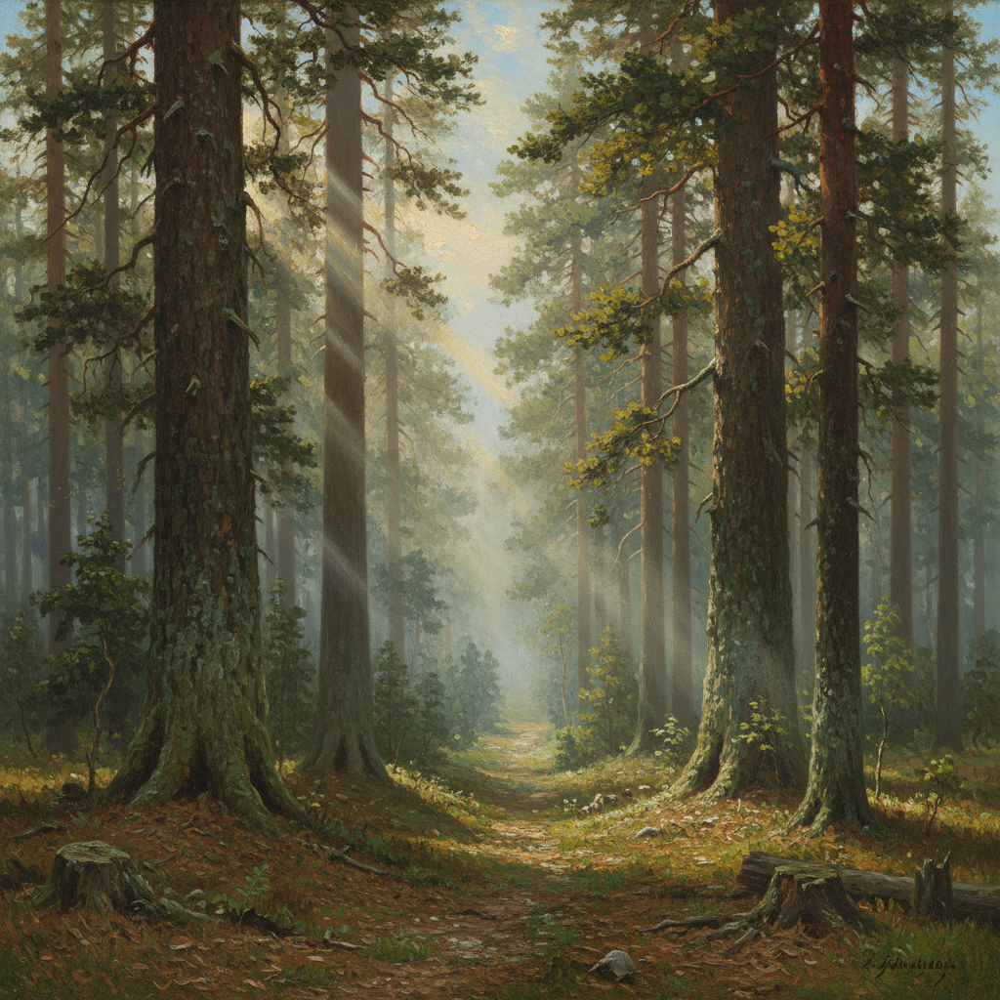

# 俄罗斯森林绘画 · Russian Forest Painting Art

> "森林是俄罗斯的灵魂，每一棵树都在讲述大地的故事。" —— 伊万·希施金

## 概述

俄罗斯森林绘画（Russian Forest Painting Art）是19世纪俄罗斯风景画中最具民族特色的子题材，以希施金为最高代表。俄罗斯广袤的针叶林和混交林不仅是地理景观，更是民族精神的象征——力量、坚韧、永恒。从希施金植物学级别的精确描绘，到列维坦诗意化的林间光影，再到库因芝戏剧性的森林月光，俄罗斯画家将森林主题发展为一个完整的视觉传统，深刻影响了俄罗斯民族的自然审美。

## 核心特征

| 特征 | 描述 |
|------|------|
| 时期 | 1860s–1910s（巅峰期） |
| 地域 | 俄罗斯中部、乌拉尔、波罗的海沿岸 |
| 媒介 | 油画、素描、版画 |
| 核心理念 | 以森林为载体表达民族精神与自然崇拜 |
| 色彩 | 深绿、墨绿、金黄（阳光）、棕褐（树干） |

## 视觉特征

- **树木肖像**：每棵树都被赋予个性，如同人物肖像
- **光线穿透**：阳光穿过树冠的丁达尔效应
- **纵深空间**：林间小路引导视线深入画面
- **季节变化**：同一片森林在四季中的不同面貌
- **微观与宏观**：从松针细节到全景森林的尺度跨越
- **湿润空气**：晨雾、露水营造的森林氛围

## 代表作品

| 作品 | 作者 | 年代 | 特点 |
|------|------|------|------|
| 《松树林的清晨》 | 希施金/萨维茨基 | 1889 | 晨雾松林与熊 |
| 《橡树林》 | 希施金 | 1887 | 阳光下的橡树群 |
| 《船桅林》 | 希施金 | 1898 | 笔直松树的纪念碑感 |
| 《白桦林》 | 库因芝 | 1879 | 戏剧性光影对比 |
| 《橡树·秋日》 | 列维坦 | 1880 | 抒情化的森林 |

## 发展时间线

| 时期 | 事件 |
|------|------|
| 1860s | 希施金开始系统性描绘俄罗斯森林 |
| 1870s | 巡回展览画派推动森林题材的民族意义 |
| 1878 | 希施金《黑麦田》确立全景式风景画范式 |
| 1880s | 库因芝以光影实验革新森林表现 |
| 1889 | 《松树林的清晨》成为俄罗斯最知名画作之一 |
| 1890s | 列维坦将森林题材推向抒情诗化方向 |
| 1898 | 希施金去世，森林绘画传统由学生延续 |

## 中国语境

俄罗斯森林绘画对中国风景油画影响极大。中国东北的白桦林、大兴安岭的针叶林与俄罗斯森林景观相似，为中国画家提供了天然的创作对象。1950-60年代留苏画家如全山石、肖峰等人将希施金式的森林写实技法带回中国。至今，中国北方风景画家仍以俄罗斯森林绘画为重要参照，"画树"作为基本功训练也源自这一传统。

## AI 概念图

*AI 生成概念图：俄罗斯森林绘画风格*

## 关联词条

- [[shishkin-art]] - 希施金艺术
- [[kuindzhi-art]] - 库因芝艺术
- [[levitan-art]] - 列维坦艺术
- [[russian-landscape-art]] - 俄罗斯风景画
- [[russian-plein-air-art]] - 俄罗斯外光派

---

*浮光艺志 · Chronicle of Artistry*
