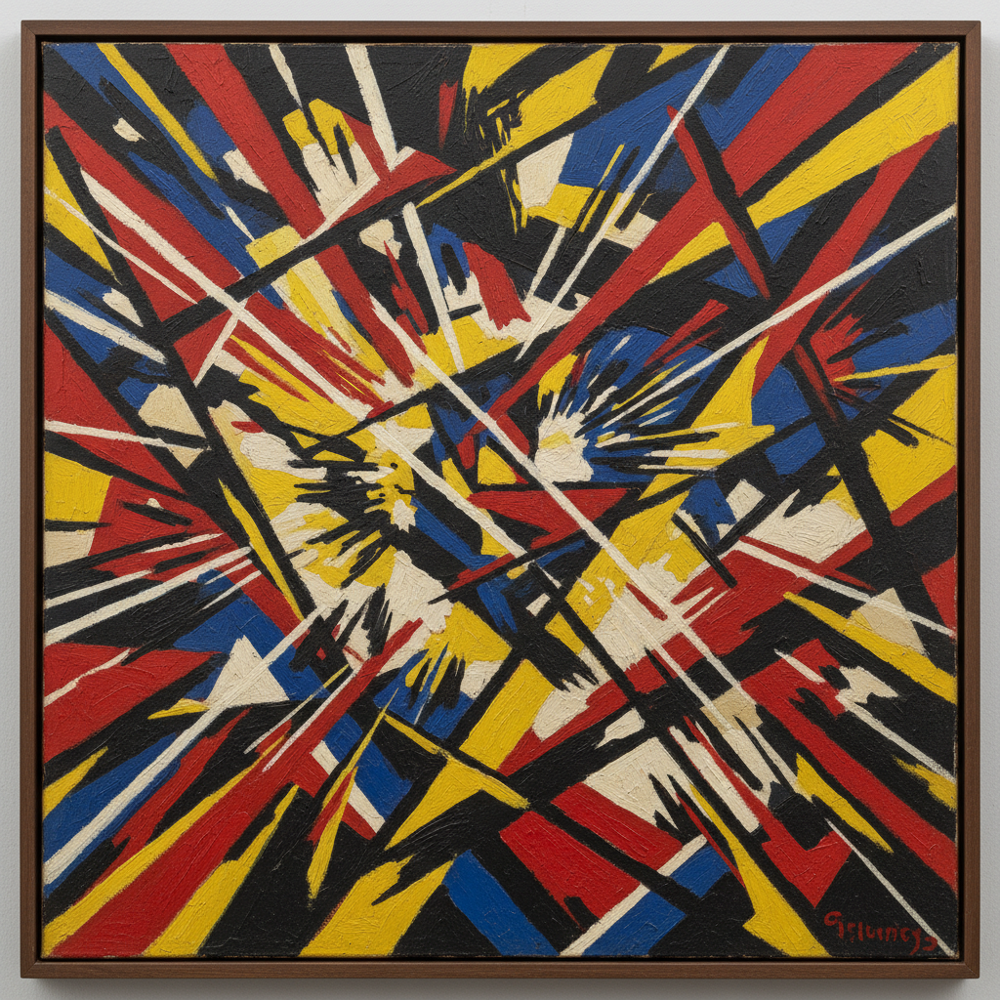

# Russian Futurism Art 俄罗斯未来主义艺术

> "We alone are the face of our Time. The horn of time blows through us in the art of the word." — Russian Futurist manifesto

## 概述

俄罗斯未来主义艺术（Russian Futurism Art）是1910年代俄罗斯发展的一种激进的前卫艺术运动——它受到意大利未来主义的启发，但发展出了完全独立的方向，成为俄罗斯先锋派艺术的重要组成部分。俄罗斯未来主义比意大利未来主义更加激进和多元——它不仅关注速度和机器，更深入探索了语言、形式和感知的根本问题。

俄罗斯未来主义在绘画领域的代表是纳塔利娅·冈察洛娃（Goncharova）和米哈伊尔·拉里奥诺夫（Larionov）——他们创造了"射线主义"（Rayonism），被认为是最早的纯粹抽象绘画之一。在文学领域，马雅可夫斯基、赫列勃尼科夫等诗人创造了"超理性语言"（zaum）——一种超越逻辑意义的纯粹声音诗歌。俄罗斯未来主义的核心理念是"打碎旧世界"——不仅要打碎旧的艺术形式，更要打碎旧的感知方式和思维模式。

俄罗斯未来主义艺术的核心要素包括：1）激进破坏——彻底打碎传统艺术观念；2）射线主义——光线和能量的抽象表现；3）新原始主义——回归原始和民间艺术；4）超理性语言——超越逻辑的纯粹形式；5）跨媒介——绘画、诗歌、戏剧的融合；6）表演性——公共表演和挑衅行为；7）革命精神——与社会革命的紧密联系。

## 核心特征

| 特征 | 描述 |
|------|------|
| 激进破坏 | 彻底打碎传统艺术观念 |
| 射线主义 | 光线能量抽象表现 |
| 新原始主义 | 回归原始民间艺术 |
| 超理性语言 | 超越逻辑纯粹形式 |
| 跨媒介 | 绘画诗歌戏剧融合 |
| 革命精神 | 与社会革命紧密联系 |

## 视觉特征

- **射线构图**：从中心向外辐射的线条
- **碎片化**：物象的碎片化和重组
- **强烈色彩**：大胆的原色对比
- **民间元素**：俄罗斯民间艺术的影响
- **文字入画**：文字和图像的融合
- **动态感**：强烈的运动和能量感

## 代表作品

| 作品 | 艺术家 | 意义 |
|------|------|------|
| *射线主义构图* | 拉里奥诺夫 | 射线主义宣言 |
| *骑自行车的人* | 冈察洛娃 | 动态表现 |
| *给社会趣味一记耳光* | 集体 | 未来主义宣言 |
| *胜利太阳* | 马列维奇等 | 未来主义歌剧 |
| *马雅可夫斯基海报* | 马雅可夫斯基 | 视觉诗歌 |
| *超理性诗歌* | 赫列勃尼科夫 | 语言实验 |

## 历史时间线

| 时期 | 事件 |
|------|------|
| 1910年 | 俄罗斯未来主义运动兴起 |
| 1912年 | 《给社会趣味一记耳光》宣言 |
| 1913年 | 射线主义宣言发表 |
| 1913年 | 《胜利太阳》歌剧首演 |
| 1914-17年 | 未来主义与战争和革命 |
| 1917年后 | 融入先锋派和构成主义 |

## 中国语境

俄罗斯未来主义对中国艺术的影响主要是间接的——通过俄罗斯先锋派的整体影响传递。但俄罗斯未来主义的某些理念与中国文化革命时期的"破四旧"有着表面上的相似——两者都主张彻底打碎旧的文化传统。然而，俄罗斯未来主义的"破坏"是为了创造全新的艺术形式，而非简单的否定。冈察洛娃的"新原始主义"——回归俄罗斯民间艺术和圣像画传统——与中国当代艺术中"回归传统"的倾向有着某种平行关系。俄罗斯未来主义将诗歌、绘画、戏剧融为一体的跨媒介实践，对理解当代中国跨媒介艺术实践也有重要的参考价值。

## 概念图

## 与其他风格的关系

- **Italian Futurism** → 意大利未来主义（启发来源）
- **Rayonism** → 射线主义（绘画分支）
- **Russian Avant-Garde** → 俄罗斯先锋派（母运动）
- **Suprematism** → 至上主义（后续发展）
- **Goncharova** → 冈察洛娃（核心人物）
- **Cubism** → 立体主义（影响来源）

---

*浮光艺志 | Chronicle of Artistry*
